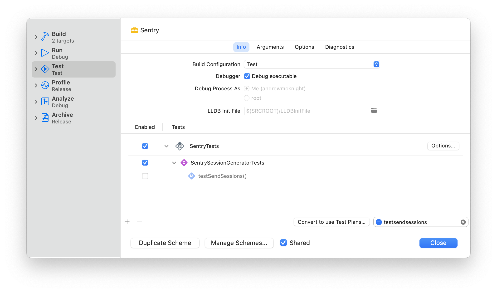
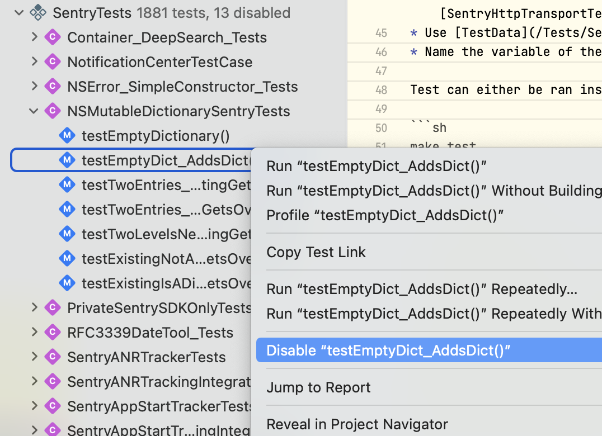
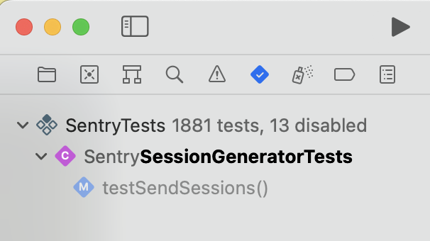

<p align="center">
  <a href="https://sentry.io" target="_blank" align="center">
    
  </a>
  <br />
</p>

# Contributing

We welcome suggested improvements and bug fixes for `sentry-cocoa`, in the form of pull requests. To get early feedback, we recommend opening up a [draft PR](https://docs.github.com/en/pull-requests/collaborating-with-pull-requests/proposing-changes-to-your-work-with-pull-requests/about-pull-requests#draft-pull-requests). Please follow our official [Commit Guidelines](https://develop.sentry.dev/code-review/#commit-guidelines) and also prefix the title of your PR according to the [Commit Guidelines](https://develop.sentry.dev/code-review/#commit-guidelines). The guide below will help you get started, but if you have further questions, please feel free to reach out on [Discord](https://discord.gg/Ww9hbqr).

## PR reviews

For feedback in PRs, we use the [LOGAF scale](https://blog.danlew.net/2020/04/15/the-logaf-scale/) to specify how important a comment is:

* `l`: low - nitpick. You may address this comment, but you don't have to.
* `m`: medium - normal comment. Worth addressing and fixing.
* `h`: high - Very important. We must not merge this PR without addressing this issue.

You only need one approval from a maintainer to be able to merge. For some PRs, asking specific or multiple people for review might be adequate.

Our different types of reviews:
  
  1. **LGTM without any comments.** You can merge immediately.
  2. **LGTM with low and medium comments.** The reviewer trusts you to resolve these comments yourself, and you don't need to wait for another approval. 
  3. **Only comments.** You must address all the comments and need another review until you merge.
  4. **Request changes.** Only use if something critical is in the PR that absolutely must be addressed. We usually use `h` comments for that. When someone requests changes, the same person must approve the changes to allow merging. Use this sparingly.

## Setting up an Environment

Run `make init` to get started. This will install `pre-commit`, `bundler` and `Homebrew` and their managed dependencies (see `Gemfile` and `Brewfile`).

## Tests

The tests depend on our test server. To run the automated tests, you first need to have the server running locally with

```sh
make run-test-server
```

Test guidelines:

* We write our tests in Swift. When touching a test file written in Objective-C consider converting it to Swift and then add your tests.
* Make use of the fixture pattern for test setup code. For examples, checkout [SentryClientTest](/Tests/SentryTests/SentryClientTest.swift) or [SentryHttpTransportTests](/Tests/SentryTests/SentryHttpTransportTests.swift).
* Use [TestData](/Tests/SentryTests/Protocol/TestData.swift) when possible to avoid setting up data classes with test values.
* Name the variable of the class you are testing `sut`, which stands for [system under test](https://en.wikipedia.org/wiki/System_under_test).
* We prefer using [Nimble](https://github.com/Quick/Nimble) over XCTest for test assertions. We can't use the latest Nimble version and are stuck
with [v10.0.0](https://github.com/Quick/Nimble/releases/tag/v10.0.0), cause it's the latest one that still supports Xcode 13.2.1, which we use in CI for
running our tests. [v11.0.0](https://github.com/Quick/Nimble/releases/tag/v11.0.0) already requires Swift 5.6 / Xcode 13.3.
* When calling `SentrySDK.start` in a test, specify only the minimum integrations required to minimize side effects for tests and reduce flakiness.


Test can either be ran inside from Xcode or via

```sh
make test
```

### Flaky tests

If you see a test being flaky, you should ideally fix it immediately. If that's not feasible, you can disable the test in the test scheme by unchecking it in the Test action:



or by right-clicking it in the Tests Navigator (⌘6):



Then create a GH issue with the [flaky test issue template](https://github.com/getsentry/sentry-cocoa/issues/new?assignees=&labels=Platform%3A+Cocoa%2CType%3A+Flaky+Test&template=flaky-test.yml). 

Disabling the test in the scheme has the advantage that the test report will state "X tests passed, Y tests failed, Z tests skipped", as well as maintaining a centralized list of skipped tests (look in Sentry.xcscheme) and they will be grayed out when viewing in the Xcode Tests Navigator (⌘6):



## Code Formatting

Please follow the convention of removing the copyright code comments at the top of files. We only keep them inside [SentryCrash](/SentryCrash/),
as the code is based on [KSCrash](https://github.com/kstenerud/KSCrash).

All Objective-C, C and C++ needs to be formatted with [Clang Format](http://clang.llvm.org/docs/ClangFormat.html). The configuration can be found in [`.clang-format`](./.clang-format). Simply run the make task, which runs automatically with git pre commit, before submitting your changes for review:

```sh
make format
```

### GH actions suddenly formats code differently

It can be that it uses a different clang-format version, than you local computer. Please run `brew install clang-format`, and ensure that your version (run `clang-format --version`) matches the one from GH actions.

**More information:**
We always use the latest version of clang-format in homebrew in [our GH actions](https://github.com/getsentry/sentry-cocoa/blob/bdaf35331fa9dc67fc318e4a25b92cdc9b0c0ed7/.github/workflows/format-code.yml#L19-L20) for formatting the code.
As we use homebrew for setting up the development environment,  homebrew only contains formulas for clang-format 8, 11, or the latest, and we want to use the latest clang-format version; we accept that we don't pin clang-format to a specific version. Using the GH action images clang-format version doesn't work, as it can be different than the one from homebrew.
This means if homebrew updates the [formula](https://formulae.brew.sh/formula/) for the default clang-format version so does our GH actions job. If the GH actions job suddenly starts to format code differently than your local make format, please compare your clang-format version with the GH actions jobs version.

## Linting

We use [Swiftlint](https://github.com/realm/SwiftLint) and Clang-Format. For SwiftLint, we keep a multiple config files for the tests and samples, cause some rules don't make sense for testing and sample code. To run all the linters locally execute:

```sh
make lint
```

## Environment

Please use `Sentry.xcworkspace` as the entry point when opening the project in Xcode. It also contains all samples for different environments.

## Public Headers

To make a header public follow these steps:

* Move it into the folder [Public](/Sources/Sentry/Public). Both [CocoaPods](Sentry.podspec) and [Swift Package Manager](Package.swift) make all headers in this folder public.
* Add it to the Umbrella Header [Sentry.h](/Sources/Sentry/Public/Sentry.h).
* Set the target membership to public.

## Configuring certificates and provisioning profiles locally

You can run samples in a real device without changing certificates and provisioning profiles if you are a Sentry employee with access to Sentry profiles repository and 1Password account.

* Configure your environment to use SSH to access GitHub. Follow [this instructions](https://docs.github.com/en/authentication/connecting-to-github-with-ssh).
* You will need `Cocoa codesigning match encryption password` from your Sentry 1Password account.
* run `fastlane match_local`

This will setup certificates and provisioning profiles into your machine, but in order to be able to run a sample in a real device you need to register that device with Sentry AppConnect account, add the device to the provisioning profile you want to use, download the profile again and open it with Xcode.

## Final Notes

When contributing to the codebase, please make note of the following:

* Non-trivial PRs will not be accepted without tests (see above).
* Please do not bump version numbers yourself.
