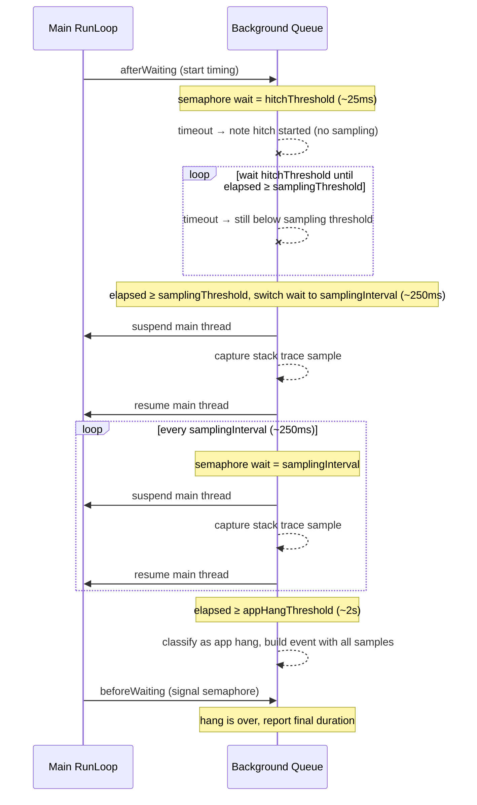
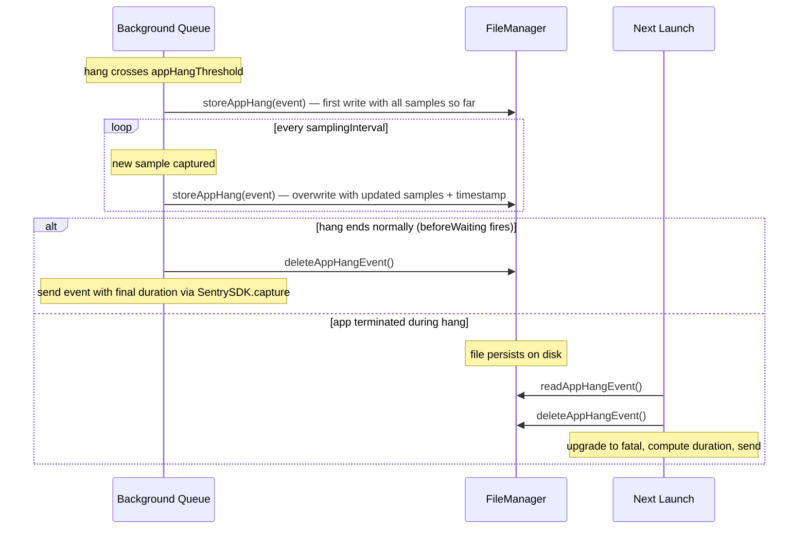

# App Hang Tracking — Design Spec

Status: **Living document**
Last updated: 2026-06-09

---

## Table of Contents

- [Comparison Matrix](#comparison-matrix)
- [V3 Design Spec](#v3-design-spec)
- [Open Issues and Feature Requests](#open-issues-and-feature-requests)
- [Previous Solutions](#previous-solutions)
  - [Architecture Overview](#architecture-overview)
  - [V1: Main-Queue Dispatch Probe](#v1-main-queue-dispatch-probe)
  - [V2: Frame-Delay Signal](#v2-frame-delay-signal)

---

## Comparison Matrix

| Aspect                 | V1                              | V2                                    | V3                                                                            |
| ---------------------- | ------------------------------- | ------------------------------------- | ----------------------------------------------------------------------------- |
| Signal                 | Main-queue dispatch probe       | Frame delay query                     | RunLoop afterWaiting → beforeWaiting                                          |
| Architecture           | Polling thread + sleep          | Polling thread + sleep                | CFRunLoopObserver + semaphore                                                 |
| Granularity            | ~seconds (configurable timeout) | ~seconds (configurable timeout)       | ~milliseconds (hitchThreshold)                                                |
| Hang types             | Unknown only                    | Fully-blocking / non-fully-blocking   | Fully-blocking only (non-fully-blocking dropped)                              |
| Duration measurement   | No                              | Yes (min/max range)                   | Yes (precise, continuous)                                                     |
| Stack trace capture    | At detection (~2s in)           | At detection (~2s in)                 | Sampled every ~250ms from samplingThreshold onward                            |
| Stack trace quality    | Single snapshot, may miss cause | Single snapshot, may miss cause       | Multiple samples with confidence metric                                       |
| Overhead when healthy  | Dispatch to main queue per tick | FramesTracker query per tick          | Low (event-driven: observer callback + semaphore + dispatch per iteration)    |
| Dependencies           | DispatchQueue, Thread           | DispatchQueue, Thread, FramesTracker  | CFRunLoop, DispatchQueue                                                      |
| Platform support       | All                             | iOS, tvOS, visionOS (UIKit)           | All (stack traces on all except watchOS)                                      |
| Suspension handling    | Wall-clock delta check          | Wall-clock delta check                | Wall-clock delta check per semaphore timeout                                  |
| Background filtering   | Late (after threshold)          | Per-tick foreground check             | Per-sample check via SentryCrash state (safe during hang)                     |
| Cooldown               | No                              | Yes (timeoutInterval after last hang) | Yes (configurable cooldownDuration, default = appHangThreshold)               |
| Fatal hang persistence | Write once at detection         | Write once at detection               | Incremental writes — updated on each sample, duration recoverable on relaunch |
| Fatal hang duration    | Unknown                         | Unknown                               | Estimated from last_sample_time − hang_start_time                             |

---

## TL;DR — V3 at a Glance

V3 replaces V1/V2 with a single **event-driven** hang detector built on `CFRunLoopObserver` + `DispatchSemaphore`. It has **low overhead when the app is healthy** (no polling threads, but the run loop observer callback and semaphore/dispatch per iteration have a small cost that needs benchmarking). A background queue waits on the semaphore with escalating timeouts: hitch noted at ~25ms, stack trace sampling starts at ~250ms, app hang reported at ~2s. Only **fully-blocking hangs** (one run loop iteration > threshold) are reported — V2's "non-fully-blocking" category is dropped. Stack traces are **sampled every ~250ms** by suspending only the main thread (not all threads), then aggregated client-side into a representative trace with a confidence metric. Fatal hangs are **incrementally persisted** to disk so duration is recoverable on next launch (±250ms). Works on **all Apple platforms**; watchOS gets timing-only detection (no stack traces). Opt-in via `options.experimental.appHangs.enableV3`.

---

## V3 Design Spec

V3 replaces both V1 and V2 with a unified, event-driven detection mechanism based on CFRunLoop observers. The prototype lives in `Sources/Swift/HangTracker.swift`.

### Core Mechanism: Run Loop Observer + Semaphore

Uses `CFRunLoopObserver` to directly measure main run loop busy time:

1. Register an observer for `afterWaiting | beforeWaiting` on the main run loop
2. On `afterWaiting`: record start time, create a `DispatchSemaphore`, dispatch `waitForHang` to a serial background queue
3. Background queue waits on the semaphore with a configurable timeout
4. On timeout: re-wait (the main thread is still busy)
5. On `beforeWaiting`: signal the semaphore → the run loop iteration is over

This approach is event-driven and has minimal overhead during healthy run loop iterations. No polling threads, no dispatched probe blocks, no frame tracker queries.

The `waitForHang` loop already provides periodic wake-ups on the background queue during a hang. Each timeout is an opportunity to capture a stack trace. No additional timer or sampling infrastructure is needed.

### Tiered Detection and Stack Trace Sampling

The hang tracker uses a tiered approach with configurable thresholds. Each semaphore timeout checks the elapsed duration and escalates through tiers:



**Tier 1, Hitch detection** (`hitchThreshold`, default ~25ms):

First timeout fires. We note that the run loop iteration is slow. No stack trace is captured at this point, only a timestamp. This is the point where we know something is taking longer than a single frame. Cost: near zero.

**Tier 2, Sampling begins** (`samplingThreshold`, default ~250ms):

If still hanging, capture the first main thread stack trace. At 250ms into a fully-blocking hang, the main thread is very likely still in the blocking call. This early sample is the most valuable for root-cause attribution.

**Tier 3, Ongoing sampling** (`samplingInterval`, default ~250ms):

Continue capturing stack traces at regular intervals while the hang persists. For a 2s hang this yields ~8 samples. Samples are collected in a ring buffer (bounded by `maxSamples`).

**Tier 4, App hang classification** (`appHangThreshold`, default ~2s):

When elapsed time crosses the app hang threshold, classify and report the event with all collected stack trace samples. The most frequent call site across samples identifies the root cause. This is similar to how Instruments' Time Profiler uses statistical sampling, but applied only during hangs.

When `beforeWaiting` fires, the run loop iteration is over. If it never crossed `appHangThreshold`, the collected samples are discarded. If it did, the final event includes duration and sample count.

### Signal Categories

V3 draws a clear distinction between hangs, hitches, and sustained degradation. V2 conflated these by introducing "non-fully-blocking hangs" as a workaround for its coarse polling-based detection that couldn't distinguish "one 2s block" from "twenty 100ms blocks in 2s" (both produce the same total frame delay).

With V3's per-iteration run loop observer, we have the granularity to classify correctly:

**App Hang.** A single run loop iteration exceeds `appHangThreshold` (e.g., 2s). The main thread is truly unresponsive, meaning touch events are not delivered and the UI does not update. V3 captures sampled stack traces and reports a hang event with a confidence metric.

**Hitch.** A single run loop iteration exceeds `hitchThreshold` (e.g., 25ms) but not `appHangThreshold`. The main thread was slow but recovered. Tracked as a lightweight metric (count + duration) with no stack trace capture and no event per hitch.

**Sustained degradation.** Many consecutive hitches where the main thread is busy for most of a time window, but the run loop is technically cycling between iterations. The app feels sluggish but is not hung. Touch events are still delivered (late) and the UI still updates (poorly). This is a fundamentally different problem from a hang and should not be reported as one.

V2's "non-fully-blocking hang" category mapped to sustained degradation. V3 intentionally does not report sustained degradation as a hang event because:

1. **The run loop is responsive.** `beforeWaiting` fires between iterations, meaning the main thread is not blocked. Calling this a "hang" is misleading.
2. **Stack traces are not representative.** Capturing a stack trace during one arbitrary 100ms iteration tells you what that iteration was doing, not what's causing the overall slowness. The root cause may be spread across many different call sites.
3. **The signal is different.** Sustained degradation is a performance monitoring concern (like slow/frozen frames), not an error event. It's best surfaced through frame metrics, not hang events.

Sustained degradation tracking is out of scope for V3. It may be addressed in the future as a separate performance metric, potentially using the hitch data that V3 already collects at Tier 1.

### Background Filtering

V3 does not report hangs that occur while the app is backgrounded. Background filtering is handled at two levels:

**App state check (background queue):** Before capturing stack traces, the integration checks `SentryCrashReporter.isApplicationInForeground` on the background queue. This reads from SentryCrash's internal state struct (`sentrycrashstate_currentState().applicationIsInForeground`), which is updated via `UIApplicationDidEnterBackgroundNotification` delivered on the main thread. During a fully-blocking hang, the main thread cannot process notifications, so this flag may not update if the app backgrounds mid-hang. This is an acknowledged limitation. In practice, a fully-blocking hang prevents the user from switching apps (the UI is frozen), so the app is unlikely to enter the background while the main thread is blocked. The flag reliably catches the case where a hang starts while the app is already backgrounded.

**App state check (event building):** When the hang crosses `appHangThreshold` and the integration builds the event, it performs a `UIApplication.shared.applicationState == .active` check (same as current `SentryHangTrackingIntegration` behavior at line 133). This is a second, independent check. If the app is not active at event-building time, the event is discarded. This catch covers the scenario where the app transitioned to background before the hang started (so `isApplicationInForeground` is already false) or where the notification was delivered between run loop iterations.

**Filtering logic in the `waitForHang` loop:**

1. **Hang starts while backgrounded:** On the first semaphore timeout that would cross `samplingThreshold`, check `isApplicationInForeground`. If false, skip sampling and continue waiting. Re-check on each subsequent timeout. If the app returns to foreground mid-hang, begin sampling from that point.

2. **App backgrounds mid-hang:** On each sampling timeout, check `isApplicationInForeground`. If the app has gone to background since the last sample, stop sampling. If the app returns to foreground, resume sampling. The hang duration reported in the event reflects wall-clock time of the full run loop iteration (afterWaiting to beforeWaiting), regardless of background transitions. Background time is **not** subtracted from the reported duration.

3. **Decision on duration adjustment:** V2 subtracted background time from reported duration. V3 does not, for two reasons:
   - V3 hangs are fully-blocking (single run loop iteration). The main thread cannot process the background transition during the hang because it's stuck in the same call. The blocking call's actual duration includes the background time.
   - Subtracting background time adds complexity and can produce misleading durations (e.g., a 10s hang that happened to span a background transition reported as 3s).

   Note: the app can be suspended mid-run-loop-iteration (e.g., the OS suspends the process while backgrounded). This is handled by the [Suspension Detection](#suspension-detection) mechanism, which discards the hang if the semaphore wait took significantly longer than expected. Duration subtraction could be made configurable in the future if needed, but is not planned for the initial V3 release.

The hang tracker itself (`HangTracker.swift`) remains agnostic to app state and reports all run loop timing to observers. Background filtering is the integration layer's responsibility, keeping the tracker reusable for other consumers (e.g., watchdog termination detection) that may want background hangs.

### Suspension Detection

When the OS suspends the process (e.g., backgrounded app, system resource pressure), all threads freeze, including the background queue waiting on the semaphore. On resume, the semaphore times out immediately and the elapsed time appears enormous. This is not a hang and must be discarded.

**Clocks involved:**

| Clock                                     | Pauses during sleep? | Used by                                                              |
| ----------------------------------------- | -------------------- | -------------------------------------------------------------------- |
| `ProcessInfo.systemUptime`                | Yes                  | HangTracker's `dateProvider.systemUptime()` for duration calculation |
| `CLOCK_UPTIME_RAW` / `mach_absolute_time` | No                   | `DispatchTime.now()` used by the semaphore wait timeout              |

When the device sleeps, `systemUptime` pauses so the computed duration stays small and no false positive occurs. The problem case is **process suspension while the device is awake** (e.g., app backgrounded but device not sleeping): `systemUptime` advances normally, producing a large computed duration.

**Detection algorithm:**

On each semaphore timeout in the `waitForHang` loop, track the wall-clock time of the wait itself:

```
expectedWait = hitchThreshold (or samplingInterval, depending on current tier)
actualWait = dateProvider.systemUptime() - timeBeforeWait
```

If `actualWait > expectedWait * 3.0`, the process was likely suspended during the wait. The 3× multiplier is generous enough to tolerate scheduling jitter and brief priority inversions while still catching genuine suspensions. In this case:

1. Discard all collected samples for the current hang
2. Reset the hang state (as if `beforeWaiting` fired)
3. Do not report an event

This is the same conceptual approach as V1/V2's wall-clock delta check, adapted to the semaphore-based loop. The check happens on every timeout, so suspension is detected on the first wake-up after resume.

**Edge case, suspension exactly at `beforeWaiting`:** If the process is suspended right as the main thread was about to signal `beforeWaiting`, the background queue sees a large elapsed time on resume but `beforeWaiting` fires immediately after. The suspension check on the timeout catches this before any event is built.

**Edge case, short suspension:** A brief suspension (e.g., 50ms) during a real hang would add 50ms to one wait interval. With the 3× multiplier and `hitchThreshold` of 25ms, the check triggers at >75ms of actual wait time. A 50ms suspension during a 25ms expected wait produces ~75ms actual wait, right at the boundary. In practice, scheduling jitter alone can produce 2× deviations, so 3× provides adequate headroom. The multiplier may need tuning through testing on real devices under load.

### Cooldown

After reporting a hang event, the tracker suppresses new hang events for a cooldown window. This prevents event floods when the main thread repeatedly blocks across consecutive run loop iterations (e.g., heavy work in a loop where each iteration exceeds `appHangThreshold`).

**Mechanism:** The integration records the timestamp (`dateProvider.systemUptime()`) when a hang event is reported. On subsequent run loop iterations, if `samplingThreshold` is crossed and the time since the last reported hang is less than `cooldownDuration`, sampling is skipped and no event is built for that iteration.

**Where it lives:** In the integration layer, not the hang tracker. The tracker continues reporting all timing to observers. Cooldown is a policy decision about when to create events. This keeps the tracker reusable for consumers that don't want cooldown (e.g., watchdog termination tracking needs to know about every hang regardless).

**Cooldown window:** Defaults to `appHangThreshold` (e.g., 2s), same as V2. This means after a 2s hang is reported, the next 2s of run loop iterations are ignored. If the main thread is still doing heavy work, the next hang event fires after the cooldown expires. This gives the user one event per ~4s of continuous blocking rather than one per ~2s.

**Edge case, long hang followed by short hang:** A 10s hang is reported. Cooldown starts. A 2.5s hang follows immediately. With a 2s cooldown, the second hang is reported (cooldown expired during the first hang's duration). This is correct because distinct hangs should be reported.

**Edge case, rapid oscillation:** The main thread alternates between 2.1s blocks and brief idle periods. Without cooldown: one event per ~2.1s. With 2s cooldown: one event per ~4.1s. This is intentional because the first event captures the pattern and duplicates add noise.

### Configurable Options

All thresholds should be exposed as configurable options with sensible defaults:

| Option              | Default                                       | Description                                                                                                                                                |
| ------------------- | --------------------------------------------- | ---------------------------------------------------------------------------------------------------------------------------------------------------------- |
| `hitchThreshold`    | `expectedFrameDuration * 1.5` (~25ms at 60Hz) | Duration before noting a hitch started. No sampling.                                                                                                       |
| `samplingThreshold` | `250ms`                                       | Duration before capturing the first stack trace sample.                                                                                                    |
| `samplingInterval`  | `250ms`                                       | Interval between subsequent stack trace samples during an ongoing hang.                                                                                    |
| `appHangThreshold`  | `2s`                                          | Duration before classifying as an app hang and reporting an event. Replaces V1/V2's `appHangTimeoutInterval`.                                              |
| `maxSamples`        | `40`                                          | Maximum number of stack trace samples retained per hang (ring buffer). Bounds memory usage for very long hangs. At 250ms intervals, 40 samples covers 10s. |
| `cooldownDuration`  | `appHangThreshold` (e.g., 2s)                 | Minimum time after reporting a hang before a new hang event can be reported. Prevents event floods from consecutive hangs.                                 |

**Semaphore timeout progression:** The semaphore wait duration changes as the hang escalates through tiers:

1. **Before `samplingThreshold`:** wait with `hitchThreshold` (~25ms). This provides fast hitch detection with minimal overhead. Multiple timeouts may fire as the hang approaches `samplingThreshold`. Each checks elapsed time but takes no action beyond noting the hitch.
2. **After `samplingThreshold`:** switch to `samplingInterval` (~250ms). Each timeout now captures a stack trace sample. Using the longer interval reduces sampling overhead while the hang is clearly established.

This avoids the dual-use problem where a single timeout value would either be too short for efficient sampling (waking every 25ms to sample) or too long for hitch detection (missing sub-250ms hitches).

#### Option Structure and Migration

All V3 hang tracking options live under a tree-structured namespace: `options.experimental.appHangs.*` during the experimental phase, graduating to `options.appHangs.*` when the feature matures.

**V3 opt-in:** A new flag `options.experimental.appHangs.enableV3` (default `false`) controls whether V3 is used. When enabled, V3 takes precedence over V1/V2. When disabled, the existing V1/V2 selection logic applies. See [Mutual Exclusivity](#mutual-exclusivity) for details.

**Option namespace:**

| Option                                    | Default                                       | Description                                                                     |
| ----------------------------------------- | --------------------------------------------- | ------------------------------------------------------------------------------- |
| `experimental.appHangs.enableV3`          | `false`                                       | Opt-in to V3 hang tracking. When true, V3 replaces V1/V2.                       |
| `experimental.appHangs.appHangThreshold`  | `2s`                                          | Duration before classifying as an app hang. Maps from `appHangTimeoutInterval`. |
| `experimental.appHangs.samplingThreshold` | `250ms`                                       | Duration before capturing the first stack trace sample.                         |
| `experimental.appHangs.samplingInterval`  | `250ms`                                       | Interval between subsequent stack trace samples.                                |
| `experimental.appHangs.hitchThreshold`    | `expectedFrameDuration * 1.5` (~25ms at 60Hz) | Duration before noting a hitch started.                                         |
| `experimental.appHangs.maxSamples`        | `40`                                          | Maximum stack trace samples retained per hang (ring buffer).                    |
| `experimental.appHangs.cooldownDuration`  | `appHangThreshold` (e.g., 2s)                 | Minimum time after reporting a hang before a new hang event.                    |

**V2 migration:**

- `enableAppHangTracking`: **keep as-is.** Controls whether any hang tracking is enabled (V1/V2/V3). V3 only activates when both `enableAppHangTracking` and `experimental.appHangs.enableV3` are true.
- `appHangTimeoutInterval`: **keep as-is.** When V3 is enabled, its value is used as the default for `experimental.appHangs.appHangThreshold` if the latter is not explicitly set. Explicit V3 setting takes precedence.
- `enableReportNonFullyBlockingAppHangs`: **deprecate.** V3 does not have a non-fully-blocking category. The option becomes a no-op when V3 is active. Mark `@available(*, deprecated, message: "V3 hang tracking only reports fully-blocking hangs.")`. Remove in v10.

#### Mutual Exclusivity

V3 and the CADisplayLink-based V2 must not run simultaneously (per @philipphofmann's requirement). Selection logic in the dependency container:

```
if options.experimental.appHangs.enableV3 {
    → use SentryANRTrackerV3 (wraps HangTracker)
} else if platform supports CADisplayLink {
    → use SentryANRTrackerV2 (existing)
} else {
    → use SentryANRTrackerV1 (existing)
}
```

When V3 is enabled, it wins unconditionally on all platforms. The V1/V2 trackers are not instantiated.

### Stack Trace Capture Strategy

Stack traces are captured on the background queue during semaphore timeouts. V3 suspends only the main thread (not all threads), unlike V2 which suspends all threads (up to 70) via `sentrycrashmc_suspendEnvironment`.

**SentryCrash dependency:** The current stack trace capture path uses `SentryCrash` APIs (`sentrycrashmc_suspendEnvironment`, machine context reading). Since the SDK is migrating away from `SentryCrash`, V3's single-thread suspend path (`thread_suspend` / `thread_get_state` / `vm_read_overwrite` / `thread_resume`) should be implemented directly in the Sentry layer (e.g., in `Sources/Swift/` or `Sources/Sentry/`) without depending on `SentryCrash`. The Mach APIs used are standard kernel interfaces and do not require the SentryCrash framework. The binary image lookup for symbolication can use `dyld` APIs directly. This aligns with the broader effort to decouple from `SentryCrash`.

**Per-sample capture steps:**

1. Call `thread_suspend()` on the main thread's Mach port
2. Call `thread_get_state()` to read the ARM64 thread state + exception state
3. Walk frame pointers via `vm_read_overwrite()` to capture raw stack entries (max depth ~100)
4. Call `thread_resume()` on the main thread
5. Convert raw entries to structured stack trace (binary image lookup, hex formatting). This happens after resume and has no signal-safety constraints.

**Why main-thread-only is sufficient:** Hangs are caused by the main thread being blocked. The blocking call's stack trace is the diagnostic signal. Other threads' stacks add noise without improving root-cause attribution because the hang is not caused by a background thread.

**Implementation requirement:** The existing codebase only exposes `sentrycrashmc_suspendEnvironment` (suspend all threads). A new single-thread suspend path needs to be added. This is a prerequisite for V3 stack trace capture. See [Performance Impact](#performance-impact) for the syscall count reduction.

**Safety consideration:** Suspending only the main thread means other threads continue running during frame walking. This should be safe because `vm_read_overwrite()` reads from the target thread's stack memory, which is not being modified while the target thread is suspended. However, this needs validation. See open questions in Performance Impact.

**Lock ordering constraint:** The `thread_suspend()` / `thread_resume()` window must not overlap with holding any lock that the main thread might also acquire. If the main thread is holding such a lock at the moment of suspension, any subsequent attempt to acquire that lock on the background queue would deadlock. In the current `HangTracker` design, the wrapper's stack trace capture runs inside the observer callback, which is already inside `observersLock.synchronized`. The main thread only acquires `observersLock` briefly when adding/removing observers, not during run loop iteration processing, so contention is unlikely. The wrapper must not introduce additional locks that violate this constraint. See [Comparison to KSCrash — Lock-Then-Suspend Ordering](#lock-then-suspend-ordering) for the prior art.

### Client-Side Sample Aggregation

When the hang ends (or crosses `appHangThreshold`), the SDK aggregates collected samples client-side before building the event.

#### Ring Buffer

Samples are stored in a fixed-size ring buffer of capacity `maxSamples` (default 40). Each entry holds the raw stack trace (array of instruction addresses) and the capture timestamp.

**Eviction policy:** When the buffer is full, the oldest sample is overwritten. This means for very long hangs (>10s at 250ms intervals), early samples are lost. This is acceptable because:

- Later samples are more representative of the blocking call that sustained the hang
- Early samples near `samplingThreshold` may capture setup/transition code rather than the actual blocker
- The `samples_total` counter still reflects all captured samples (including evicted ones), while `representative_count` and `sample_groups` only reflect retained samples. This allows the confidence metric to indicate when significant data was lost.

**Capture failure handling:** If `thread_suspend()` returns an error (e.g., thread already terminated, Mach port invalid), the sample is skipped. No entry is added to the ring buffer and `samples_total` is not incremented. This is a silent skip, not an error condition. In practice, the main thread should always be suspendable during a hang because it's blocked in a run loop iteration.

#### Aggregation Algorithm

1. Collect N raw stack trace samples during the hang (retained in ring buffer, up to `maxSamples`)
2. Group samples by top frame (raw instruction address, not symbolicated)
3. Select the group with the highest count. This is the **representative stack trace**.
4. Compute **confidence** = representative count / total retained samples

**Grouping by raw address:** Samples are grouped by the exact instruction pointer of the top (innermost) frame. Two samples are in the same group if and only if their top frame address is identical. This works because a fully-blocking hang typically keeps the main thread in the same function (and often the same instruction) for most of its duration. ASLR does not affect grouping because all samples are from the same process launch and the slide is constant.

**Tie-breaking:** If two groups have equal count, the group whose most recent sample is newer wins. The rationale: the call that was active more recently is more likely to be the one that sustained the hang until detection/termination.

#### Confidence Metric

The dominance ratio measures how confidently the representative stack trace identifies the root cause:

| Confidence | Interpretation                           | Typical cause                                      |
| ---------- | ---------------------------------------- | -------------------------------------------------- |
| ~1.0       | All samples agree on the same top frame  | Single blocking call for the entire hang duration  |
| 0.5–0.8    | One dominant contributor with some noise | Mostly one call, with some other work interspersed |
| < 0.5      | No single dominant frame                 | Multiple different blocking calls during the hang  |

Low confidence tells the developer the hang had multiple contributors rather than one root cause. The `sample_groups` breakdown shows what those contributors were.

Since V3 only reports hangs where a single run loop iteration exceeds `appHangThreshold` (see [Signal Categories](#signal-categories)), all hangs are by definition fully-blocking because the main thread never returned to `beforeWaiting`. The confidence metric is not about hang _type_ but about root-cause _attribution_: did the main thread stay in one call for the whole hang, or did it move between several long calls within the same iteration?

#### Event Payload

The event includes the representative stack trace plus aggregation metadata:

```
mechanism.data: {
    "samples_total": 8,
    "representative_count": 7,
    "confidence": 0.875,
    "sample_groups": [
        { "top_frame": "0x1a2b3c4d", "count": 7 },
        { "top_frame": "0x5e6f7a8b", "count": 1 }
    ]
}
```

- `samples_total` is the total number of stack trace samples captured during the hang (including those evicted from the ring buffer)
- `representative_count` is the number of retained samples that matched the reported stack trace
- `confidence` is the dominance ratio (representative_count / total retained samples in the ring buffer, not samples_total). When no samples have been evicted, `samples_total` equals the retained count and the two denominators are identical.
- `sample_groups` contains top-K frame groups with counts (from retained samples only), allowing the backend to show a breakdown (e.g., "87% in `syncWrite`, 13% in `decode`")

The event contains a **single** stack trace: the representative one selected by the aggregation algorithm. This stack trace is attached as the event's exception stack trace, identical in format to V2. Raw samples are not sent. The `sample_groups` metadata in `mechanism.data` provides attribution context (which top-frame addresses were seen and how often) without transmitting full stack traces for each sample.

**Backend compatibility:** The `sample_groups`, `confidence`, `samples_total`, and `representative_count` fields in `mechanism.data` are new payload additions. No backend or frontend changes are required:

- **Relay** treats `mechanism.data` as a free-form `Object<Value>` (max depth 5, max bytes 2048). Arbitrary keys pass through without validation — events are not dropped or rejected.
- **Frontend** already renders `mechanism.data` as pills (key-value tags) in the exception mechanism display. Scalar fields (`samples_total`, `representative_count`, `confidence`) appear automatically. The `sample_groups` array is not rendered as a pill (the renderer skips object values) but is visible in the raw event JSON.
- The representative stack trace works for issue grouping and display identically to V2.

No coordination with backend/frontend teams is needed for the initial V3 release. A future UI enhancement could render the `sample_groups` breakdown more richly, but this is optional and independent of the SDK work.

### Performance Impact

_To be benchmarked. Below is a preliminary analysis of the cost per stack trace sample._

**Current implementation (`SentryDefaultThreadInspector`)** suspends all threads:

| Operation           | Mach syscalls               | Notes                                                                |
| ------------------- | --------------------------- | -------------------------------------------------------------------- |
| Enumerate threads   | 1× `task_threads()`         | Returns all thread ports                                             |
| Suspend all threads | (N-1)× `thread_suspend()`   | N = thread count, typically 20-30                                    |
| Get CPU state       | 2× `thread_get_state()`     | ARM64 thread state + exception state                                 |
| Walk frames         | ~100× `vm_read_overwrite()` | One kernel round-trip per frame pointer dereference. Max depth = 100 |
| Resume all threads  | (N-1)× `thread_resume()`    | Plus `mach_port_deallocate()` per thread                             |
| ObjC conversion     | 0 (after resume)            | Binary image lookup, hex formatting — normal heap allocation         |

Total: ~200+ Mach kernel calls per sample for a typical app with 20-30 threads.

**V3 approach:** suspend only the main thread (see [Stack Trace Capture Strategy](#stack-trace-capture-strategy)). This reduces to ~104 Mach calls per sample (1 suspend + 2 state + ~100 frame walks + 1 resume).

**Estimated per-sample cost:** low hundreds of microseconds (TBD, needs benchmarking). At 250ms sampling intervals during a hang, overhead is <0.1% of wall time. Sampling only occurs while the app is already degraded (hanging), so the impact on user experience is negligible.

**Platform limitation:** `thread_suspend` / `thread_resume` are Mach kernel APIs gated on `SENTRY_HAS_THREADS_API` (defined in `SentryInternalCDefines.h`). This macro is 1 for iOS, macOS, tvOS, and visionOS. Only watchOS is excluded. Stack trace sampling is available on all platforms except watchOS. Hang detection (timing only, no stack traces) still works on watchOS via the run loop observer.

### Platform-Degraded Experience

On watchOS (the only platform without `thread_suspend`), V3 provides timing-only hang detection:

**What works:**

- Run loop observer detects hangs with the same precision as iOS/macOS
- Tiered detection works fully: hitch counting, `samplingThreshold`, `appHangThreshold` all fire correctly
- Duration measurement: precise `afterWaiting` to `beforeWaiting` timing
- Background filtering, suspension detection, and cooldown all work (no Mach dependency)
- Fatal hang persistence: event is written to disk with timestamps, duration recoverable on next launch
- Watchdog termination integration: `isANROngoing` state is set correctly

**What's missing:**

- No stack traces. The event has no `exception.stacktrace` or `threads` array.
- No sample aggregation. `samples_total`, `confidence`, `sample_groups` are absent from mechanism data.
- No debug images. `debugMeta` is empty (no threads to resolve).

**Event structure on degraded platforms:**

The event is still created with a `Mechanism(type: "AppHang")` and an exception of type `"App Hang Fully Blocked"` with the hang duration message. The exception has no stack trace. The event provides:

- Exact hang duration
- Scope context (tags, breadcrumbs, user, extras)
- App state (foreground, active)
- View name (if available, see requirement #11)

This is still useful for identifying _that_ hangs occur and correlating them with breadcrumbs and view context, even without stack traces for root-cause attribution. Developers can use the breadcrumb trail and view name to narrow down the culprit.

**Open questions:**

- Benchmark actual per-sample cost on representative devices (iPhone SE vs iPhone 16 Pro)
- Measure memory cost per sample (stack trace depth × frame size) to validate `maxSamples` default
- Validate that single-thread suspend is safe without suspending all threads (no risk of the main thread being in a state that makes frame walking unsafe)

### View Name Context

Hang events need the current view/screen name for debugging context ([#3563](https://github.com/getsentry/sentry-cocoa/issues/3563)).

**Current state:** View names already flow to hang events through the existing pipeline:

1. `SentryScope.currentScreen` is set by `PrivateSentrySDKOnly.setCurrentScreen(_:)` (called by UI tracking integrations and hybrid SDKs)
2. When the hang event is built, `scope.applyTo(event:)` copies scope data
3. `SentryClient.prepareEvent` reads `scope.currentScreen` and writes it to `event.context.app.view_names`

**V3 consideration:** The scope is captured when the hang crosses `appHangThreshold` (see [Scope Capture Timing](#scope-capture-timing)). At that point, `scope.currentScreen` reflects the view that was active when the hang started, which is the correct context. If the view changes during the hang (unlikely since the main thread is blocked), the original view name is more useful for debugging.

No changes are needed for V3 because view names work through existing scope mechanics.

### Profile Linkage

Hang events should link to continuous profiling data when available ([#3493](https://github.com/getsentry/sentry-cocoa/issues/3493)).

**Current gap:** Transactions automatically capture `SentryContinuousProfiler.currentProfilerID` and attach it as `event.context.profile.profiler_id`. Hang events (which are regular `Event` objects, not transactions) do not have this linkage and lack the automatic profile session attachment.

**V3 design:** When building the hang event at `appHangThreshold`, the integration checks if continuous profiling is active:

```
if SentryContinuousProfiler.isCurrentlyProfiling() {
    let profileContext = ["profiler_id": SentryContinuousProfiler.currentProfilerID.sentryIdString]
    event.context["profile"] = profileContext
}
```

This links the hang event to the active profiling session. The backend can then correlate the hang's time window with the continuous profile data, allowing developers to see a full profile flame graph for the hang period. This is richer than V3's sampled stack traces alone.

**Timing:** The profile context is captured at `appHangThreshold` crossing (same time as scope capture). The profiler ID identifies the session, not a specific time range. The backend matches the hang's timestamp and duration to the profile data.

**Fallback:** If continuous profiling is not enabled, no profile context is attached. This is not an error because stack trace samples from V3 still provide root-cause attribution.

### Prototype Status

`HangTracker.swift` currently implements the core run loop observer + semaphore mechanism. It is used only by `SentryWatchdogTerminationTrackingIntegration` (behind `options.experimental.enableWatchdogTerminationsV2`) to track whether a hang was ongoing when the app was terminated. The tiered sampling and stack trace capture described above are not yet implemented.

### ANR Tracker V3 Wrapper

V3 introduces `SentryANRTrackerV3`, a wrapper around `HangTracker` that bridges the run-loop-observer mechanism to the existing integration layer.

**Responsibilities:**

- Registers as a `HangTracker` observer via `addOngoingHangObserver`
- Implements `SentryANRTrackerInternalDelegate` callbacks (`anrDetected` / `anrStopped`) to keep the `SentryHangTrackingIntegration` unchanged
- Owns the single-thread suspend logic: `thread_suspend()`, `thread_get_state()`, `vm_read_overwrite()`, `thread_resume()` on the main thread's Mach port
- Manages the sample ring buffer and performs client-side aggregation
- Handles background filtering, suspension detection, and cooldown (all per-sample policy)
- Performs incremental persistence (disk writes on each sample)

**Why a wrapper and not modifying HangTracker directly:**

- `HangTracker` is generic and reusable. It reports timing data to observers without policy decisions. The watchdog termination integration already consumes it directly and does not need stack traces, aggregation, or persistence.
- The wrapper encapsulates all V3-specific logic (sampling, aggregation, persistence, filtering) in one place, keeping `HangTracker` minimal.
- The wrapper conforms to the same `SentryANRTracker` protocol as V1/V2, so the dependency container can substitute it transparently based on `options.experimental.appHangs.enableV3`.

**Architecture:**

```
SentryHangTrackingIntegration (unchanged)
  → SentryANRTracker protocol
    → SentryANRTrackerV3 (new)
      → HangTracker (existing, run loop observer + semaphore)
      → Single-thread stack trace capture
      → Sample ring buffer + aggregation
      → Fatal hang persistence
```

The same persistence logic (incremental disk writes, fatal hang recovery) runs on all platforms. On watchOS, the stack trace capture step is skipped, but timing data, duration estimation, and persistence all work identically.

### HangTracker Thread Safety Model

- `observers` dictionary: modified on main queue under `observersLock`, read on main queue without lock, read on background queue under lock
- `MainQueueState` struct: all access from main queue only (no lock needed)
- Background queue is serial, guaranteeing sequential callback delivery
- `weak self` captures in closures prevent retain cycles and use-after-free
- Stack trace sample buffer: written on the background queue only, read when building the event (also on background queue)
- **Lock ordering constraint for `SentryANRTrackerV3`:** The wrapper must not hold any lock shared with the main thread across the `thread_suspend` / `thread_resume` window. The main thread acquires `observersLock` only when adding/removing observers (not during run loop iteration processing). The wrapper's stack trace capture runs inside the observer callback on the background queue, which already holds `observersLock`. No additional lock that the main thread might hold should be introduced in the suspend/resume path. See [Comparison to KSCrash — Lock-Then-Suspend Ordering](#lock-then-suspend-ordering) for context.

### Fatal Hang Persistence

When the app is terminated during a hang (by the OS watchdog, the user, or system pressure), V3 must recover and report the hang on next launch. This addresses requirement #5 and [#4845](https://github.com/getsentry/sentry-cocoa/issues/4845).

#### V2 Baseline

V2 writes the full event to disk once at detection time (`fileManager.storeAppHang(event)`), then reads it back when the hang ends or on next launch. The file is `app.hang.event.json` in `[cacheDir]/io.sentry/[dsn-hash]/`. Session handling (`SentryCrashIntegrationSessionHandler`) checks `appHangEventExists()` to mark the session as abnormal. The watchdog termination integration sets `isANROngoing = true` in app state via `SentryAppStateManager`.

**V2 limitations:**

- Duration is unknown for fatal hangs. Only the initial detection timestamp is persisted, not how long the hang continued before termination.
- The single stack trace captured at detection may not reflect the state at termination time
- No sample data for root-cause attribution

#### V3 Persistence Design

V3 uses incremental persistence. The on-disk event is updated as new samples are collected, so the persisted state always reflects the latest snapshot of the ongoing hang.

**Lifecycle:**



**When to write:**

1. **First write.** When elapsed time crosses `appHangThreshold` (e.g., 2s). The event includes the scope, context, all stack trace samples collected since `samplingThreshold`, and aggregation metadata.
2. **Subsequent writes.** After each new stack trace sample (every `samplingInterval`, ~250ms). Each write overwrites the previous file with an updated event containing all samples and a refreshed `lastSampleTime`. **On platforms without stack trace capture (watchOS):** the `waitForHang` loop still fires semaphore timeouts at `samplingInterval`. Each timeout updates `last_sample_time` and overwrites the persisted event, even though no stack trace is captured. This ensures fatal hang duration recovery works on all platforms.
3. **On hang end.** Delete the file and send the event through the normal capture path with the final precise duration.

**What is persisted:**

The event is serialized as JSON in the same format as V2 (`Event.serialize()`), keeping compatibility with `SentryCrashIntegrationSessionHandler` which reads the file for session handling. V3 adds fields to `mechanism.data`:

```json
{
  "hang_start_time": 1234567890.123,
  "last_sample_time": 1234567898.456,
  "samples_total": 8,
  "representative_count": 7,
  "confidence": 0.875,
  "sample_groups": [
    { "top_frame": "0x1a2b3c4d", "count": 7 },
    { "top_frame": "0x5e6f7a8b", "count": 1 }
  ]
}
```

- `hang_start_time` is `dateProvider.systemUptime()` at `afterWaiting`, converted to wall-clock `Date` for persistence (system uptime is not stable across launches)
- `last_sample_time` is the wall-clock `Date` of the most recent sample write
- The event's `timestamp` field is set to `hang_start_time` (same as V2)

**Duration recovery on next launch:**

```
estimated_duration = last_sample_time - hang_start_time + samplingInterval
```

The `+ samplingInterval` accounts for the worst case: the app was terminated just before the next sample would have been written. At 250ms intervals, the duration estimate is accurate to within 250ms. This is a major improvement over V2, which cannot estimate fatal hang duration at all.

The fatal event message uses this estimated duration:

```
"The user or the OS watchdog terminated your app while it blocked the main thread for approximately X.X seconds."
```

**On-disk path:** Same as V2, using `app.hang.event.json`. Only one hang can be in progress at a time (the main run loop is single-threaded), so a single file is sufficient.

**Cross-platform consistency:** The persistence logic (incremental writes, duration recovery, fatal hang detection on next launch) is identical on all platforms. On watchOS, the persisted event lacks stack trace data but still contains timing, duration, scope context, and mechanism metadata. This means fatal hang recovery works everywhere, not just on platforms with `thread_suspend`.

#### Integration Points

**`SentryHangTrackingIntegration`** owns the persistence lifecycle:

- Registers as an observer on the hang tracker
- On each callback where `ongoing == true` and `duration >= appHangThreshold`: build/update the event and call `fileManager.storeAppHang(event)`
- On callback where `ongoing == false`: delete the file and send the event
- On integration install: call `captureStoredAppHangEvent()` to handle fatal hangs from the previous launch

**`SentryWatchdogTerminationTrackingIntegration`** sets `isANROngoing` in app state:

- Already uses `HangTracker.addOngoingHangObserver` (V2 parity)
- No changes needed because the existing callback with duration threshold works for V3

**`SentryCrashIntegrationSessionHandler`** marks sessions as abnormal:

- Already checks `fileManager.appHangEventExists()` (line 72) and reads the event timestamp for session end time
- No changes needed because V3's persisted event has the same structure

**`captureStoredAppHangEvent()`** handles next-launch recovery:

- Reads the persisted event, checks `crashedLastLaunch`
- If no crash: upgrades to fatal level, computes duration from `hang_start_time` and `last_sample_time`, updates the exception message and type
- If crash: sends as-is (the crash report takes priority, but the hang context is preserved)

#### Disk I/O Considerations

Writing ~10–20 KB of JSON every 250ms during a hang is negligible on modern flash storage. The write happens on the background queue, not the main thread. The app is already unresponsive (hanging), so any minor I/O contention does not affect user experience. Writes must be **atomic** (write to a temporary file, then `rename`) to avoid partial files if the app is terminated mid-write.

For very long hangs (minutes), the file grows as `sample_groups` accumulates entries. With `maxSamples = 40` (ring buffer), the sample data is bounded regardless of hang duration. Once the ring buffer is full, existing samples are evicted, and the file size stabilizes.

### Event Sending Mechanics

V3 unifies the event sending pattern across all platforms, replacing V2's split behavior where V1 sent immediately on macOS and V2 used disk-write-then-send on iOS/tvOS/visionOS.

#### Normal Hang (App Recovers)

The full flow from detection to delivery:

1. `afterWaiting` fires → hang timing begins on background queue
2. Elapsed time crosses `samplingThreshold` → stack trace sampling begins (if foreground, not suspended, not in cooldown)
3. Elapsed time crosses `appHangThreshold` → classify as hang
   - Build event with exception type `"App Hang Fully Blocked"`: scope, context, breadcrumbs, representative stack trace from sample aggregation, debug images, mechanism data with sample metadata
   - Persist to disk: `fileManager.storeAppHang(event)`
4. Sampling continues → overwrite persisted event on each new sample
5. `beforeWaiting` fires → semaphore signaled, hang is over
   - Compute final precise duration: `beforeWaitingTime - afterWaitingTime`
   - Update event with final duration and aggregation
   - Delete persisted file: `fileManager.deleteAppHangEvent()`
   - Send: `SentrySDK.capture(event:scope:)` passing an empty scope to avoid double-application (the hub's scope was already applied to the event at step 3)

**Key difference from V2:** The event is captured with the final precise duration, not a min/max range. Duration = `beforeWaiting - afterWaiting`, measured via `dateProvider.systemUptime()`.

#### Fatal Hang (App Terminated)

See [Fatal Hang Persistence](#fatal-hang-persistence) for the full lifecycle. On next launch:

1. `captureStoredAppHangEvent()` reads the persisted event
2. If `crashWrapper.crashedLastLaunch`: a crash occurred during the hang. Send the event as-is (level `.error`). The crash report is the primary signal and the hang event provides additional context.
3. If no crash: upgrade to fatal
   - Set `event.level = .fatal`
   - Set `exception.mechanism.handled = false`
   - Map exception type to fatal variant: `"App Hang Fully Blocked"` → `"Fatal App Hang Fully Blocked"`
   - Compute duration from `hang_start_time` and `last_sample_time` in mechanism data
   - Update exception message with estimated duration
   - Send via `SentrySDKInternal.captureFatalAppHang(event)`

#### Platform Behavior

| Platform                   | Stack traces? | Persistence?               | Notes                                                                                                                   |
| -------------------------- | ------------- | -------------------------- | ----------------------------------------------------------------------------------------------------------------------- |
| iOS, macOS, tvOS, visionOS | Yes           | Yes (disk-write-then-send) | Full experience: sampled stack traces, fatal hang recovery                                                              |
| watchOS                    | No            | Yes (timing only)          | Event has duration and mechanism data but no stack trace. Fatal hangs are detected and reported with estimated duration |

V3 uses the disk-write-then-send pattern on **all** platforms (including macOS), unlike V2 which sent immediately on macOS via V1. This ensures fatal hang recovery works everywhere.

#### Scope Capture Timing

The scope is the hub's current scope (`SentryHub.scope`), which contains tags, breadcrumbs, user, extras, and context accumulated by the app and SDK integrations. It is **not** an empty `Scope()`. The scope is captured and baked into the event when the hang first crosses `appHangThreshold`, not when the hang ends. This is intentional:

- The scope at hang onset reflects the app's state when the hang started, which is the most relevant context for debugging
- Capturing scope requires reading from `SentryHub.scope`, which is thread-safe (protected by locks) and can be read from the background queue
- V2 uses the same approach (scope captured in `anrDetected`, not `anrStopped`)

#### Interaction with `beforeSend`

The `beforeSend` callback runs at capture time, not at persistence time. For normal hangs, this is when the hang ends (step 5). For fatal hangs, this is on next launch (the fatal event goes through `captureFatalAppHang` which invokes the event pipeline including `beforeSend`). Users can drop or modify hang events in `beforeSend` as with any other event.

### Requirements

Derived from V1/V2 experience and open issues:

1. **Cross-platform.** Must work on all Apple platforms without UIKit dependency ([#4950](https://github.com/getsentry/sentry-cocoa/issues/4950)).
2. **Event-driven.** No polling overhead when app is idle ([#5263](https://github.com/getsentry/sentry-cocoa/issues/5263)).
3. **No non-fully-blocking category.** V3 only reports hangs where a single run loop iteration exceeds the threshold (all hangs are fully-blocking by definition). V2's "non-fully-blocking" category is dropped. See [Signal Categories](#signal-categories).
4. **Duration measurement.** Continuous, not just min/max range (V2 parity + improvement).
5. **Fatal hang duration.** Persist timestamps to disk for duration recovery after termination ([#4845](https://github.com/getsentry/sentry-cocoa/issues/4845)).
6. **Suspension detection.** Avoid false positives when the process is suspended by the OS.
7. **Foreground/background filtering.** Don't report hangs when app is backgrounded.
8. **Cooldown.** Prevent rapid re-triggering (V2 parity).
9. **Configurable thresholds.** All detection and sampling thresholds exposed as options with sensible defaults.
10. **Profile linkage.** Expose enough context to link hangs to continuous profiling data ([#3493](https://github.com/getsentry/sentry-cocoa/issues/3493)).
11. **View name context.** Propagate current view name to hang events ([#3563](https://github.com/getsentry/sentry-cocoa/issues/3563)).
12. **No self-inflicted hangs.** Hang detection and reporting must not block the main thread ([#7757](https://github.com/getsentry/sentry-cocoa/issues/7757), [#7794](https://github.com/getsentry/sentry-cocoa/issues/7794), [#5138](https://github.com/getsentry/sentry-cocoa/issues/5138)).
13. **Testable.** Injectable dependencies, no reliance on real run loop or timers in tests (prototype parity).
14. **Integration compatibility.** V3 uses the existing `SentryANRTrackerInternalDelegate` protocol and `SentryHangTrackingIntegration` layer. The `SentryANRTrackerV3` wrapper adapts `HangTracker` to this protocol. See [ANR Tracker V3 Wrapper](#anr-tracker-v3-wrapper).

### Open Design Questions

_To be resolved during implementation:_

- **Memory budget:** Ring buffer of stack traces during a hang. What's the per-sample memory cost and acceptable ceiling? Needs benchmarking to validate `maxSamples` default.
- **Single-thread suspend safety:** Validate that suspending only the main thread (without suspending all threads) is safe for frame walking. See [Stack Trace Capture Strategy](#stack-trace-capture-strategy).
- **Scope capture from background queue:** The scope is read from the background queue when the hang crosses `appHangThreshold`. `SentryHub.scope` access involves locks that may contend with main-thread writers. This works in V2 (same pattern) and is not expected to be a problem, but should be validated under contention. Lower priority than the items above.

---

## Open Issues and Feature Requests

### Architecture / Detection

- **[#5263](https://github.com/getsentry/sentry-cocoa/issues/5263):** App Hang / Session Replay should use run loop observers. **Addressed by V3.** Core mechanism is CFRunLoopObserver, no CADisplayLink dependency. See [Core Mechanism](#core-mechanism-run-loop-observer--semaphore).
- **[#4950](https://github.com/getsentry/sentry-cocoa/issues/4950):** Add App Hangs V2 for macOS. **Addressed by V3.** Run loop observer works on all platforms including macOS. See [Platform-Degraded Experience](#platform-degraded-experience).
- **[#4845](https://github.com/getsentry/sentry-cocoa/issues/4845):** Fatal App Hang Duration. **Addressed by V3.** Incremental persistence with `hang_start_time` and `last_sample_time` enables duration recovery. See [Fatal Hang Persistence](#fatal-hang-persistence).
- **[#4959](https://github.com/getsentry/sentry-cocoa/issues/4959):** `crashedLastRun` to include watchdog and fatal app hangs. _Not directly addressed by V3. Requires separate API change._

### False Positives / Accuracy

- **[#7770](https://github.com/getsentry/sentry-cocoa/issues/7770):** Investigate cause of increased ANR/App Hang events. **Partially addressed by V3.** Dropping the non-fully-blocking category eliminates a major source of noisy/confusing hang reports. Event-driven detection avoids false positives from polling artifacts.
- **[#3563](https://github.com/getsentry/sentry-cocoa/issues/3563):** App Hang events don't have view names. **Addressed by V3.** View names flow through scope capture. See [View Name Context](#view-name-context).

### SDK Self-Inflicted Hangs

- **[#7757](https://github.com/getsentry/sentry-cocoa/issues/7757):** Deadlock when calling `SentrySDK.capture` on main thread. _Not directly addressed by V3. Requires fix in SentryScope lock contention._
- **[#7794](https://github.com/getsentry/sentry-cocoa/issues/7794):** Hang attributed to breadcrumb recording. _Not directly addressed by V3. Requires fix in storeBreadcrumb I/O._
- **[#7806](https://github.com/getsentry/sentry-cocoa/issues/7806):** `UIKeyboardTaskQueue` hang with swizzled `sendEvent:`. _Not directly addressed by V3. This is a swizzling concern._
- **[#5138](https://github.com/getsentry/sentry-cocoa/issues/5138):** `SentryHttpTransport` blocks main thread on init. _Not directly addressed by V3. Requires transport init fix._

V3's event-driven architecture (no main-queue dispatch blocks, no polling) reduces the SDK's own main-thread footprint, making self-inflicted hangs less likely. However, the specific issues above are in other SDK components and need separate fixes.

### Profiling / Diagnostics

- **[#3493](https://github.com/getsentry/sentry-cocoa/issues/3493):** Link App Hangs to Profiles. **Addressed by V3.** Hang events capture `profiler_id` from continuous profiler when active. See [Profile Linkage](#profile-linkage).

### Testing

- **[#4135](https://github.com/getsentry/sentry-cocoa/issues/4135):** Tests for deallocating `SentryANRTrackingIntegration` stopping ANR tracking don't work. Listener is never removed from tracker on dealloc.

### Related

- **[#4904](https://github.com/getsentry/sentry-cocoa/issues/4904):** Different main thread ID for errors and traces. Inconsistent thread identification across code paths.
- **[#3599](https://github.com/getsentry/sentry-cocoa/issues/3599):** Support span-level measurements for frame delay data.

---

## Previous Solutions

### Architecture Overview

All hang detection currently flows through the same integration layer:

```
SentryHangTrackingIntegration
  → SentryANRTracker (Swift wrapper, implements add/removeListener)
    → SentryANRTrackerV1 (macOS, watchOS, non-UIKit platforms)
    → SentryANRTrackerV2 (iOS, tvOS, visionOS, requires SentryFramesTracker)
  → SentryANRTrackerDelegate callbacks
    → anrDetected(type:)   captures stack trace, stores event to disk
    → anrStopped(result:)  reads stored event, updates duration, sends
```

Version selection happens at dependency container initialization (`SentryDependencyContainer.getANRTracker`):

```swift
#if (os(iOS) || os(tvOS) || os(visionOS)) && !SENTRY_NO_UI_FRAMEWORK
    SentryANRTrackerV2(timeoutInterval: timeout)
#else
    SentryANRTrackerV1(timeoutInterval: timeout)
#endif
```

#### Common Delegate Protocol

Both V1 and V2 implement `SentryANRTrackerInternalDelegate`:

```objc
- (void)anrDetected:(SentryANRTypeInternal)type;
- (void)anrStopped:(nullable SentryANRStoppedResultInternal *)result;
```

ANR types:

| Internal enum value                   | Description                                    |
| ------------------------------------- | ---------------------------------------------- |
| `kSentryANRTypeFullyBlocking`         | Single frame caused all delay (one long block) |
| `kSentryANRTypeNonFullyBlocking`      | Many slow frames accumulated into a hang       |
| `kSentryANRTypeFatalFullyBlocking`    | Fully-blocking hang that the OS terminated     |
| `kSentryANRTypeFatalNonFullyBlocking` | Non-fully-blocking hang that the OS terminated |
| `kSentryANRTypeUnknown`               | V1 — cannot distinguish hang type              |

### V1: Main-Queue Dispatch Probe

**Files:** `Sources/Sentry/SentryANRTrackerV1.m`
**Platforms:** macOS, watchOS, non-UIKit targets

#### Detection Mechanism

Spawns a dedicated `NSThread` that polls in a loop:

1. Dispatch a block to the main queue that resets an atomic counter to 0
2. Sleep for `timeoutInterval / reportThreshold` (where `reportThreshold = 5`)
3. Increment the counter each tick
4. If counter reaches threshold (5 ticks without reset) → ANR detected
5. When the main queue finally processes the reset block → ANR stopped

#### Suspension Detection

Compares wall-clock delta against `sleepDeadline`. If the thread slept much longer than expected (delta >= timeoutInterval), the process was likely suspended by the OS. The tick is discarded to avoid false positives.

#### Strengths

- Simple, minimal dependencies
- Works on all platforms (no UIKit/CADisplayLink requirement)
- Low code complexity (~150 lines)

#### Weaknesses

- **No hang type differentiation.** Always reports `kSentryANRTypeUnknown`.
- **No duration measurement.** Cannot report how long the hang lasted.
- **Main-queue overhead every tick.** Dispatches a block to the main queue on every poll cycle, even when the app is healthy.
- **Foreground check is late.** Checks `isApplicationInForeground` only after the threshold is reached, wasting background cycles.
- **Coarse granularity.** Detection latency is `timeoutInterval` at minimum and resolution is `sleepInterval`.

#### Thread Safety Model

- `threadLock` (`@synchronized`) guards the `state` enum across the detector thread and callers
- `listeners` has its own `@synchronized` lock
- `ticksSinceUiUpdate` and `reported` use C11 atomics (`memory_order_relaxed`) for cross-thread communication between the detector thread and main-queue dispatch blocks

### V2: Frame-Delay Signal

**Files:** `Sources/Sentry/SentryANRTrackerV2.m`
**Platforms:** iOS, tvOS, visionOS (requires `SentryFramesTracker` / `CADisplayLink`)

#### Detection Mechanism

Same dedicated-thread-with-sleep architecture as V1, but replaces the main-queue dispatch probe with frame-delay queries:

1. Sleep for `sleepInterval`
2. Query `SentryFramesTracker.getFramesDelaySPI` for frame delay over the last `timeoutInterval`
3. **Fully-blocking detection:** If `framesContributingToDelayCount == 1` and delay >= timeout → single long block
4. **Non-fully-blocking detection:** If `framesContributingToDelayCount > 1` and delay > `timeout * 0.99` → accumulated slow frames
5. **Stop detection:** Check if frame delay over the last `sleepInterval * 2` drops below `20%` of that window

#### Duration Measurement

Reports a min/max range to account for polling granularity:

```
duration_min = timeoutInterval + foregroundElapsed - sleepInterval
duration_max = timeoutInterval + foregroundElapsed + sleepInterval
```

#### Background Time Tracking

Tracks when the app goes to background during an ongoing hang:

- Records `wentToBackgroundSystemTime` on background transition
- Accumulates background time and subtracts it from reported duration
- Prevents inflated duration when the app is suspended mid-hang

#### Cooldown

Ignores new hangs that start within `timeoutInterval` of the last hang ending. Prevents rapid re-triggering when the system is under load.

#### Suspension Detection

Same wall-clock delta check as V1.

#### Strengths

- **Hang type differentiation.** Fully-blocking vs non-fully-blocking.
- **Duration measurement.** Min/max range reported to consumers.
- **No main-queue overhead.** Queries frame tracker on background thread.
- **Background time exclusion.** More accurate duration during background transitions.
- **Cooldown.** Avoids rapid re-triggering.

#### Stack Trace Capture

The entire chain from detection to stack capture runs synchronously on the background detector thread with no dispatch hops:

1. V2 detector thread calls `ANRDetected:` synchronously
2. Bridges through `SentryANRTracker.swift` wrapper (no dispatch)
3. `SentryHangTrackingIntegration.anrDetected(type:)` calls `threadInspector.getCurrentThreadsWithStackTrace()`
4. `SentryDefaultThreadInspector` suspends **all threads** via `sentrycrashmc_suspendEnvironment_upToMaxSupportedThreads()` (up to 70)
5. Walks each suspended thread's machine context to capture raw stack entries (no ObjC/heap allocation in this window)
6. Resumes all threads
7. Converts raw entries to `SentryStacktrace` objects, sorts main thread to index 0

The main thread is **guaranteed to still be hanging** during capture because all threads are suspended. There is no race.

**Timing gap:** The stack trace is captured ~`timeoutInterval` after the hang started (e.g., ~2s for a 2s timeout, since 5 ticks of `sleepInterval` must pass). For **fully-blocking** hangs (single long call), this is fine because the main thread is still in the same call. For **non-fully-blocking** hangs (accumulated slow frames), the main thread may have moved to different work by the time the stack is captured, so the reported stack trace may not show the actual culprit frames.

**Event storage:** On iOS/tvOS/visionOS, the event is stored to disk (not sent immediately) because the app is still hanging. The event is later read and sent when the hang ends (`anrStopped`) or on next launch if the app was terminated.

#### Weaknesses

- **UIKit dependency.** Requires `CADisplayLink` via `SentryFramesTracker`, limiting to iOS/tvOS/visionOS.
- **Indirect signal.** Frame delay is a proxy for main-thread blocking, not a direct measurement.
- **Polling overhead.** Still sleeps and polls, even when the app is idle.
- **Higher complexity.** ~250 lines with more state to manage.
- **Frame tracker coupling.** If `SentryFramesTracker` returns `-1` (can't calculate), detection stalls.
- **Late stack trace.** Captured ~2s after hang onset. For non-fully-blocking hangs the main thread may have moved past the culprit frames.

#### Thread Safety Model

Same as V1: `@synchronized(threadLock)` for state, `@synchronized(self.listeners)` for listener management. Uses local `BOOL` variables instead of atomics (all on the detector thread).

---

## Comparison to KSCrash Watchdog Monitor

KSCrash's `KSCrashMonitor_Watchdog.c` implements a hang detector using the same core pattern as V3 — a `CFRunLoopObserver` on the main run loop watching `afterWaiting` / `beforeWaiting` transitions. This section documents the architectural differences and why V3 does not adopt KSCrash's approach.

### KSCrash Architecture

KSCrash uses a **dedicated watchdog thread running its own `CFRunLoop`** with a repeating `CFRunLoopTimer`:

1. `afterWaiting` on the main run loop → stores `enterTime` (atomic uint64, uptime nanoseconds), creates a repeating timer on the watchdog thread (fires every 250ms)
2. Timer fires on watchdog thread → reads `enterTime`, computes elapsed time. If `>= threshold`, transitions to hang state
3. `beforeWaiting` on the main run loop → invalidates the timer, finalizes any active hang

The timer is created and destroyed on every run loop iteration (created on `afterWaiting`, invalidated on `beforeWaiting`).

### Key Differences

| Aspect               | KSCrash Watchdog                                            | V3                                                            |
| -------------------- | ----------------------------------------------------------- | ------------------------------------------------------------- |
| Escalation mechanism | `CFRunLoopTimer` on a watchdog `CFRunLoop`                  | `DispatchSemaphore` timeout loop on a serial background queue |
| Threshold            | Single (250ms)                                              | Tiered (25ms hitch → 250ms sampling → 2s hang)                |
| Stack trace capture  | Once at detection, suspends all threads                     | Sampled every 250ms, main thread only                         |
| Persistence          | Full JSON report once + 24-byte mmap'd binary sidecar       | Full JSON overwrite per sample                                |
| Thread safety        | `os_unfair_lock` + `_Atomic uint64_t` for `enterTime`       | Observers lock + serial background queue                      |
| Suspension detection | Not implemented                                             | Wall-clock delta check (`actualWait > expectedWait * 3.0`)    |
| Timer lifecycle      | Created per `afterWaiting`, invalidated per `beforeWaiting` | Semaphore created per run loop iteration                      |

### Timer vs Semaphore Decision

Both approaches wake a background thread periodically during a hang, so the per-wake cost is comparable:

- **`CFRunLoopTimer`** fires via the kernel's timer coalescing infrastructure. The OS can batch it with other timers to reduce wakeups. However, it requires a full `CFRunLoop` on the watchdog thread, which checks all sources/timers/observers on each iteration even when only one timer exists.
- **`DispatchSemaphore`** wait is a direct kernel wait (`semaphore_timedwait` Mach trap). Lighter per-wakeup than a run loop iteration, but the OS cannot coalesce it with other timers — each timeout is an independent kernel wakeup.

In practice, the difference is negligible. Both wake a thread every ~250ms during a hang, do a small amount of work, then go back to sleep. The dominant cost is the wakeup itself, not whether it came from a timer or semaphore timeout.

The semaphore has a structural advantage for V3: tiered escalation (25ms → 250ms) maps naturally to changing the wait timeout. With a timer, changing the interval requires invalidating and recreating it. V3 retains the semaphore approach.

### Stack Trace Capture: All Threads vs Main Thread Only

KSCrash suspends **all threads** via `ksmc_suspendEnvironment()` (`task_threads()` + `thread_suspend()` on each) and captures stack traces for every thread. V3 suspends **only the main thread** via a single `thread_suspend()` call and captures only the main thread's stack trace.

KSCrash does not document whether the all-thread suspend is a safety requirement for frame walking or simply a consequence of needing all threads' stacks. V3's single-thread suspend means other threads continue running during the main thread's frame walk. Whether this poses a risk (e.g., another thread modifying memory that the frame walker reads) is an open question that needs validation. See [Open Design Questions](#open-design-questions).

### Lock-Then-Suspend Ordering

KSCrash acquires its `os_unfair_lock` **before** calling `ksmc_suspendEnvironment()` in `populateReportForCurrentHang`. This ensures that if the main thread is currently inside a lock-protected section, the watchdog thread blocks on the lock until the main thread releases it. Only then does it suspend. If the order were reversed — suspend first, then acquire the lock — and the main thread happened to be holding the same lock, the result would be a deadlock: the main thread is suspended and can never release the lock, and the watchdog thread waits on it forever.

V3's `HangTracker` prototype has one shared lock between the main thread and background queue: `observersLock`, which protects the `observers` dictionary. The main thread holds it when adding/removing observers. The background queue holds it when notifying observers after a semaphore timeout.

In the current prototype, this is not a problem because `thread_suspend()` is not called yet. When `SentryANRTrackerV3` adds stack trace capture inside the `waitForHang` callback, the suspend/resume must complete **before** the wrapper acquires any lock that the main thread might also hold. The current `HangTracker` flow already satisfies this: the observer callback runs inside `observersLock.synchronized`, and the wrapper's stack trace capture would run inside that callback (i.e., the lock is already held by the background queue, not by the main thread). However, the wrapper must not introduce any new lock that is held across the `thread_suspend` / `thread_resume` window and also acquired by the main thread. See [HangTracker Thread Safety Model](#hangtracker-thread-safety-model) for the full constraint.
