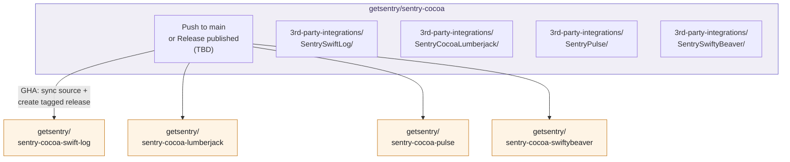

# Improve SDK Distribution — Investigation

[Project Link](https://linear.app/getsentry/project/improve-sdk-distribution-701247dc74ad)

## Problem

When a developer adds `getsentry/sentry-cocoa` via Swift Package Manager, Xcode presents **11 library targets** to choose from. Most of these are variant binary builds (dynamic, ARM64e, without UIKit) that only niche consumers need. Worse, SPM resolves _all_ binary targets on first fetch, downloading **~550 MB** of XCFramework zips regardless of which one the developer actually uses.

Separately, the SDK's **3rd-party integrations** (swift-log, CocoaLumberjack, Pulse, SwiftyBeaver) live as sub-packages inside the monorepo under `3rd-party-integrations/`. SPM requires each package to live at its own repository URL, so users currently cannot consume them as SPM dependencies at all.

Goals:

1. Slim Down Package.swift
2. Have independent repositories for 3rd-Party integrations

---

## Current State

### Package.swift targets today

| Target                                   | Type   | Linking | Size    | Action                                    |
| ---------------------------------------- | ------ | ------- | ------- | ----------------------------------------- |
| `Sentry`                                 | Binary | Static  | ~63 MB  | **MOVE** (renamed `Sentry-Static` in v10) |
| `Sentry-Dynamic`                         | Binary | Dynamic | ~130 MB | **MOVE**                                  |
| `Sentry-Dynamic-WithARM64e`              | Binary | Dynamic | ~143 MB | **MOVE**                                  |
| `Sentry-WithoutUIKitOrAppKit`            | Binary | Dynamic | ~105 MB | **MOVE**                                  |
| `Sentry-WithoutUIKitOrAppKit-WithARM64e` | Binary | Dynamic | ~115 MB | **MOVE**                                  |
| `SentryObjC-Dynamic`                     | Binary | Dynamic | ~84 MB  | **MOVE**                                  |
| `SentryObjC-Static`                      | Binary | Static  | ~42 MB  | **MOVE**                                  |
| `SentrySwiftUI`                          | Source | —       | —       | **DELETED**                               |
| `SentrySPM`                              | Source | —       | —       | **KEEP** (renamed `Sentry` in v10)        |
| `SentryObjC`                             | Source | —       | —       | **KEEP**                                  |
| `SentryDistribution`                     | Source | —       | —       | **KEEP**                                  |

> **v10 plan:**
>
> - `SentrySPM` → renamed to `Sentry` (becomes the primary target)
> - `Sentry` (static binary) → renamed to `Sentry-Static` in the binary repo
> - `SentrySwiftUI` → deleted (functionality folded into the main SDK)
> - After v10, the main `Package.swift` contains only `Sentry` (source), `SentryObjC` (source), and `SentryDistribution`

### 3rd-party integrations in the monorepo

| Sub-package             | External Dependency | Status                                                      |
| ----------------------- | ------------------- | ----------------------------------------------------------- |
| `SentrySwiftLog`        | apple/swift-log     | Source in `3rd-party-integrations/`, not consumable via SPM |
| `SentryCocoaLumberjack` | CocoaLumberjack     | Same                                                        |
| `SentryPulse`           | kean/Pulse          | Same                                                        |
| `SentrySwiftyBeaver`    | SwiftyBeaver        | Same                                                        |

---

## Goal 1 — Slim Down Package.swift

The binary target changes are breaking (removing published SPM targets) and will ship in **v10**. There is no separate v10 branch — all v10 work lands on `main` behind the v10 environment flag. This means the infrastructure and the breaking changes can all be developed and merged incrementally before the v10 release.

In **v10**:

- All 7 binary targets move to `getsentry/sentry-cocoa-binary`
- `SentrySwiftUI` is deleted (functionality folded into the main SDK)
- `SentrySPM` is renamed to `Sentry` (becomes the sole primary target)
- The current static binary `Sentry` is renamed to `Sentry-Static` in the binary repo
- `SentryObjC` (source wrapper) stays in the main repo
- The main `Package.swift` becomes source-only: `Sentry` + `SentryObjC` + `SentryDistribution`

### Where to host XCFramework assets

The binary repo's `Package.swift` can reference download URLs hosted in either location:

**Option A: URLs point at sentry-cocoa releases (Recommended)**

The XCFramework zip files remain as release assets on the main `sentry-cocoa` repo. The binary repo only contains a `Package.swift` with `.binaryTarget(url:checksum:)` entries pointing at those URLs.

- No artifact duplication (~550 MB saved per release)
- Single source of truth for binaries
- Binary repo releases are lightweight (tag + manifest only)

**Option B: Duplicate assets to binary repo**

Upload the same XCFramework zips as release assets on _both_ repos. The binary repo's `Package.swift` references its own releases.

- Self-contained — no cross-repo download dependency
- Doubles storage and upload time per release
- More moving parts in the release pipeline

### How to automate cross-repo releases

There are two approaches for creating releases in the binary and integration repos. The right choice is still an open question.

**GH workflows: GitHub Actions workflow triggered on release publish**

A workflow in `sentry-cocoa` trigger on `release: published` event and creates matching tagged releases in the binary/integration repos. Craft only handles the main `sentry-cocoa` release — downstream repos are automated independently.

- Runs in our own CI environment (not craft's)
- No additional approvals needed in `getsentry/publish`
- Simple to implement (`gh release create --repo ...`)
- Downstream releases are not tracked in Sentry's release registry

> **Open question:** Should we use craft for cross-repo releases (tracked in registry, but more approval friction in `getsentry/publish`), or use release-triggered workflows (simpler, but downstream releases live outside craft's tracking)?

### What the binary repo looks like

```swift
// sentry-cocoa-binary/Package.swift
// Auto-updated by CI on each sentry-cocoa release

let package = Package(
    name: "SentryBinary",
    products: [
        .library(name: "Sentry-Static",
                 targets: ["Sentry-Static", "SentryCppHelper"]),
        .library(name: "Sentry-Dynamic",
                 targets: ["Sentry-Dynamic"]),
        .library(name: "Sentry-Dynamic-WithARM64e",
                 targets: ["Sentry-Dynamic-WithARM64e"]),
        .library(name: "Sentry-WithoutUIKitOrAppKit",
                 targets: ["Sentry-WithoutUIKitOrAppKit", "SentryCppHelper"]),
        .library(name: "Sentry-WithoutUIKitOrAppKit-WithARM64e",
                 targets: ["Sentry-WithoutUIKitOrAppKit-WithARM64e", "SentryCppHelper"]),
        .library(name: "SentryObjC-Dynamic",
                 targets: ["SentryObjC-Dynamic"]),
        .library(name: "SentryObjC-Static",
                 targets: ["SentryObjC-Static"]),
    ],
    targets: [
        .binaryTarget(
            name: "Sentry-Static",
            url: "https://github.com/getsentry/sentry-cocoa/releases/download/10.0.0/Sentry.xcframework.zip",
            checksum: "..."
        ),
        .binaryTarget(
            name: "Sentry-Dynamic",
            url: "https://github.com/getsentry/sentry-cocoa/releases/download/10.0.0/Sentry-Dynamic.xcframework.zip",
            checksum: "..."
        ),
        // ... remaining 5 binary targets
    ]
)
```

### Test impact

Tests are **not affected** by this change. All unit tests (`make test-ios`, etc.) run through the **Xcode project** (`Sentry.xcodeproj`), which builds `Sentry.framework` from source — they never go through `Package.swift` or binary targets.

What does need updating are the **CI validation jobs** in `release.yml` that verify SPM integration with binary targets before a release:

| CI Job                  | Current behavior                                                 | Change needed                                                                         |
| ----------------------- | ---------------------------------------------------------------- | ------------------------------------------------------------------------------------- |
| `validate-spm`          | Builds sample project against static binary from `Package.swift` | Point at `sentry-cocoa-binary` repo, or drop (source target validation is sufficient) |
| `validate-spm-dynamic`  | Builds against `Sentry-Dynamic` binary target                    | Move to `sentry-cocoa-binary` CI                                                      |
| `swift-build`           | Runs `swift build` with local binary paths                       | Update for source-only `Package.swift`                                                |
| `validate-spm-visionos` | Builds against binary target for visionOS                        | Move to `sentry-cocoa-binary` CI                                                      |

### Scripts that need updating

| Script                          | Change                                                                                      |
| ------------------------------- | ------------------------------------------------------------------------------------------- |
| `scripts/update-package-sha.sh` | Also update the binary repo's `Package.swift` (clone, patch checksums + URLs, commit, push) |
| `scripts/bump.sh`               | Trigger binary repo update after main repo bump                                             |
| `scripts/prepare-package.sh`    | Remove moved binary targets from the rewrite logic                                          |
| `.github/workflows/release.yml` | Add step to update binary repo manifest, or rely on craft's second `github` target          |

---

## Goal 2 — 3rd-Party Integration Repos

Each integration sub-package under `3rd-party-integrations/` needs its own GitHub repository so users can add it as an SPM dependency. The source of truth stays in the monorepo; downstream repos are mirrors.

### Proposed repos

| Source                                          | Mirror repo                           |
| ----------------------------------------------- | ------------------------------------- |
| `3rd-party-integrations/SentrySwiftLog/`        | `getsentry/sentry-cocoa-swift-log`    |
| `3rd-party-integrations/SentryCocoaLumberjack/` | `getsentry/sentry-cocoa-lumberjack`   |
| `3rd-party-integrations/SentryPulse/`           | `getsentry/sentry-cocoa-pulse`        |
| `3rd-party-integrations/SentrySwiftyBeaver/`    | `getsentry/sentry-cocoa-swiftybeaver` |

### Sync mechanism

The source of truth stays in `3rd-party-integrations/` in the monorepo. Mirror repos need to receive source updates and tagged releases. The sync trigger is an open question:

**Option A: Sync on push to `main`**

A GHA workflow detects changes in `3rd-party-integrations/<name>/` and pushes them to the corresponding mirror repo's `main` branch. Tagged releases are created separately on each sentry-cocoa release.

- Mirror repos always reflect the latest code on `main`
- Users depending on a branch (e.g. `main`) get updates immediately
- More workflow runs (triggers on every push, even if nothing changed in that integration)

**Option B: Sync only on release**

Source sync and tagged release happen together, triggered by the sentry-cocoa `release: published` event.

- Mirror repos only update at release boundaries — cleaner history
- Fewer workflow runs
- Users can't test unreleased changes from the mirror repo

> **Open question:** Should integration mirrors sync on every push to `main` (always current, more CI churn) or only on releases (cleaner, but no pre-release access)?



## Suggested Work Breakdown

All tasks land on `main` behind the v10 environment flag. No separate branch needed.

#### New repos and release automation

| # | Task                                                                                                       | Goal         | Dependencies |
| - | ---------------------------------------------------------------------------------------------------------- | ------------ | ------------ |
| 1 | Create `getsentry/sentry-cocoa-binary` repo (empty seed)                                                   | Binary       | —            |
| 2 | Build GHA workflow: on `release: published`, create tagged release + update `Package.swift` in binary repo | Binary       | 1            |
| 3 | Create mirror repos for each 3rd-party integration                                                         | Integrations | —            |
| 4 | Build GHA workflow for integration sync (trigger TBD: push to main or release)                             | Integrations | 3            |

#### Package changes

| # | Task                                                                                                                                                  | Goal   | Dependencies |
| - | ----------------------------------------------------------------------------------------------------------------------------------------------------- | ------ | ------------ |
| 5 | Gate binary targets in `Package.swift`, `Package@swift-6.1.swift`, `Package@swift-6.2.swift` behind the v10 env flag (present in v9, excluded in v10) | Binary | 1, 2         |
| 6 | Delete `SentrySwiftUI` target/product from Package files + Xcode project + `SentrySwiftUI.xcconfig`                                                   | Binary | v10 env flag |
| 7 | Rename `SentrySPM` → `Sentry`, rename binary `Sentry` → `Sentry-Static` (when using the v10 env flag)                                                 | Binary | 5            |

#### CI and release pipeline

| #  | Task                                                                                                                                                                        | Goal | Dependencies |
| -- | --------------------------------------------------------------------------------------------------------------------------------------------------------------------------- | ---- | ------------ |
| 8  | Update `build.yml` validation jobs (`validate-spm`, `validate-spm-dynamic`, `swift-build`, `validate-spm-visionos`, `build-spm`, `build-sample-spm`, `build-sample-binary`) | CI   | 5, 6, 7      |
| 9  | Update `release.yml` (remove binary-target validation, update XCFramework upload flow)                                                                                      | CI   | 5            |
| 10 | Remove/repurpose `release-upload-xcframework.yml` and `.github/last-release-runid` (chicken-and-egg mechanism no longer needed)                                             | CI   | 5            |
| 11 | Update `api-stability.yml` — remove SentrySwiftUI API check + delete `sdk_api_sentryswiftui.json`                                                                           | CI   | 6            |
| 12 | Update `test-3rd-party-integrations.yml` — remove `prepare-package.sh` binary rewrite, build against source `Sentry` target                                                 | CI   | 5, 7         |
| 13 | Update `fast-pr-checks.yml`, `testflight.yml`, `size-analysis.yml` — remove binary target workarounds                                                                       | CI   | 5            |
| 14 | Update `.github/file-filters.yml` — remove `sdk_api_sentryswiftui.json` and stale sample paths                                                                              | CI   | 6            |

#### Scripts

| #  | Task                                                                                                                | Goal    | Dependencies |
| -- | ------------------------------------------------------------------------------------------------------------------- | ------- | ------------ |
| 15 | Update `scripts/update-package-sha.sh`, `bump.sh`, `prepare-package.sh` — remove binary target logic from main repo | Scripts | 5            |
| 16 | Update `scripts/generate_release_matrix.sh` — remove SentrySwiftUI from slice/variant matrix                        | Scripts | 6            |
| 17 | Update `scripts/update-api.sh` — remove SentrySwiftUI XCFramework build + API extraction                            | Scripts | 6            |
| 18 | Remove or move `scripts/verify-package-sha.sh` (no checksums left in main Package.swift)                            | Scripts | 5            |
| 19 | Update `Utils/VersionBump/main.swift` — version regex matches binary target URLs that no longer exist               | Scripts | 5            |

#### Sample apps

| #  | Task                                                                                                                                                         | Goal    | Dependencies |
| -- | ------------------------------------------------------------------------------------------------------------------------------------------------------------ | ------- | ------------ |
| 20 | Update all SPM sample Xcode projects to reference `Sentry` instead of `SentrySPM` (iOS/macOS/tvOS/watchOS/visionOS SwiftUI SPM samples)                      | Samples | 7            |
| 21 | Update SwiftUI samples that import `SentrySwiftUI` module — replace with main SDK import (`iOS-SwiftUI`, `macOS-SwiftUI`, `visionOS-Swift`, `iOS15-SwiftUI`) | Samples | 6            |
| 22 | Update/remove `Samples/SPM-Dynamic` (depends on `Sentry-Dynamic` product, moved to binary repo)                                                              | Samples | 5            |
| 23 | Update `Samples/macOS-SPM-CommandLine` — remove `SentrySwiftUI` dependency                                                                                   | Samples | 6            |
| 24 | Update `Samples/macOS-CLI` — remove binary vs SPM distinction                                                                                                | Samples | 5, 7         |
| 25 | Update `Samples/XCFramework-Validation` — remove `SentrySwiftUI` import/framework link                                                                       | Samples | 6            |
| 26 | Update/remove `iOS-ObjectiveC-Dynamic` and `iOS-ObjectiveC-Static` samples (depend on binary products)                                                       | Samples | 5            |

#### Makefile

| #  | Task                                                                                                    | Goal  | Dependencies |
| -- | ------------------------------------------------------------------------------------------------------- | ----- | ------------ |
| 27 | Remove `build-xcframework-swiftui` target, update `build-spm` scheme reference (`SentrySPM` → `Sentry`) | Build | 6, 7         |

#### Fastlane

| #  | Task                                                                                                                   | Goal  | Dependencies |
| -- | ---------------------------------------------------------------------------------------------------------------------- | ----- | ------------ |
| 28 | Remove `skip_package_dependencies_resolution` workaround from Fastlane lanes (no longer needed without binary targets) | Build | 5            |

#### Documentation

| #  | Task                                                                                                           | Goal | Dependencies |
| -- | -------------------------------------------------------------------------------------------------------------- | ---- | ------------ |
| 29 | Update `README.md` and `CONTRIBUTING.md` with new package URLs and target names                                | Docs | 5, 3         |
| 30 | Update [sentry-docs](https://github.com/getsentry/sentry-docs) Apple platform guides (installation, SPM setup) | Docs | 5, 3         |
| 31 | Write READMEs for binary repo and each integration mirror repo                                                 | Docs | 1, 3         |
| 32 | Write v10 migration guide (target renames, binary repo URL, SentrySwiftUI removal)                             | Docs | 5, 6, 7      |
| 33 | Update `develop-docs/` internal maintainer docs (`RELEASE.md`, `BUILD.md`, this doc)                           | Docs | 5, 9, 15     |
