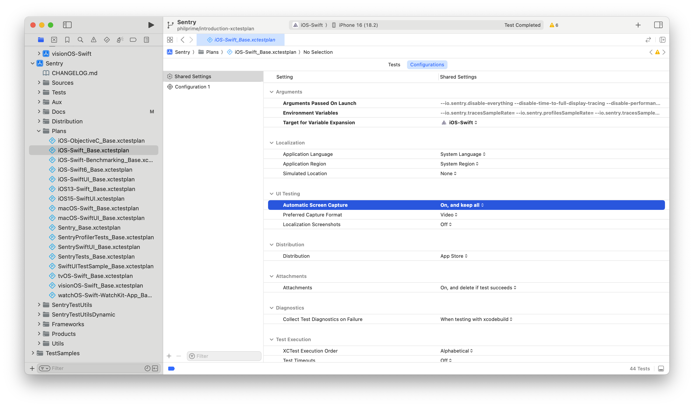
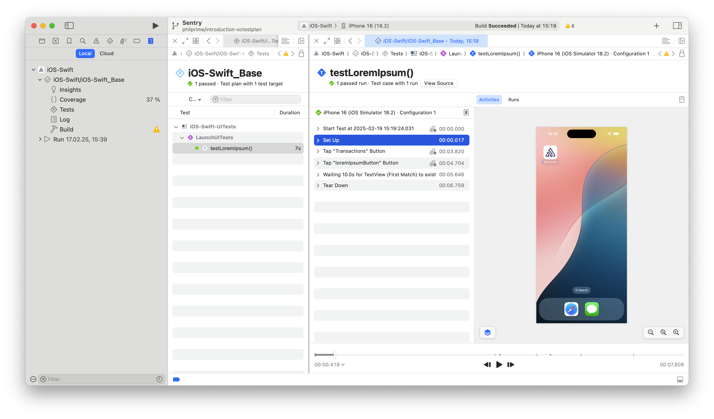

# Develop Documentation

This page contains internal documentation for development.

## Coding with Swift

To use Swift in the project take a look at [Swift Usage](Swift-Usage.md) documentation.

## Code Signing

This repository follows the [codesiging.guide](https://codesigning.guide/) in combination with [fastlane match](https://docs.fastlane.tools/actions/match/).
Therefore the sample apps use manual code signing, see [fastlane docs](https://docs.fastlane.tools/codesigning/xcode-project/):

> In most cases, fastlane will work out of the box with Xcode 9 and up if you selected manual code signing and choose a provisioning profile name for each of your targets.

### Creating new App Identifiers

E.g. if you create a new extension target, like a File Provider for iOS-Swift, make sure it has a unique bundle identifier like `io.sentry.sample.iOS-Swift.FileProvider`. Then, run the following terminal command:

```
rbenv exec bundle exec fastlane produce -u andrew.mcknight@sentry.io --skip_itc -a io.sentry.sample.iOS-Swift.FileProvider
```

You'll be prompted for an Apple Developer Portal 2FA code, and the description for the identifier; in this example, "Sentry Cocoa Sample Swift File Provider Extension".

### Creating provisioning profiles

For an existing app identifier, run the terminal command, after changing the email address in the Matchfile to your personal ADP account's:

```
rbenv exec bundle exec fastlane match development --app_identifier io.sentry.sample.iOS-Swift.FileProvider
```

You can include the `--force` option to regenerate an existing profile.

### Help

Reach out to a [CODEOWNER](https://github.com/getsentry/sentry-cocoa/blob/main/.github/CODEOWNERS) if you need access to the match git repository.

## Testing

### Unit Tests with Thread Sanitizer

CI runs the unit tests for one job with thread sanitizer enabled to detect race conditions.
To ignore false positives or known issues, use the `SENTRY_DISABLE_THREAD_SANITIZER` macro or the [suppression file](../Sources/Resources/ThreadSanitizer.sup).
It's worth noting that you can use the `$(PROJECT_DIR)` to specify the path to the suppression file.
To run the unit tests with the thread sanitizer enabled in Xcode click on edit scheme, go to tests, then open diagnostics, and enable Thread Sanitizer.
The profiler doesn't work with TSAN attached, so tests that run the profiler will be skipped.

#### Further Reading

- [ThreadSanitizerSuppressions](https://github.com/google/sanitizers/wiki/ThreadSanitizerSuppressions)
- [Running Tests with Clang's AddressSanitizer](https://pspdfkit.com/blog/2016/test-with-asan/)
- [Diagnosing Memory, Thread, and Crash Issues Early](https://developer.apple.com/documentation/xcode/diagnosing-memory-thread-and-crash-issues-early)
- [Stackoverflow: ThreadSanitizer suppression file with Xcode](https://stackoverflow.com/questions/38251409/how-can-i-suppress-thread-sanitizer-warnings-in-xcode-from-an-external-library)

### Using Xcode Test Plans

Test plans in Xcode provide a convenient way to organize and configure test execution.
They allow us to segment tests into different groups and configure specific test environments without creating additional targets or schemes.
Furthermore, test plans provide additional features such as built-in test repetition and retry on failures, automatic screen capture for debugging UI test failures, and custom test configurations for different scenarios.

Each Xcode scheme can have multiple test plans configured, but only one test plan can be marked as the default test plan.
When adding new test plans, they must also be added to the relevant schemes.

Some of the features of test plans are:

- Built-in test repetition and retry on failures
- Automatic screen capture for debugging UI test failures
- Custom test configurations for different scenarios

Additional outputs are written to the Xcode results (`.xcresult`) files, which can be found in the `~/Library/Developer/Xcode/DerivedData/.../Logs/Test/` directory.

#### Base Test Plans

We maintain "base" test plans that automatically include all new tests as they are configured by defining a list skipped tests.
This prevents tests from being accidentally excluded and provides convenience when adding new test files.

In case a test is manually marked as skipped in the test plan, it should be added to another test plan (which must also be used in the CI workflow).
When using `xcodebuild` to run tests, only the default test plan is executed unless explicitly specified with the -testPlan argument.

#### Test Plan Organization

Test plans are stored in the repository root since they are shared between sample apps and SDK targets.
This central location makes them easily accessible while maintaining the relationship between plans and schemes.

#### UI Test Recording

It is possible to record UI tests by changing the test plan configuration `Automatic Screen Capture` to `On, and keep all` or `On, and delete if test succeeds`.

After running the tests with the configuration set, it is possible to open the test results in Xcode, inspect the tests in detail by double clicking them.



The details of the test case will display the UI Test history and also display playback of the screen captures.



#### Further Resources

For more details on test plans and their capabilities, refer to:

- [WWDC21 video on Test Plans](https://developer.apple.com/videos/play/wwdc2021/10296/)
- [Apple's documentation on Test Plans](https://developer.apple.com/documentation/xcode/running-tests-and-interpreting-results)

### Test Logs

The [`SentryTestLogConfig`](https://github.com/getsentry/sentry-cocoa/blob/3a6ab6ec167d2532c024322a0a0019431275d1c1/Tests/SentryTests/TestUtils/SentryTestLogConfig.m) sets the log level to debug in `load`, so we understand what's going on during out tests.
The [`clearTestState`](https://github.com/getsentry/sentry-cocoa/blob/3a6ab6ec167d2532c024322a0a0019431275d1c1/SentryTestUtils/ClearTestState.swift#L25) method does the same, in case a test changes the log level.

### UI Tests

CI runs UI tests on simulators via the `ui-tests.yml` workflow for every PR and every commit on main.

#### Saucelabs

You can find the available devices on [their website](https://saucelabs.com/platform/supported-browsers-devices). Another way to check their available devices is to go to [live app testing](https://app.saucelabs.com/live/app-testing), go to iOS-Swift and click on choose device. This brings the full list of devices with more details.

### Test Expectations

We recommend using `XCTAssertEqual(<VALUE>, <EXPECTED VALUE>)` over `XCTAssertEqual(<EXPECTED VALUE>, <VALUE>)` for no strong reason, but to align so tests are consistent and therefore easier to read.

## Performance benchmarking

Once daily and for every PR via [Github action](../.github/workflows/benchmarking.yml), the benchmark runs in Sauce Labs, on a [high-end device](https://github.com/getsentry/sentry/blob/8986f81e19f63ee370b1649e08630c9b946c87ed/src/sentry/profiles/device.py#L43-L49) we categorize. Benchmarks run from an XCUITest (`PerformanceBenchmarks` target) using the iOS-Swift sample app, under the `iOS-Swift-Benchmarking` scheme. [`PerformanceViewController`](../Samples/iOS-Swift/iOS-Swift/ViewControllers/PerformanceViewController.swift) provides a start and stop button for controlling when the benchmarking runs, and a text field to marshal observations from within the test harness app into the test runner app. There, we assert that the P90 of all trials remains under 5%. We also print the raw results to the test runner's console logs for postprocessing into reports with `//scripts/process-benchmark-raw-results.py`.

### Test procedure

- Tap the button to start a Sentry transaction with the associated profiling.
- Run a loop performing large amount of calculations to use as much CPU as possible. This simulates something an app developer would want to profile in a real world scenario.
- While benchmarking, run a sampling profiler at 10 Hz to calculate the CPU usage of each thread, in particular the Sentry profiler's, to calculate its relative usage.
- Tap the button to stop the transaction after waiting for 15 seconds.
- Calculate the total time used by app threads and separately, the profiler's thread. Keep separated by system call and user call times.
- Write these four values as CSV into the text field accessible as an XCUIElement in the runner app.

### Test Plan

- Run the procedure 20 times, then assert that the 90th percentile remains under 5% so we can be alerted via CI if it spikes.
  - Sauce Labs allows relaxing the timeout for a suite of tests and for a `XCTestCase` subclass' collection of test case methods, but each test case in the suite must run in less than 15 minutes. 20 trials takes too long, so we split it up into multiple test cases, each running a subset of the trials.
  - This is done by dynamically generating test case methods in `SentrySDKPerformanceBenchmarkTests`, which is necessarily written in Objective-C since this is not possible to do in Swift tests. By doing this dynamically, we can easily fine tune how we split up the work to account for changes in the test duration or in constraints on how things run in Sauce Labs etc.

## Upload iOS-Swift's dSYMs with Xcode Run Script

The following script applies a patch so Xcode uploads the iOS-Swift's dSYMs to Sentry during Xcode's build phase.
Ensure to not commit the patch file after running this script, which then contains your auth token.

```sh
./scripts/upload-dsyms-with-xcode-build-phase.sh YOUR_AUTH_TOKEN
```

## Generating classes

You can use the `generate-classes.sh` to generate ViewControllers and other classes to emulate a large project. This is useful, for example, to test the performance of swizzling in a large project without having to check in thousands of lines of code.

## UIKit

Some customers would like to not link UIKit for various reasons. Either they simply may not want to use our UIKit functionality, or they actually cannot link to it in certain circumstances, like a File Provider app extension.

There are two build configurations they can use for this: `DebugWithoutUIKit` and `ReleaseWithoutUIKit`, that are essentially the same as `Debug` and `Release` with the following differences:

- They set `CLANG_MODULES_AUTOLINK` to `NO`. This avoids a load command being automatically inserted for any UIKit API that make their way into the type system during compilation of SDK sources.
- `GCC_PREPROCESSOR_DEFINITIONS` has an additional setting `SENTRY_NO_UIKIT=1`. This is now part of the definition of `SENTRY_HAS_UIKIT` in `SentryDefines.h` that is used to conditionally compile out any code that would otherwise use UIKit API and cause UIKit to be automatically linked as described above. There is another macro `SENTRY_UIKIT_AVAILABLE` defined as `SENTRY_HAS_UIKIT` used to be, meaning simply that compilation is targeting a platform where UIKit is available to be used. This is used in headers we deliver in the framework bundle to compile out declarations that rely on UIKit, and their corresponding implementations are switched over `SENTRY_HAS_UIKIT` to either provide the logic for configurations that link UIKit, or to provide a stub delivering a default value (`nil`, `0.0`, `NO` etc) and a warning log for publicly facing things like SentryOptions, or debug log for internal things like SentryDependencyContainer.

There are two jobs in `.github/workflows/build.yml` that will build each of the new configs and use `otool -L` to ensure that UIKit does not appear as a load command in the build products.

This feature is experimental and is currently not compatible with SPM.

## Logging

We have a set of macros for logging at various levels defined in SentryLog.h. These are not async-safe because they use NSLog, which takes its own lock, and aren't suitable for SentryCrash.

### SentryCrash Logging

In SentryCrash we have to use SentryAsyncSafeLog and we can't use NSLog, as it's not async-safe. Therefore, logging to the console is disabled for log messages from SentryAsyncSafeLog. You can enable it by setting `SENTRY_ASYNC_SAFE_LOG_ALSO_WRITE_TO_CONSOLE` to `1`, but you MUST NEVER commit this change. SentryAsyncSafeLog writes its messages to the file `/Caches/io.sentry/async.log`. The default log level is error. To see all log messages set `SENTRY_ASYNC_SAFE_LOG_LEVEL` in `SentryAsyncSafeLog.h` to `SENTRY_ASYNC_SAFE_LOG_LEVEL_TRACE`.

## Profiling

### Transaction profiling

The profiler runs on a dedicated thread, and on a predefined interval will enumerate all other threads and gather the backtrace on each non-idle thread.

The information is stored in deduplicated frame and stack indexed lookups for memory and transmission efficiency. These are maintained in `SentryProfilerState`.

If enabled and sampled in (controlled by `SentryOptions.profilesSampleRate` or `SentryOptions.profilesSampler`), the profiler will start along with a trace, and the profile information is sliced to the start and end of each transaction and sent with them an envelope attachments.

The profiler will automatically time out if it is not stopped within 30 seconds, and also stops automatically if the app is sent to the background.

With transaction profiling, there's only ever one profiler instance running at a time, but instances that have timed out will be kept in memory until all traces that ran concurrently with it have finished and serialized to envelopes. The associations between profiler instances and traces are maintained in `SentryProfiledTracerConcurrency`.

App launches can be automatically profiled if configured with `SentryOptions.enableAppLaunchProfiling`. If enabled, when `SentrySDK.startWithOptions` is called, `SentryLaunchProfiling.configureLaunchProfiling` will get a sample rate for traces and profiles with their respective options, and store those rates in a file to be read on the next launch. On each launch, `SentryLaunchProfiling.startLaunchProfile` checks for the presence of that file is used to decide whether to start an app launch profiled trace, and afterwards retrieves those rates to initialize a `SentryTransactionContext` and `SentryTracerConfiguration`, and provides them to a new `SentryTracer` instance, which is what actually starts the profiler. There is no hub at this time; also in the call to `SentrySDK.startWithOptions`, any current profiled launch trace is attempted to be finished, and the hub that exists by that time is provided to the `SentryTracer` instance via `SentryLaunchProfiling.stopAndTransmitLaunchProfile` so that when it needs to transmit the transaction envelope, the infrastructure is in place to do so. If TTID/TTFD tracking is also enabled, then the launch profile is stopped when the SDK detects that initial/full display have completed, instead of when `SentrySDK.startWithOptions` is called.

### Continuous profiling (beta)

With continuous profiling, there's also only ever one profiler instance running at a time. They are either started manually by customers or automatically based on active root span counts. They aren't tied to transactions otherwise so are immediately captured in envelopes when stopped.

### UI Profiling

Also referred to in implementation as continuous profiling V2. Essentially a combination of transaction-based profiling (although now focused on "root spans" instead of transactions) for the trace lifecycle and continuous profiling beta for the manual lifecycle, with the exception that manual mode also respects a configured sample rate.

The sample apps are configured by default to use UI Profiling with trace lifecycle (to override the default of manual lifecycle), traces and profile session sample rates of 1 (to override the defaults of 0), and to use app start profiling.

### Sample apps

The iOS-Swift and iOS-ObjectiveC sample apps have schema launch args and environment variables available to customize how the SDK is configured.

In iOS-Swift, these can also be modified at runtime, to help test various configurations in scenarios where using launch args and environment variables isn't possible, like TestFlight builds. Runtime overrides are set via `UserDefaults`. They interact with schema launch arguments and environment variables as follows: - Boolean flags are ORed together: if either a `true` is set in User Defaults, or a launch argument is set, then the override takes effect. - Values written to user defaults take precedence over schema environment variables by default. If you want to give precedence to schema environment vars over user defaults values, enable the launch arg `--io.sentry.schema-environment-variable-precedence`.

Note that if a key we use to write a boolean value to defaults isn't present in defaults, then UserDefaults returns `false` for the query by default. We write all environment variables as strings, so that by default, if the associated key isn't present, `UserDefaults` returns `nil` (if we directly wrote and read Floats, for example, defaults would return `0` if the key isn't present, and we'd have to do more work to disambiguate that from having overridden it to 0, for cases where 0 isn't the default we want to set in the sample app).

You can see the current override value being used in the "Features" tab.

You can also remove all stored values in user defaults by launching with `--io.sentry.wipe-data`. See `SentrySDKWrapper.swift` and `SentrySDKOverrides.swift` for usages.

Note that in-app overrides don't take effect until the app is relaunched (and not simply backgrounded and then foregrounded again). This means that if you want to test changes to launch profiling, you must change the settings, then relaunch the app for the launch profile configuration to be written to disk, and then relaunch once more for the launch profile scenario to actually be tested.

### Testing

In testing and debug environments, when a profile payload is serialized for transmission, the dictionary will also be written to a file in NSCachesDirectory that can be retrieved by a sample app. This helps with UI tests that want to verify the contents of a profile after some app interaction. See `iOS-Swift.ProfilingViewController.viewLastProfile` and `iOS-Swift-UITests.ProfilingUITests`.

## Swift and Objective-C Interoperability

When making an Objective-C class public for Swift SDK code, do the following:

- Add it to SentryPrivate.h
- Remove existing imports from any test bridging headers.
- Add the import `@_implementationOnly import _SentryPrivate` to your Swift class that wants to use
  the Objective-C class.

## Public Protocols

pod lib lint fails with the warning duplicate protocol definition when including a public header for
a protocol in a private ObjC class header, when adding that header to `SentryPrivate.h` to expose it
to internal SDK Swift code, as `SentrySDKInfo.h`. To solve this problem we have to use the
`SentryInternalSerializable` for internal classes implementing serializable.

### Detailed explanation of the Swift and Objective-C Interoperability setup

The SentrySDK uses Swift and Objective-C code. Public Objective-C classes, made public
[through the umbrella header](https://developer.apple.com/documentation/swift/importing-objective-c-into-swift#Import-Code-Within-a-Framework-Target),
are automatically visible to Swift without imports. Our umbrella header is defined in the `Sentry.modulemap`.
Accessing private Objective-C classes doesn't
work out of the box. One approach to making this work is to define a private module that contains
all the private ObjC headers. To define such a module, we added a module.modulemap file to our
project with the name _SentryPrivate. We added the prefix `_`because Xcode autocomplete seems to ignore such modules. This modulemap file points to a header called`SentryPrivate.h`, which include all private ObjC headers that should be available for Swift. When importing the generated _SentryPrivate module we have to use `@\_implementationOnly import \_SentryPrivate`.
[@_implementationOnly](https://github.com/apple/swift/blob/main/docs/ReferenceGuides/UnderscoredAttributes.md#_implementationonly) will most likely be superseded by [access level imports](https://github.com/apple/swift-evolution/blob/main/proposals/0409-access-level-on-imports.md) in a future Swift version. Not using `@\_implementationOnly` leads to errors when including the
prebuilt XCFramwork into projects, such as:

```sh
Sentry.swiftmodule/arm64-apple-ios.private.swiftinterface:10:8: error: no such module '_SentryPrivate'

import _SentryPrivate
```

Adding Objective-C classes to the \_SentryPrivate module also exposes them to test classes written in
Swift. When making an Objective-C class public to SDK Swift code, we must remove it from test
bridging headers because this can lead to compiler errors. The SentryTests only find the
\_SentryPrivate module when adding setting `HEADER_SEARCH_PATHS = $(SRCROOT)/Sources/Sentry/include/**`
which we must not set for SwiftUI, because this uses its own implementation of SentryInternal.h.
Setting the `HEADER_SEARCH_PATHS` for SwiftUI breaks the build.

See also [decision to remove SentryPrivate](./DECISIONS.md#removing-sentryprivate).

Useful resources:

- [Module Map Syntax](https://clang.llvm.org/docs/Modules.html#module-map-file)
- Sample GH Repo for [mixed Swift ObjC Framework](https://github.com/danieleggert/mixed-swift-objc-framework)
- [Swift Forum Discussion](https://forums.swift.org/t/mixing-swift-and-objective-c-in-a-framework-and-private-headers/27787/6)
- [Apple Docs: Importing Objective-C into Swift](https://developer.apple.com/documentation/swift/importing-objective-c-into-swift#Import-Code-Within-a-Framework-Target)
