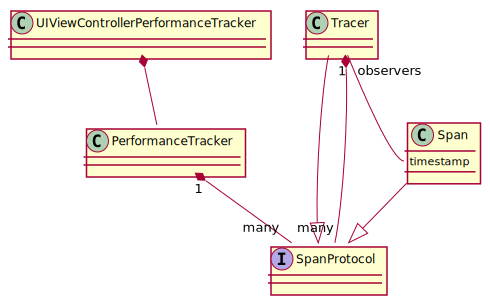
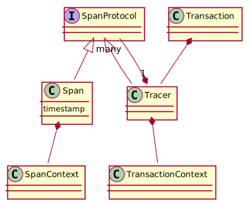

# Develop Documentation

This page contains internal documentation for development.

## Code Signing

This repository follows the [codesiging.guide](https://codesigning.guide/) in combination with [fastlane match](https://docs.fastlane.tools/actions/match/).
Therefore the sample apps use manual code signing, see [fastlane docs](https://docs.fastlane.tools/codesigning/xcode-project/):
> In most cases, fastlane will work out of the box with Xcode 9 and up if you selected manual code signing and choose a provisioning profile name for each of your targets.

Reach out to @philipphofmann if you need access to the match git repository.

## Unit Tests with Thread Sanitizer

CI runs the unit tests for one job with thread sanitizer enabled to detect race conditions.
The Test scheme of Sentry uses `TSAN_OPTIONS` to specify the [suppression file](../Tests/ThreadSanitizer.sup) to ignore false positives or known issues.
It's worth noting that you can use the `$(PROJECT_DIR)` to specify the path to the suppression file.
To run the unit tests with the thread sanitizer enabled in Xcode click on edit scheme, go to tests, then open diagnostics, and enable Thread Sanitizer.

### Further Reading

* [ThreadSanitizerSuppressions](https://github.com/google/sanitizers/wiki/ThreadSanitizerSuppressions)
* [Running Tests with Clang's AddressSanitizer](https://pspdfkit.com/blog/2016/test-with-asan/)
* [Diagnosing Memory, Thread, and Crash Issues Early](https://developer.apple.com/documentation/xcode/diagnosing-memory-thread-and-crash-issues-early)
* [Stackoverflow: ThreadSanitizer suppression file with Xcode](https://stackoverflow.com/questions/38251409/how-can-i-suppress-thread-sanitizer-warnings-in-xcode-from-an-external-library)

## UI Tests

CI runs UI tests on simulators via the `test.yml` workflow, and on devices via `saucelabs-UI-tests.yml`. All are run for each PR, and Sauce Labs tests also run on a nightly cron schedule.

### Saucelabs

You can find the available devices on [their website](https://saucelabs.com/platform/supported-browsers-devices). Another way to check their available devices is to go to [live app testing](https://app.saucelabs.com/live/app-testing), go to iOS-Swift and click on choose device. This brings the full list of devices with more details.

### Performance benchmarking

Once daily and for every PR via [Github action](../.github/workflows/benchmarking.yml), the benchmark runs in Sauce Labs, on a [high-end device](https://github.com/getsentry/sentry/blob/8986f81e19f63ee370b1649e08630c9b946c87ed/src/sentry/profiles/device.py#L43-L49) we categorize. Benchmarks run from an XCUITest (`PerformanceBenchmarks` target) using the iOS-Swift sample app, under the `iOS-Swift-Benchmarking` scheme. [`PerformanceViewController`](../Samples/iOS-Swift/iOS-Swift/ViewControllers/PerformanceViewController.swift) provides a start and stop button for controlling when the benchmarking runs, and a text field to marshal observations from within the test harness app into the test runner app. There, we assert that the P90 of all trials remains under 5%. We also print the raw results to the test runner's console logs for postprocessing into reports with `//scripts/process-benchmark-raw-results.py`.

#### Test procedure

- Tap the button to start a Sentry transaction with the associated profiling.
- Run a loop performing large amount of calculations to use as much CPU as possible. This simulates something an app developer would want to profile in a real world scenario.
- While benchmarking, run a sampling profiler at 10 Hz to calculate the CPU usage of each thread, in particular the Sentry profiler's, to calculate its relative usage.
- Tap the button to stop the transaction after waiting for 15 seconds.
- Calculate the total time used by app threads and separately, the profiler's thread. Keep separated by system call and user call times.
- Write these four values as CSV into the text field accessible as an XCUIElement in the runner app.

#### Test Plan

- Run the procedure 20 times, then assert that the 90th percentile remains under 5% so we can be alerted via CI if it spikes.
    - Sauce Labs allows relaxing the timeout for a suite of tests and for a `XCTestCase` subclass' collection of test case methods, but each test case in the suite must run in less than 15 minutes. 20 trials takes too long, so we split it up into multiple test cases, each running a subset of the trials. 
    - This is done by dynamically generating test case methods in `SentrySDKPerformanceBenchmarkTests`, which is necessarily written in Objective-C since this is not possible to do in Swift tests. By doing this dynamically, we can easily fine tune how we split up the work to account for changes in the test duration or in constraints on how things run in Sauce Labs etc.

## Auto UI Performance Class Overview



## Performance API Overview



## Generating classes

You can use the `generate-classes.sh` to generate ViewControllers and other classes to emulate a large project. This is useful, for example, to test the performance of swizzling in a large project without having to check in thousands of lines of code.

## Generating Diagrams

The diagrams are created with [PlantUml](http://plantuml.com). The advantage of PlantUml
over other diagram tools is that you describe the diagrams with text, and you don't have
to worry about UML and layout, which can be time-consuming for changes. Furthermore, the
diagrams can be stored in git.

With [Visual Studio Code](https://code.visualstudio.com/) and the
[PlantUml Plugin](https://marketplace.visualstudio.com/items?itemName=jebbs.plantuml#user-content-use-plantuml-server-as-render)
you can create diagrams, view them and export them. If you don't want to use Visual Studio Code,
there are many [alternatives](http://plantuml.com/running).

For learning the syntax and quickly playing around you can check out [Plant Text](https://www.planttext.com/).

### Visual Studio Code Setup

Visual Studio Code needs a rendering engine for PlantUml. We recommend using the following Docker image:

```sh
docker run -d -p 8080:8080 plantuml/plantuml-server:jetty
```

To ensure the rendering server is running properly, visit with `localhost:8080`.

Finally, you have to configure the rendering server in Visual Studio Code. For this, open the settings of Visual Studio Code. Choose `Extensions > PlantUML configuration`. Click on `Edit in settings.json`. Then paste the following into the config:

```json
{
  "plantuml.server": "http://localhost:8080",
  "plantuml.render": "PlantUMLServer"
}
```

Save the settings and you should be able to render a diagram.

You can find the official guide here: [configure a rendering server](https://marketplace.visualstudio.com/items?itemName=jebbs.plantuml#user-content-use-plantuml-server-as-render).

## Decision Log

### Not capturing screenshots for crashes

Date: April 21st 2022
Contributors: @philipphofmann, @brustolin

We decided against capturing screenshots for crashes because we must only call [async-safe functions](https://man7.org/linux/man-pages/man7/signal-safety.7.html) in signal handlers. Capturing a screenshot requires Objcetive-C code, which is not async safe.
We could create the crash report first, write it to disk and then call Objective-C to get the screenshot. The outcome in such a scenario would be undefined, potentially breaking other signal handlers. We decided against this approach because we don't want to break the contract of signal handlers only calling async-safe functions.

Related links:

- https://github.com/getsentry/sentry-cocoa/pull/1751

### Custom SentryHttpStatusCodeRange type instead of NSRange

Date: October 24th 2022
Contributors: @marandaneto, @brustolin and @philipphofmann

We decided not to use the `NSRange` type for the `failedRequestStatusCodes` property of the `SentryNetworkTracker` class because it's not compatible with the specification, which requires the type to be a range of `from` -> `to` integers. The `NSRange` type is a range of `location` -> `length` integers. We decided to use a custom type instead of `NSRange` to avoid confusion. The custom type is called `SentryHttpStatusCodeRange`.

### Manually installing iOS 12 simulators

Date: October 21st 2022
Contributors: @philipphofmann

GH actions will remove the macOS-10.15 image, which contains an iOS 12 simulator on 12/1/22; see https://github.com/actions/runner-images/issues/5583.
Neither the[ macOS-11](https://github.com/actions/runner-images/blob/main/images/macos/macos-11-Readme.md#installed-sdks) nor the
[macOS-12](https://github.com/actions/runner-images/blob/main/images/macos/macos-12-Readme.md#installed-sdks) image contains an iOS 12 simulator. GH
[concluded](https://github.com/actions/runner-images/issues/551#issuecomment-788822538) to not add more pre-installed simulators. SauceLabs doesn't
support running unit tests and adding another cloud solution as Firebase TestLab would increase the complexity of CI. Not running the unit tests on
iOS 12 opens a risk of introducing bugs, which has already happened in the past, especially with swizzling. Therefore, we give manually installing
the iOS 12 simulator a try.

Related to [GH-2218](https://github.com/getsentry/sentry-cocoa/issues/2218)

### Adding Swift code in the project

Date: October 1st 2022
Contributors: @brustolin

A Sentry SDK started to be [written in Swift once,](https://github.com/getsentry/raven-swift) but due to ABI not being stable at that time, it got dropped. Since then Swift 5.0 landed and we got ABI stability. We’ve considered adding Swift to our sentry.cocoa SDK since then, but because of some of the trade offs, we’ve postponed that decision.
This changed with our goal to better support SwiftUI. It’s growing in popularity and we need to write code in Swift in order to support it.
SwiftUI support will be available through an additional library, but to support it, we need to be able to demangle Swift class names in Sentry SDK, which can be done by using Swift API.
Since we support SPM, and SPM doesn't support multi-language projects, we need to create two different targets, one with Swift and another with Objective-C code. Because of that, our swift code needs to be public, so we're creating a second module called SentryPrivate, where all swift code will be, and we need an extra cocoapod library. 
With this approach, classes from SentryPrivate will not be available when users import Sentry.
We don't mind breaking changes in SentryPrivate, because this is not meant to be use by the user, we going to point this out in the docs.
