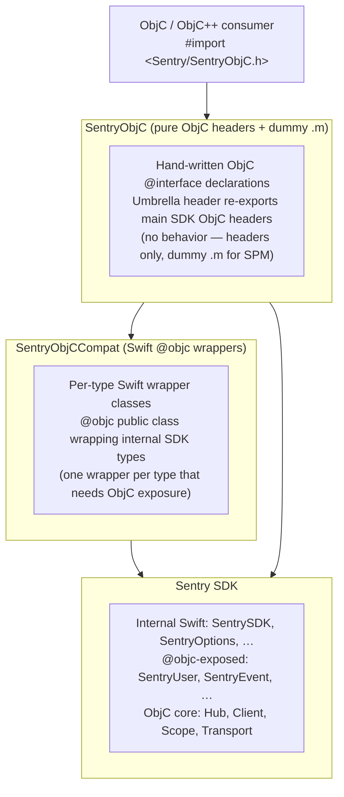

# SentryObjC Architecture

SentryObjC is a pure Objective-C wrapper around the Sentry SDK. It is the recommended Sentry integration for any Objective-C project — including those that _can_ enable Clang modules and those that cannot (e.g., ObjC++ projects with `-fmodules=NO`) — so consumers never have to deal with Swift in their headers, build configuration, or compile graph unless they explicitly want to.

This document specifies the target architecture and the design decisions that led to it. Its scope is limited to the new SentryObjC wrapper layer (the `SentryObjC` headers and `SentryObjCCompat` Swift wrappers introduced by this work); the internal architecture of the main Sentry SDK is out of scope and treated as a fixed precondition.

## Problem

Many projects cannot enable Clang modules:

- **React Native** (≤0.76): AppDelegate is `.mm` (Objective-C++), modules disabled by default
- **Haxe**: Build toolchain conflicts with `-fmodules` / `-fcxx-modules`
- **Custom build systems**: May not support module imports

With modules disabled:

- `@import Sentry` does not work (requires modules)
- `#import <Sentry/Sentry.h>` exposes only ObjC headers, not Swift APIs
- `#import <Sentry/Sentry-Swift.h>` fails with forward declaration errors in `.mm` files

This results in `SentrySDK`, `SentryOptions`, `options.sessionReplay` and other Swift-bridged APIs are unavailable from ObjC++ without modules.

Full context can be found in [getsentry/sentry-cocoa#6342](https://github.com/getsentry/sentry-cocoa/issues/6342) and [getsentry/sentry-cocoa#4543](https://github.com/getsentry/sentry-cocoa/issues/4543).

## Design Goals / Requirements

The following design goals / requirements follow from that intent:

1. The public interface must be defined as pure Objective-C. No Swift-related headers appear in the public surface, neither re-exports of a Swift module nor compiler-generated `*-Swift.h` files, and consumer translation units never need to import one to use the SDK.
2. The public Objective-C ABI must not transitively depend on the Swift SDK, nor on the Swift compiler's `@objc` emission rules. The public headers may be authored by hand or generated by a tool we control, but the surface never reflects whatever `swiftc` happens to emit in a given Swift version. This lets the internal Swift SDK refactor, rename types, and restructure freely without breaking the Objective-C SDK.
3. The conversion between Objective-C and Swift types must be statically type-checked at compile time. No sketchy runtime tricks, no KVC, no `performSelector:`, no casting roulette. Wrong types fail to build, not at runtime.
4. SentryObjC must ship through every distribution channel the main SDK supports including pre-built `.xcframework` and Swift Package Manager for all platforms supported by the main SDK.
5. In every distribution form the consumer only has to link a single SentryObjC library. The pre-built `.xcframework` embeds the bridging logic and the Swift SDK; the SPM product bundles the equivalent targets.

## Solution

A **two-target architecture**:

### The two targets

| Target             | Language     | Purpose                                                                                                                                                                         | Public ABI?                                                 |
| ------------------ | ------------ | ------------------------------------------------------------------------------------------------------------------------------------------------------------------------------- | ----------------------------------------------------------- |
| `SentryObjC`       | ObjC         | Public headers — hand-written ObjC `@interface` declarations, umbrella header re-exporting main SDK pure-ObjC headers, and a dummy `.m` file (required by SPM for ObjC targets) | Yes — composed surface (re-exports + redeclarations)        |
| `SentryObjCCompat` | Swift        | Per-type wrapper classes — each wrapper is a Swift `@objc` class that imports the internal SDK, wraps one type, and exposes it with ObjC-compatible API                         | No — internal (consumed by SentryObjC headers at link time) |
| `Sentry`           | ObjC + Swift | Core SDK — the existing Sentry codebase written in Mixed Swift / ObjC                                                                                                           | Yes (re-exported by `SentryObjC` for the pure-ObjC subset)  |

### Two dependency paths from `SentryObjC`

**Direct path** (`SentryObjC → Sentry`) — for types already ObjC-compatible in the SDK. The `SentryObjC` umbrella exposes them with no intermediate wrapper class. Two sub-mechanisms depending on the type's source language:

- **Pure-ObjC types in main SDK** (e.g., `SentryUser`, `SentryEvent`, `SentryBreadcrumb`, `SentryScope`, `SentryAttachment`, ~30 others): the umbrella re-exports the main SDK's header directly via `<Sentry/X.h>`. The Headers build phase copies the file into `SentryObjC.framework/Headers/`. Single source of truth lives in `Sources/Sentry/Public/`.
- **Swift `@objc` classes with ObjC-compatible API** (e.g., `SentryOptions`, `SentryLogger`, `SentryFeedback`, `SentryReplayOptions`, `SentryExperimentalOptions`, `SentryAttribute`, `SentryLog`, `SentryEnvelope*`): the Swift class is annotated `@objc(SentryX)` so its runtime name is the plain `SentryX`. `SentryObjC/Public/SentryX.h` declares a hand-written `@interface SentryX : NSObject` that resolves to the Swift class at link time. No `@compatibility_alias` machinery, no Swift-mangled names in the public headers.
- **`SentryObjCSDK`** is a special case: it delegates to `SentryObjCCompat` wrappers. It uses a different name than the Swift `SentrySDK` to avoid duplicate ObjC class registration when both `SentryObjC.framework` and the embedded `Sentry.framework` are loaded.

**Wrapper path** (`SentryObjC → SentryObjCCompat → Sentry`) — for Swift-only internal types that don't naturally bridge to ObjC.

- Examples: metrics API, logger API, replay API, `SentryAttributeContent` (Swift enum with associated values)
- Each type gets a dedicated Swift wrapper class in `SentryObjCCompat` that imports the internal SDK and exposes an ObjC-compatible interface.
- The SentryObjC headers declare `@interface` forward declarations that resolve to these wrapper classes at link time.

## SentryObjC — headers and dummy `.m`

`SentryObjC` contains only:

- **Hand-written ObjC headers** (`Sources/SentryObjC/Public/`): `@interface` declarations for types exposed to ObjC consumers. These resolve at link time to either main SDK classes (direct path) or `SentryObjCCompat` wrapper classes (wrapper path).
- **Umbrella header** (`SentryObjC.h`): re-exports ~32 pure-ObjC types from the main SDK via `__has_include(<Sentry/...>)` and includes all wrapper type headers.
- **Dummy `.m` file**: SPM requires at least one source file for ObjC targets. This file is empty and exists solely to satisfy that requirement.

There is no behavior in this target. All logic lives either in the main SDK (direct path) or in `SentryObjCCompat` wrappers (wrapper path).

## SentryObjCCompat — per-type Swift wrappers

Each type that needs ObjC exposure but cannot be directly bridged gets a dedicated wrapper class in `SentryObjCCompat`. Each wrapper:

1. Is a Swift `@objc` class (e.g., `@objc(SentryObjCMetricsApi) public class SentryObjCMetricsApi: NSObject`).
2. Imports the internal `Sentry` module to access SDK internals.
3. Wraps one SDK type, exposing its API through ObjC-compatible methods and properties.
4. Performs any necessary type mapping (e.g., Swift enums with associated values to ObjC-compatible properties).

The wrapper classes are not imported directly by ObjC code. Instead, `SentryObjC` headers declare matching `@interface` forward declarations that resolve to the wrapper's `@objc` class at link time.

## Naming convention

Two naming patterns coexist; which to use depends on whether the underlying type bridges naturally to ObjC:

### Same name (direct-path types)

When the underlying type already has an ObjC-compatible runtime presence, the public ObjC name is the same as the SDK's name. There is **no separate wrapper class**; `SentryObjC` exposes the type via one of two mechanisms (see "Two dependency paths"):

- **Pure-ObjC main SDK types** (`SentryUser`, `SentryEvent`, `SentryScope`, ...) — re-exported from `Sources/Sentry/Public/`, single declaration shared between SDKs.
- **Swift `@objc` classes** (`SentryOptions`, `SentryLogger`, ...) — the Swift class is `@objc(SentryX)` so the runtime symbol is the plain name; the public ObjC `@interface` is hand-written in `Sources/SentryObjC/Public/`. Exception: `SentryObjCSDK` uses a distinct name from Swift's `SentrySDK` to avoid duplicate class registration.

**Why it works for ObjC consumers without modules:** in both sub-cases the consumer's translation unit only ever sees ObjC headers. No `*-Swift.h` is involved, no `@import` is required, and the runtime class resolves to a single definition (either main SDK's `@implementation` or the Swift `@objc(SentryX)` class) at link time.

### `SentryObjC*` prefix (wrapper types)

When a public ObjC type has a **differently-shaped Swift counterpart** (typically: Swift enum with associated values, struct, generic type), prefix the public ObjC name:

- Internal Swift `SentryAttributeContent` (enum with associated values) -> Public ObjC wrapper `SentryObjCAttributeContent` (class with typed properties)

**Why it's necessary:** the wrapper file imports both `Sentry` (internal) and exposes a public `@objc` class. If both the internal type and the wrapper used the same name, every reference would need disambiguating. Distinct names eliminate the ambiguity and make the wrapper code read linearly.

**Rule of thumb:** if the wrapper has to construct one side from the other, the two sides have different shapes — use the `SentryObjC*` prefix on the public ObjC side.

## Stability contract

`SentryObjC` headers are the **public ABI anchor**. They are stable: additions are welcome, but only non-breaking changes are allowed — breaking changes require a major version bump of the `SentryObjC-*` xcframeworks. The following invariants hold:

1. **`SentryObjC` headers depend only on `Foundation`.** No `SentrySwift`, no internal SDK imports. If a header starts needing the SDK, the logic belongs in a `SentryObjCCompat` wrapper, not the header.
2. **All headers are hand-written.** No Swift `@objc` classes, no compiler-generated `-Swift.h` inclusions in the public surface.
3. **Any PR touching `Sources/SentryObjC/Public/` is a public API change** — subject to changelog entry, CODEOWNERS review, and (eventually) automated API-diff gating.
4. **Breaking changes require a major version bump** of the `SentryObjC-*` xcframeworks.

This boundary is what makes the "internal Swift refactors freely" goal safe: a change to internal Swift types affects only the `SentryObjCCompat` wrapper code, never the public ObjC ABI, because the public ABI lives in a different target that doesn't depend on Swift.

## Design decisions

### Why two targets instead of one?

SPM does not support mixed ObjC/Swift sources in a single target. The ObjC headers need to live in a pure-ObjC target (`SentryObjC`), while the Swift wrapper implementations need their own Swift target (`SentryObjCCompat`). This separation also enforces a clean boundary: public headers never import Swift, and wrapper implementations have full access to the SDK's Swift internals.

### Why per-type wrappers instead of a central bridge class?

An earlier iteration used a single `SentryObjCBridge` class with `@objc` static methods that all ObjC facade `.m` files would forward-declare and call. This had several drawbacks:

- The bridge class grew into a monolithic file touching every SDK subsystem.
- Each `.m` facade file needed hand-written forward declarations of bridge methods.
- Adding a new API required changes in three places: the bridge, the facade `.m`, and the public header.

Per-type wrappers in `SentryObjCCompat` keep each type's ObjC exposure self-contained. The wrapper class is the `@objc` implementation that the public header resolves to at link time — no intermediate facade `.m` needed for wrapper-path types.

### Why not define the types as Swift `@objc` classes and re-export them?

Considered and rejected. Defining public ObjC types as Swift `@objc` classes and "re-exporting" them via `*-Swift.h` from the `SentryObjC` umbrella would hand control of the public ObjC ABI to `swiftc`'s emission rules:

- Nullability, method naming, designated-init patterns, factory methods, `NS_SWIFT_NAME`/`NS_REFINED_FOR_SWIFT` all governed by compiler behavior that has shifted across Swift versions.
- The public surface becomes a build artifact, not a source file — harder to review, diff, gate.
- Headerdoc (`@param`, `@return`, `@c`) expresses poorly through Swift -> generated ObjC.
- Cascades `-Swift.h` imports into every consumer of `SentryObjC.h`, which is exactly what the current no-modules posture exists to avoid.

Hand-written ObjC headers in `SentryObjC` preserve the stable public ABI goal.

### Why `@objc(SentryX)` instead of `@compatibility_alias`?

An earlier iteration of this work used `@compatibility_alias` in every public header to map the plain ObjC class name (e.g., `SentryOptions`) to the Swift-mangled runtime name (`_TtC6Sentry13SentryOptions`). Each header had a `#if SWIFT_PACKAGE`/`#else` block emitting two distinct mangled names depending on whether the SDK was built via SPM (module name `SentrySwift`) or Xcode (module name `Sentry`). This worked but had real costs:

- Brittle to Swift's name-mangling rules — any change to `swiftc`'s `@objc` emission could silently break the alias.
- Verbose and easy to drift — every Swift `@objc` class needed a matching alias header, and the mangled-name strings had to be edited by hand.
- The public surface mentioned compiler-internal symbols (`_TtC...`), which leaked the Swift origin into the ObjC ABI.

Annotating the Swift class with `@objc(SentryX)` makes the runtime name explicit on the source side, so the public ObjC `@interface` resolves to it directly without an alias hop. The mangled name is no longer a load-bearing part of the ABI. See commit `cf4d8d570` for the full removal.

### Why re-export main SDK headers instead of redeclaring them?

Pure-ObjC types like `SentryUser`, `SentryEvent`, `SentryScope` already have stable ObjC declarations in `Sources/Sentry/Public/`. An earlier iteration redeclared each in `Sources/SentryObjC/Public/`, which created a parallel set of declarations that drifted in nullability syntax, docs, and `NS_SWIFT_NAME` annotations. Two declarations of the same runtime class is a drift surface that bites silently — the compiler accepts both, the runtime only cares about the implementation, and discrepancies in things like documented nullability never surface as build errors.

Re-exporting the main SDK's headers via `SentryObjC.h`'s `__has_include(<Sentry/...>)` block (with quoted fallback for SPM compile-from-source) collapses the two declarations into one. The `SentryObjC` framework's Headers build phase copies the headers into `SentryObjC.framework/Headers/`, so the framework's surface is unchanged from the consumer's perspective. See commit `cba25e6cf` for the bulk migration of 32 such types.

### Why embed the full SDK in the xcframeworks?

Embedding the full SDK in `SentryObjC-*.xcframework` (vs. depending on `Sentry.xcframework`) provides:

- Single framework to link.
- No transitive dependency management.
- No risk of version mismatches between wrapper and SDK.

## Current state

The two-target architecture described above is implemented. `Sources/SentryObjC/Public/` contains:

- The umbrella `SentryObjC.h` with an `__has_include(<Sentry/...>)` block re-exporting ~32 pure-ObjC types from the main SDK.
- Hand-written `@interface` declarations for Swift `@objc` classes and `SentryObjCCompat` wrapper types.
- Protocol facades and SentryObjC-specific types (`SentryMetricsApi`, `SentrySpan`, `SentryTransactionNameSource`, `SentryFeedbackSource`, `SentryLogLevel`).

`Sources/SentryObjCCompat/` contains per-type Swift wrapper classes that expose ObjC-incompatible SDK types (metrics API, logger API, replay API, attribute content, etc.) through `@objc` interfaces.

### Known gaps

- **Drift detection between `SentryObjC` redeclarations and the Swift `@objc` emission** is not yet automated. A CI script that compares clang-AST extracts of the public ObjC surface against `swift-api-digester` output would catch additions/removals/signature changes on Swift `@objc` classes that the hand-written headers haven't tracked. See [Issue #6342](https://github.com/getsentry/sentry-cocoa/issues/6342) for context.
- **The `-Swift.h` boundary** (no Swift-emitted artifact in the SentryObjC framework) is currently a property of the codebase rather than an enforced invariant. A CI guardrail compiling `SentryObjC.h` with `-fmodules=NO` and asserting no `*-Swift.h` appears in the transitive include graph would lock it in.

## Out of scope

- The internal architecture of the main `Sentry` SDK — treated as an existing precondition. Only the SentryObjC wrapper layer is covered here.
- Changes to the main `Sentry` SDK's public ObjC surface — only the new `SentryObjC-*` wrapper is in scope.
- SentrySwiftUI support (requires Swift/SwiftUI).
- Hybrid SDK bridges (React Native, Flutter use their own wrappers).

## Related

- [Issue #6342](https://github.com/getsentry/sentry-cocoa/issues/6342) — original feature request
- [Issue #4543](https://github.com/getsentry/sentry-cocoa/issues/4543) — problem documentation
- `Samples/iOS-ObjectiveCpp-NoModules/` — sample app demonstrating usage
