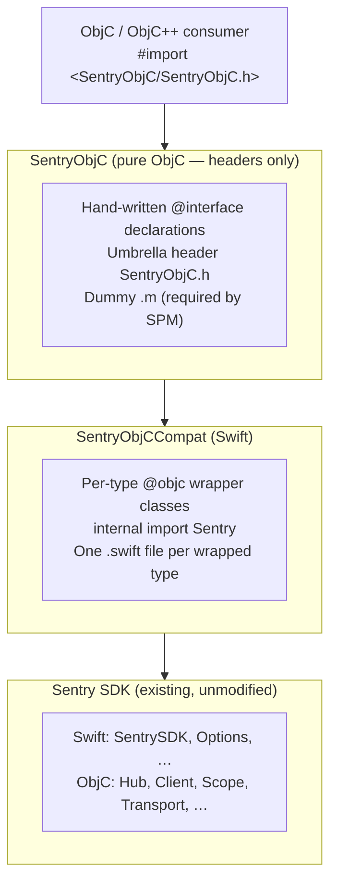

# SentryObjC Architecture

SentryObjC is a pure Objective-C wrapper around the Sentry SDK. It is the recommended Sentry integration for any Objective-C project — including those that _can_ enable Clang modules and those that cannot (e.g., ObjC++ projects with `-fmodules=NO`) — so consumers never have to deal with Swift in their headers, build configuration, or compile graph unless they explicitly want to.

This document specifies the target architecture and the design decisions that led to it. Its scope is limited to the SentryObjC wrapper layer (the `SentryObjC` headers and `SentryObjCCompat` Swift wrappers); the internal architecture of the main Sentry SDK is out of scope and treated as a fixed precondition.

## Problem

Many projects cannot enable Clang modules:

- **React Native** (≤0.76): AppDelegate is `.mm` (Objective-C++), modules disabled by default
- **Haxe**: Build toolchain conflicts with `-fmodules` / `-fcxx-modules`
- **Custom build systems**: May not support module imports

With modules disabled:

- `@import Sentry` does not work (requires modules)
- `#import <Sentry/Sentry.h>` exposes only ObjC headers, not Swift APIs
- `#import <Sentry/Sentry-Swift.h>` fails with forward declaration errors in `.mm` files

This results in `SentrySDK`, `SentryOptions`, `options.sessionReplay` and other Swift-bridged APIs being unavailable from ObjC++ without modules.

Full context can be found in [getsentry/sentry-cocoa#6342](https://github.com/getsentry/sentry-cocoa/issues/6342) and [getsentry/sentry-cocoa#4543](https://github.com/getsentry/sentry-cocoa/issues/4543).

## Design Goals

1. **Pure Objective-C public interface.** No Swift-related headers appear in the public surface, neither re-exports of a Swift module nor compiler-generated `*-Swift.h` files. Consumer translation units never need to import one.
2. **ABI independence from Swift compiler.** The public ObjC ABI must not transitively depend on the Swift compiler's `@objc` emission rules. Hand-written headers mean the internal Swift SDK can refactor, rename types, and restructure freely without breaking the ObjC SDK.
3. **Static type safety.** The conversion between ObjC and Swift types is statically type-checked at compile time. No KVC, no `performSelector:`, no casting roulette. Wrong types fail to build, not at runtime.
4. **All distribution channels.** SentryObjC must ship through every channel the main SDK supports: pre-built `.xcframework` and Swift Package Manager for all platforms.
5. **Single library to link.** In every distribution form the consumer links one `SentryObjC` library. The pre-built `.xcframework` embeds the wrapper and the Swift SDK; the SPM product bundles the equivalent targets.
6. **No changes to existing SDK.** The wrapper is purely additive — it does not modify the existing Sentry SDK code, public API, or build configuration. The main SDK's existing ObjC and Swift consumers are unaffected.

## Non-Goals

- Replacing the existing Sentry SDK for Swift consumers. `SentryObjC` is an alternative entry point, not a replacement.
- Wrapping SentrySwiftUI (requires Swift/SwiftUI — consumers who can use SwiftUI can use the Swift SDK directly).
- Replacing hybrid SDK bridges (React Native, Flutter, .NET, Unity have their own wrapper layers).
- Providing a 1:1 mirror of every internal SDK type. Only the public API surface that ObjC consumers need is wrapped.

## Solution

A **two-target architecture** where every SDK type exposed to ObjC consumers gets a dedicated `SentryObjC*`-prefixed wrapper:



### The two targets

| Target             | Language | Purpose                                                                             | Public?                              |
| ------------------ | -------- | ----------------------------------------------------------------------------------- | ------------------------------------ |
| `SentryObjC`       | ObjC     | Hand-written `@interface` declarations + umbrella header + dummy `.m`. No behavior. | Yes — this is the public ABI         |
| `SentryObjCCompat` | Swift    | Per-type wrapper classes. Each wraps one SDK type using `internal import`.          | No — internal, consumed at link time |

### How it works

1. **`SentryObjC`** contains only hand-written ObjC headers. Each header declares an `@interface SentryObjCFoo : NSObject` with the properties and methods that ObjC consumers see. A dummy `.m` file exists solely because SPM requires at least one source file for ObjC targets. There is no behavior in this target.

2. **`SentryObjCCompat`** contains one Swift file per wrapped type. Each file defines a `@objc(SentryObjCFoo) public final class SentryObjCFoo: NSObject` that:
   - Uses `internal import Sentry` (or `SentrySwift` under SPM) so no SDK types leak into the module's public interface.
   - Holds a `wrapped` property referencing the real SDK type.
   - Exposes ObjC-compatible properties and methods that delegate to `wrapped`.

3. **At link time**, the ObjC `@interface SentryObjCFoo` declared in the header resolves to the Swift `@objc(SentryObjCFoo)` class in `SentryObjCCompat`. The consumer's translation unit only ever sees ObjC headers — no `-Swift.h`, no `@import`.

### SPM dependency chain

```
SentryObjC → SentryObjCCompat → SentryObjCInternal (compiles all ObjC/C/Swift from main SDK)
```

The `SentryObjCInternal` target compiles the full main SDK from source. It is named "Internal" to reserve "SentryObjC" for the public wrapper product.

## Wrapper pattern

Every wrapped type follows the same structure:

**Header** (`Sources/SentryObjC/Public/SentryObjCFoo.h`):

```objc
@interface SentryObjCFoo : NSObject
@property (nonatomic, copy, nullable) NSString *name;
- (instancetype)init;
@end
```

**Wrapper** (`Sources/SentryObjCCompat/SentryObjCFoo.swift`):

```swift
@objc(SentryObjCFoo) public final class SentryObjCFoo: NSObject {
    internal let wrapped: Foo

    internal init(_ wrapped: Foo) {
        self.wrapped = wrapped
    }

    @objc public override init() {
        self.wrapped = Foo()
    }

    @objc public var name: String? {
        get { wrapped.name }
        set { wrapped.name = newValue }
    }
}
```

### Type categories

Different SDK types require slightly different wrapper strategies:

| SDK type shape                       | Wrapper strategy                                                                                          | Example                                                        |
| ------------------------------------ | --------------------------------------------------------------------------------------------------------- | -------------------------------------------------------------- |
| Class with properties                | `internal let wrapped: X`, delegate get/set                                                               | `SentryObjCUser` wrapping `User`                               |
| Protocol                             | `internal let wrapped: any P`, delegate methods                                                           | `SentryObjCSpan` wrapping `any Span`                           |
| Swift struct                         | `internal let wrapped: Box<X>`, delegate get/set (see [Boxing](#boxing-resilient-value-types))            | `SentryObjCInternalSdkApi` wrapping `SentryInternalSdkApi`     |
| Swift enum with associated values    | `internal let wrapped: Box<X>`, factory methods + accessors (see [Boxing](#boxing-resilient-value-types)) | `SentryObjCAttributeContent` wrapping `SentryAttributeContent` |
| ObjC enum (`NS_ENUM`)                | Mirror as `@objc public enum`, convert via `rawValue`                                                     | `SentryObjCLevel` mirroring `SentryLevel`                      |
| Callback-heavy class (e.g., Options) | Wrap callbacks to convert wrapper types at boundaries                                                     | `SentryObjCOptions` wrapping `Options`                         |
| Static API class                     | Static methods that wrap inputs/outputs                                                                   | `SentryObjCSDK` wrapping `SentrySDK`                           |

### Boxing resilient value types

Under `-enable-library-evolution` (`BUILD_LIBRARY_FOR_DISTRIBUTION=YES`), the Swift compiler treats cross-module value types (structs, enums) as **resilient** — their in-memory size is unknown at compile time. On x86_64, this prevents the compiler from emitting a static `_OBJC_CLASS_$_` symbol for any `@objc` class that stores such a value directly as an ivar. The result: the class symbol is present on arm64 but missing on x86_64, causing the `validate-xcframework-symbols.sh` check to fail.

**Fix:** Wrap the resilient stored property in `Box<T>` (defined in `Sources/SentryObjCCompat/Box.swift`):

```swift
// Before — breaks on x86_64
@objc(SentryObjCFoo) public final class SentryObjCFoo: NSObject {
    internal let wrapped: FooStruct          // resilient, unknown layout
}

// After — works on all architectures
@objc(SentryObjCFoo) public final class SentryObjCFoo: NSObject {
    internal let wrapped: Box<FooStruct>     // pointer-sized, known layout

    internal init(_ wrapped: FooStruct) {
        self.wrapped = Box(wrapped)
    }

    @objc public var name: String { wrapped.value.name }
}
```

**When to apply:** Any wrapper class whose `wrapped` property holds a cross-module `struct` or `enum` (i.e., types defined in the `Sentry`/`SentrySwift` module, not in `SentryObjCCompat` itself). Wrappers around SDK `class` types do not need boxing — classes are already pointer-sized.

### Callback wrapping

When SDK types use callbacks that accept/return SDK types, the wrapper intercepts the callback to convert at the boundary:

```swift
// In SentryObjCOptions
@objc public var beforeSend: ((SentryObjCEvent) -> SentryObjCEvent?)? {
    didSet {
        if let beforeSend = beforeSend {
            wrapped.beforeSend = { event in
                guard let result = beforeSend(SentryObjCEvent(event)) else { return nil }
                return result.wrapped
            }
        } else {
            wrapped.beforeSend = nil
        }
    }
}
```

This ensures consumers always work with `SentryObjC*` types in their callbacks.

## Naming convention

All public types use the **`SentryObjC`** prefix uniformly: `SentryObjCSDK`, `SentryObjCOptions`, `SentryObjCUser`, `SentryObjCEvent`, `SentryObjCScope`, etc.

**Why a uniform prefix instead of sharing names with the main SDK:**

- **No ambiguity.** When both the main SDK and the wrapper are linked (which is always the case), distinct names prevent duplicate ObjC class registration.
- **Simpler wrapper code.** Each wrapper file uses `internal import Sentry` and references the SDK type by its short name (e.g., `User`, `Event`). If the wrapper class had the same name, every reference would need module-qualified disambiguation.
- **Explicit boundary.** Consumers can tell at a glance that they are using the ObjC wrapper API, not the Swift SDK directly.
- **Follows ObjC conventions.** Apple's [Objective-C conventions](https://developer.apple.com/library/archive/documentation/Cocoa/Conceptual/ProgrammingWithObjectiveC/Conventions/Conventions.html) recommend three-letter prefixes for custom classes; `SentryObjC` serves the same purpose for this wrapper layer.

## Stability contract

`Sources/SentryObjC/Public/` is the **public ABI anchor**. The following invariants hold:

1. **Headers depend only on `Foundation`.** No `SentrySwift`, no internal SDK imports, no `-Swift.h`. If a header starts needing the SDK, the logic belongs in a `SentryObjCCompat` wrapper.
2. **All headers are hand-written.** The public surface is never a compiler-generated artifact.
3. **Any PR touching `Sources/SentryObjC/Public/` is a public API change** — subject to changelog entry, CODEOWNERS review, and API-diff gating via `sdk_api_objc.json`.
4. **Additions only.** Breaking changes require a major version bump of the `SentryObjC-*` xcframeworks.

This boundary is what makes the "internal Swift refactors freely" goal safe: renaming or restructuring internal SDK types affects only `SentryObjCCompat` wrappers, never the public ObjC headers.

## Platform-conditional compilation

Some APIs are only available on certain platforms (e.g., session replay on iOS/tvOS, feedback on iOS, profiler excluding watchOS/tvOS/visionOS). Both the header and the wrapper must use matching `#if` / `#if canImport` guards:

**Header:**

```objc
#if SENTRY_OBJC_REPLAY_SUPPORTED
@property (class, nonatomic, readonly) SentryObjCReplayApi *replay;
#endif
```

**Wrapper:**

```swift
#if canImport(UIKit) && !SENTRY_NO_UI_FRAMEWORK && (os(iOS) || os(tvOS))
@objc public static var replay: SentryObjCReplayApi {
    SentryObjCReplayApi(SentrySDK.replay)
}
#endif
```

Platform macros are defined in `SentryObjCDefines.h` and shared across all headers.

## Design decisions

### Why two targets instead of one?

SPM does not support mixed ObjC/Swift sources in a single target. The ObjC headers need to live in a pure-ObjC target (`SentryObjC`), while the Swift wrapper implementations need their own Swift target (`SentryObjCCompat`). This separation also enforces a clean boundary: public headers never import Swift, and wrapper implementations have full access to the SDK's Swift internals via `internal import`.

### Why per-type wrappers instead of a central bridge class?

An earlier iteration used a single `SentryObjCBridge` class with `@objc` static methods that ObjC facade `.m` files would forward-declare and call. This had several drawbacks:

- The bridge class grew into a monolithic file touching every SDK subsystem.
- Each `.m` facade file needed hand-written forward declarations of bridge methods.
- Adding a new API required changes in three places: the bridge, the facade `.m`, and the public header.

Per-type wrappers keep each type's ObjC exposure self-contained. Adding a new wrapped type means adding one `.h` and one `.swift` file — no other files need to change.

### Why wrap everything instead of re-exporting main SDK headers?

An earlier iteration re-exported pure-ObjC headers from the main SDK (e.g., `SentryUser.h`, `SentryEvent.h`) directly through the `SentryObjC` umbrella, avoiding wrapper classes for ~30 types. This was rejected because:

- **Dual-registration risk.** When both `Sentry.framework` and `SentryObjC.framework` are loaded, re-exporting the same `@interface SentryUser` from both frameworks causes duplicate class warnings or link errors depending on the build configuration.
- **Mixed naming.** Some types would be `SentryUser` (re-exported) while others would be `SentryObjCMetricsApi` (wrapped). Consumers would need to know which prefix to use for each type, and the boundary would shift as the SDK evolves.
- **Drift surface.** For Swift `@objc` classes re-exported with hand-written headers (e.g., `SentryOptions`), the header and the Swift class had to stay in sync manually. Discrepancies in nullability, method naming, or parameter types would compile but fail at runtime.
- **Blocked future SDK evolution.** Re-exporting ties the ObjC wrapper's ABI to the main SDK's ObjC surface. If the main SDK drops `@objc` from a type or changes its ObjC name, the wrapper breaks.

Wrapping everything with a uniform `SentryObjC*` prefix eliminates all four problems. The main SDK can evolve its ObjC surface freely; only the `SentryObjCCompat` wrapper code needs to track changes.

### Why not define the types as Swift `@objc` classes and re-export them?

Considered and rejected. Defining public ObjC types as Swift `@objc` classes and "re-exporting" them via `*-Swift.h` from the `SentryObjC` umbrella would hand control of the public ObjC ABI to `swiftc`'s emission rules:

- Nullability, method naming, designated-init patterns, factory methods all governed by compiler behavior that has shifted across Swift versions.
- The public surface becomes a build artifact, not a source file — harder to review, diff, gate.
- Headerdoc (`@param`, `@return`, `@c`) expresses poorly through Swift-generated ObjC headers.
- Cascades `-Swift.h` imports into every consumer of `SentryObjC.h`, which is exactly what the no-modules posture exists to avoid.

Hand-written ObjC headers preserve the stable public ABI goal.

### Why `internal import`?

`SentryObjCCompat` uses `internal import Sentry` (Swift 6 feature) so that none of the SDK's types appear in `SentryObjCCompat`'s public module interface. This means:

- Consumers of `SentryObjC` never see `Sentry` types in autocompletion or headers.
- The wrapper's public API is exactly what the hand-written headers declare — nothing more.
- The main SDK remains an implementation detail of the wrapper.

### Why embed the full SDK in the xcframeworks?

Embedding the full SDK in `SentryObjC-*.xcframework` (vs. depending on `Sentry.xcframework`) provides:

- Single framework to link.
- No transitive dependency management.
- No risk of version mismatches between wrapper and SDK.

## File layout

```
Sources/
├── SentryObjC/
│   ├── Public/
│   │   ├── SentryObjC.h              # Umbrella header
│   │   ├── SentryObjCDefines.h       # Platform macros
│   │   ├── SentryObjCSDK.h           # Entry point
│   │   ├── SentryObjCOptions.h       # Configuration
│   │   ├── SentryObjCUser.h          # Data types
│   │   ├── SentryObjCEvent.h
│   │   ├── SentryObjCScope.h
│   │   ├── SentryObjCSpan.h
│   │   ├── SentryObjCMetricsApi.h    # API surfaces
│   │   ├── SentryObjCReplayApi.h
│   │   ├── SentryObjCFeedbackApi.h
│   │   ├── SentryObjCLevel.h         # Enums
│   │   └── …                         # (~60 headers total)
│   ├── SentryObjCDummy.m             # Empty — satisfies SPM
│   └── Info.plist
├── SentryObjCCompat/
│   ├── SentryObjCSDK.swift           # One .swift per wrapped type
│   ├── SentryObjCOptions.swift
│   ├── SentryObjCUser.swift
│   ├── SentryObjCEvent.swift
│   ├── SentryObjCScope.swift
│   ├── SentryObjCSpan.swift
│   ├── SentryObjCMetricsApi.swift
│   ├── SentryObjCLevel.swift
│   └── …                             # (~60 wrappers total)
```

## Adding a new wrapped type

1. **Create the header** in `Sources/SentryObjC/Public/SentryObjCFoo.h` — declare the `@interface` with ObjC-compatible types only.
2. **Create the wrapper** in `Sources/SentryObjCCompat/SentryObjCFoo.swift` — implement the `@objc(SentryObjCFoo)` class delegating to the SDK type.
3. **Add the import** to `Sources/SentryObjC/Public/SentryObjC.h` — place it in the appropriate section (enums, leaf types, composite types, etc.).
4. **Add tests** in `Tests/SentryObjCTests/SentryObjCFooTests.m` (ObjC integration test) and optionally `Tests/SentryObjCCompatTests/` (Swift unit test for complex mapping logic).
5. **Regenerate API surface** — run `make generate-public-api` and commit the updated `sdk_api_objc.json`.

## Known gaps

- **Drift detection** between `SentryObjC` headers and `SentryObjCCompat` wrappers is partially automated via `sdk_api_objc.json` / `sdk_api_objccompat.json` diffing, but does not yet catch all categories of drift (e.g., nullability mismatches between header declarations and wrapper implementations).
- **The `-Swift.h` boundary** (no Swift-emitted artifact in the SentryObjC framework) is currently a property of the codebase rather than an enforced invariant. A CI guardrail compiling `SentryObjC.h` with `-fmodules=NO` and asserting no `*-Swift.h` appears in the transitive include graph would lock it in.

## Related

- [Issue #6342](https://github.com/getsentry/sentry-cocoa/issues/6342) — original feature request
- [Issue #4543](https://github.com/getsentry/sentry-cocoa/issues/4543) — problem documentation
- `Samples/iOS-ObjectiveCpp-NoModules/` — sample app demonstrating usage
