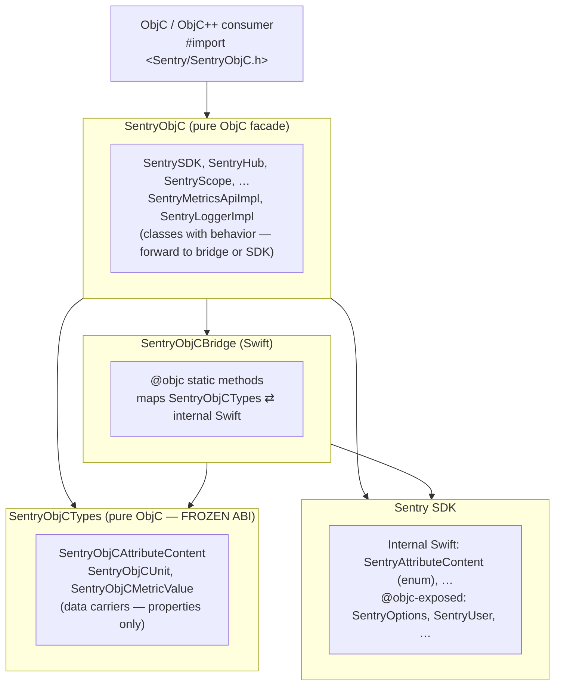

# SentryObjC Architecture

SentryObjC is a pure Objective-C wrapper around the Sentry SDK, designed for consumers who cannot use Clang modules (e.g., ObjC++ projects with `-fmodules=NO`).

This document specifies the target architecture. It is the design artifact from which the implementation plan is derived — see the "Migration" section at the end for the delta against the current codebase.

## Problem

Many projects cannot enable Clang modules:

- **React Native** (≤0.76): AppDelegate is `.mm` (Objective-C++), modules disabled by default
- **Haxe**: Build toolchain conflicts with `-fmodules` / `-fcxx-modules`
- **Custom build systems**: May not support module imports

With modules disabled:

- `@import Sentry` does not work (requires modules)
- `#import <Sentry/Sentry.h>` exposes only ObjC headers, not Swift APIs
- `#import <Sentry/Sentry-Swift.h>` fails with forward declaration errors in `.mm` files

**Result:** `SentrySDK`, `SentryOptions`, `options.sessionReplay` and other Swift-bridged APIs are unavailable from ObjC++ without modules.

## Design goals

1. **Pure ObjC public API** — consumers never import a Swift-generated header.
2. **Frozen public ABI** — the public ObjC surface is hand-written, not compiler-generated, and does not shift when internal Swift types evolve.
3. **Internal Swift SDK can migrate freely** — Swift-only constructs (enums with associated values, generics, protocols with Self requirements) can be introduced or refactored in the internal SDK without breaking the public ObjC contract.
4. **Statically typed bridge** — the bridge translates between public ObjC types and internal Swift types using compile-time type checking, not KVC / `performSelector:` / `Any` downcasts.

## Solution

A **four-tier architecture**:



### The four targets

| Target             | Language     | Purpose                                                                | Public ABI?                                    |
| ------------------ | ------------ | ---------------------------------------------------------------------- | ---------------------------------------------- |
| `SentryObjC`       | ObjC         | Facade / behavior — classes with methods that forward to bridge or SDK | Yes — but delegates types to `SentryObjCTypes` |
| `SentryObjCBridge` | Swift        | Mapping layer — converts between `SentryObjCTypes` and internal Swift  | No — internal                                  |
| `SentryObjCTypes`  | ObjC         | Data carriers — value-type-like public ObjC classes the bridge reads   | **Yes — frozen**                               |
| `Sentry`           | ObjC + Swift | Core SDK — the existing Sentry codebase                                | Yes (for direct-path types)                    |

### Two dependency paths from `SentryObjC`

**Direct path** (`SentryObjC → Sentry`) — for types already ObjC-compatible in the SDK. `SentryObjC` holds a thin wrapper that delegates to the underlying `@objc` SDK class.

- Examples: `SentryOptions`, `SentryUser`, `SentryEvent`, `SentryBreadcrumb`, `SentryHub`, `SentryScope`
- No bridge hop needed; the SDK class is already `@objc` and has a stable ObjC interface.

**Bridge path** (`SentryObjC → SentryObjCBridge → Sentry`) — for Swift-only internal types.

- Examples: metrics API, logger API, replay API, `SentryAttributeContent` (Swift enum with associated values)
- The bridge converts public ObjC values (from `SentryObjCTypes`) into Swift internal values.

**Shared upstream** (`SentryObjCTypes`) — any public ObjC type the bridge needs to read fields off of lives here, so both `SentryObjC` and `SentryObjCBridge` import the same authoritative declaration.

## Type placement rules

The rule for which target a type belongs in:

### `SentryObjCTypes` — data carriers

A type belongs here when the bridge needs to **statically read its fields** to map it to an internal Swift type.

Characteristics:

- Value-type-like ObjC class: properties, no behavior beyond trivial getters/setters.
- Hand-written `.h/.m`, pure ObjC, depends only on `Foundation`.
- No references to internal SDK types, no Swift imports.
- Frozen ABI — changes require deliberate public API review.

Examples:

- `SentryObjCAttributeContent` (mirrors the internal Swift `SentryAttributeContent` enum)
- `SentryObjCUnit`
- `SentryObjCMetricValue`
- Enums used in bridge signatures: `SentryObjCAttributeContentType`, etc.

### `SentryObjC` — behavior / facades

A type belongs here when it is a **class the consumer invokes** and its methods either forward to `SentryObjCBridge` or call into the `@objc` SDK directly.

Characteristics:

- Has methods with real behavior (dispatch, delegation, state management).
- May hold a reference to an internal SDK object (wrapper pattern).
- Can import `SentryObjCTypes` to accept data carriers as arguments.
- Can import `Sentry` (direct path) or `SentryObjCBridge` (bridge path).

Examples:

- `SentrySDK`, `SentryHub`, `SentryScope`, `SentryClient`
- API entry-point implementations: `SentryMetricsApiImpl`, `SentryLoggerImpl`, `SentryReplayApiImpl`

### Mental model

```
SentryObjCTypes  = "nouns" the bridge reads     — data
SentryObjC       = "verbs" the consumer invokes — behavior
SentryObjCBridge = the translator              — mapping
Sentry           = the real work               — SDK
```

### Borderline cases

- **Consumer-facing class whose methods all forward to Swift** (e.g., a hypothetical `SentryObjCScope`): the class is behavior → stays in `SentryObjC`. Any data types its methods accept go in `SentryObjCTypes`.
- **Config / options objects**: if bridged (bridge reads fields), goes in `SentryObjCTypes`. If directly wrapping an `@objc` SDK class, stays in `SentryObjC`.
- **Enums**: if referenced in a bridge `@objc` signature, must be in `SentryObjCTypes`. Otherwise either target.

## Naming convention

Two naming patterns coexist; which to use depends on whether the Swift-side type shares a name:

### Same name (direct-path wrappers)

When a public ObjC type is a thin wrapper around an `@objc`-exposed SDK class, reuse the SDK name:

- `SentryObjC.SentryOptions` wraps `Sentry.SentryOptions`
- `SentryObjC.SentryUser` wraps `Sentry.SentryUser`

**Why it works:** standalone xcframeworks (`SentryObjC-Static`, `SentryObjC-Dynamic`) ship the wrapper alone, so consumers never see both definitions in the same link unit. The Xcode project builds the wrapper as a separate framework target to avoid module collisions at compile time (see "Why four Xcode targets").

### `SentryObjC*` prefix (bridged data carriers)

When a public ObjC type has a **differently-shaped Swift counterpart** (typically: Swift enum with associated values, struct, generic type), prefix the public ObjC name:

- Internal Swift `SentryAttributeContent` (enum with associated values) ↔ Public ObjC `SentryObjCAttributeContent` (class with typed properties)

**Why it's necessary:** the bridge file imports both `SentrySwift` (internal) and `SentryObjCTypes` (public). If both declare `SentryAttributeContent`, every reference in the bridge needs disambiguating `typealias` gymnastics. Distinct names eliminate the ambiguity and make the bridge code read linearly.

**Rule of thumb:** if the bridge has to construct one side from the other, the two sides have different shapes — use the `SentryObjC*` prefix on the public ObjC side.

## Stability contract

`SentryObjCTypes` is the **frozen public ABI anchor**. The following invariants hold:

1. **`SentryObjCTypes` depends only on `Foundation`.** No `SentrySwift`, no `SentryObjCInternal`, no `Sentry`. If a type here starts needing the SDK, the logic belongs in the bridge, not the type.
2. **All headers are hand-written.** No Swift `@objc` classes, no compiler-generated `-Swift.h` inclusions in the public surface.
3. **Any PR touching `Sources/SentryObjCTypes/Public/` is a public API change** — subject to changelog entry, CODEOWNERS review, and (eventually) automated API-diff gating.
4. **Breaking changes require a major version bump** of the `SentryObjC-*` xcframeworks.

This boundary is what makes the "internal Swift refactors freely" goal safe: a change to `Sources/Swift/Protocol/SentryAttributeContent.swift` (for example, renaming cases or adding associated values) affects only the bridge's mapping code, never the public ObjC ABI, because the public ABI lives in a different target that doesn't depend on Swift.

## Bridge mapping

The bridge is a Swift target with `@objc` static methods. Each method:

1. Takes arguments typed as `SentryObjCTypes` classes (no `[String: Any]`, no KVC).
2. Maps those arguments into internal Swift types.
3. Dispatches to the Swift SDK.
4. (If returning) maps the result back to `SentryObjCTypes`.

### Example — `SentryObjCAttributeContent` → internal `SentryAttributeContent`

```swift
import Foundation
import SentryObjCTypes
#if SWIFT_PACKAGE
import SentrySwift
#else
import Sentry
#endif

@objc(SentryObjCBridge)
public final class SentrySwiftBridge: NSObject {
    @objc public static func metricsCount(
        key: String,
        value: UInt,
        attributes: [String: SentryObjCAttributeContent]
    ) {
        SentrySDK.metrics.count(
            key: key,
            value: value,
            attributes: attributes.mapValues { $0.toSwift() }
        )
    }
}

extension SentryObjCAttributeContent {
    func toSwift() -> SentryAttributeValue {
        switch type {
        case .string:       return .string(stringValue ?? "")
        case .boolean:      return .boolean(booleanValue)
        case .integer:      return .integer(integerValue)
        case .double:       return .double(doubleValue)
        case .stringArray:  return .stringArray(stringArrayValue ?? [])
        case .booleanArray: return .booleanArray((booleanArrayValue ?? []).map(\.boolValue))
        case .integerArray: return .integerArray((integerArrayValue ?? []).map(\.intValue))
        case .doubleArray:  return .doubleArray((doubleArrayValue ?? []).map(\.doubleValue))
        }
    }
}
```

No KVC, no `as? Bool`, no `NSNumber`-to-`Bool` platform-dependent bridging. The compiler verifies every field access.

### Forward-declaration pattern in `SentryObjC.m`

`SentryObjC`'s `.m` files continue to forward-declare `SentryObjCBridge`:

```objc
// In SentryMetricsApiImpl.m
@class SentryObjCAttributeContent;   // from SentryObjCTypes umbrella

@interface SentryObjCBridge : NSObject
+ (void)metricsCountWithKey:(NSString *)key
                      value:(NSUInteger)value
                 attributes:(NSDictionary<NSString *, SentryObjCAttributeContent *> *)attributes;
@end
```

This keeps the current no-`-Swift.h`-in-ObjC approach: the `.m` sees `SentryObjCAttributeContent` via the `SentryObjCTypes` header (pure ObjC), and the bridge class via a hand-written `@interface` forward declaration. No Swift-generated header is imported by ObjC code.

## Source layout

```
Sources/
├── SentryObjCTypes/              # NEW — frozen public ABI
│   └── Public/
│       ├── SentryObjCAttributeContent.h
│       ├── SentryObjCAttributeContent.m
│       ├── SentryObjCUnit.h
│       ├── SentryObjCUnit.m
│       ├── SentryObjCMetricValue.h
│       ├── SentryObjCMetricValue.m
│       └── …
├── SentryObjCBridge/
│   └── SentryObjCBridge.swift    # @objc bridge methods, imports SentryObjCTypes + SentrySwift
├── SentryObjC/
│   ├── Public/
│   │   ├── SentryObjC.h          # Umbrella — re-imports SentryObjCTypes headers
│   │   ├── SentrySDK.h
│   │   ├── SentryOptions.h
│   │   ├── SentryUser.h
│   │   └── …
│   ├── SentrySDK.m
│   ├── SentryOptions.m
│   ├── SentryMetricsApiImpl.h
│   ├── SentryMetricsApiImpl.m    # forward-declares SentryObjCBridge, imports SentryObjCTypes
│   └── …
```

### Umbrella re-exposure

`Sources/SentryObjC/Public/SentryObjC.h` re-imports data-carrier headers so consumers see the entire public surface via a single `#import <Sentry/SentryObjC.h>`:

```objc
// Facade types (owned by SentryObjC target)
#import "SentrySDK.h"
#import "SentryOptions.h"
// …

// Data carriers (owned by SentryObjCTypes — re-exposed transparently)
#import <SentryObjCTypes/SentryObjCAttributeContent.h>
#import <SentryObjCTypes/SentryObjCUnit.h>
#import <SentryObjCTypes/SentryObjCMetricValue.h>
// …
```

Consumers do not need to know `SentryObjCTypes` exists as a separate target.

## SPM structure

```swift
.target(
    name: "SentryObjCTypes",
    path: "Sources/SentryObjCTypes",
    publicHeadersPath: "Public"
),
.target(
    name: "SentryObjCBridge",
    dependencies: [
        "SentryObjCTypes",     // public data carriers it maps FROM
        "SentrySwift",         // internal Swift SDK it maps TO
    ],
    path: "Sources/SentryObjCBridge",
    swiftSettings: [
        .unsafeFlags(["-enable-library-evolution"])
    ]
),
.target(
    name: "SentryObjC",
    dependencies: [
        "SentryObjCTypes",     // re-exposes in umbrella; .m files reference types
        "SentryObjCBridge",    // calls bridge methods from .m files
        "SentryObjCInternal",  // direct-path access to @objc SDK types
    ],
    path: "Sources/SentryObjC",
    publicHeadersPath: "Public"
)
```

The `SentryObjC` SPM product bundles all four source targets:

```swift
.library(
    name: "SentryObjC",
    targets: ["SentryObjCInternal", "SentryObjCTypes", "SentryObjCBridge", "SentryObjC"]
)
```

## Xcode project structure

Four framework targets in `Sentry.xcodeproj`, mirroring SPM:

| Target             | Type      | Sources                        | Dependencies                                                                  |
| ------------------ | --------- | ------------------------------ | ----------------------------------------------------------------------------- |
| `Sentry`           | Framework | `Sources/Sentry/`, `Swift/`, … | System frameworks                                                             |
| `SentryObjCTypes`  | Framework | `Sources/SentryObjCTypes/`     | System frameworks                                                             |
| `SentryObjCBridge` | Framework | `Sources/SentryObjCBridge/`    | `Sentry.framework`, `SentryObjCTypes.framework`                               |
| `SentryObjC`       | Framework | `Sources/SentryObjC/`          | `Sentry.framework`, `SentryObjCBridge.framework`, `SentryObjCTypes.framework` |

## Distribution

### SPM

```swift
.library(
    name: "SentryObjC",
    targets: ["SentryObjCInternal", "SentryObjCTypes", "SentryObjCBridge", "SentryObjC"]
)
```

### XCFramework

Two xcframework variants ship each release, both bundling wrapper + bridge + types + full SDK into a single framework binary:

- `SentryObjC-Static.xcframework` — libtool-merged static archive as framework binary; consumer links symbols directly.
- `SentryObjC-Dynamic.xcframework` — merged archive re-linked as a dylib via `swiftc` (which embeds the Swift runtime); consumer embeds the framework.

Build steps (`scripts/build-xcframework-sentryobjc-standalone.sh` — to be updated):

1. Build `Sentry`, `SentryObjCTypes`, `SentryObjCBridge`, and `SentryObjC` as static libraries via `xcodebuild`.
2. Merge all four `.a` archives into one with `libtool -static`.
3. Static slice: copy the merged archive in as the framework binary.
4. Dynamic slice: re-link with `swiftc -emit-library -force_load` per architecture, `lipo` into a fat binary.
5. Copy SentryObjC **and SentryObjCTypes** public headers and the Xcode-generated module map into each framework bundle.
6. Assemble both xcframeworks with `xcodebuild -create-xcframework`.

Properties:

- All platforms: iOS, macOS, Catalyst, tvOS, watchOS, visionOS
- Pure ObjC public headers (no `Sentry-Swift.h`)
- One binary per slice containing types + wrapper + bridge + full SDK (+ Swift runtime in the dynamic variant)

#### XCFramework structure

```
SentryObjC-Dynamic.xcframework/      (same layout for SentryObjC-Static.xcframework)
├── Info.plist
├── ios-arm64/
│   └── SentryObjC.framework/
│       ├── SentryObjC (binary)
│       ├── Info.plist
│       ├── Headers/
│       │   ├── SentryObjC.h          # umbrella
│       │   ├── SentrySDK.h           # facade types
│       │   ├── SentryOptions.h
│       │   ├── SentryObjCAttributeContent.h   # data carriers
│       │   ├── SentryObjCUnit.h
│       │   └── …
│       └── Modules/
│           └── module.modulemap
├── ios-arm64_x86_64-simulator/
├── ios-arm64_x86_64-maccatalyst/
├── macos-arm64_x86_64/
├── tvos-arm64/
├── tvos-arm64_x86_64-simulator/
├── watchos-arm64_arm64_32_armv7k/
├── watchos-arm64_x86_64-simulator/
├── xros-arm64/
└── xros-arm64_x86_64-simulator/
```

All public headers (facade + data carriers) live flat in the framework's `Headers/` directory. The fact that they originate from two different source targets is erased at framework-assembly time.

#### Module map

Xcode auto-generates the framework module map. No checked-in source modulemap overrides it.

```
framework module SentryObjC {
    umbrella header "SentryObjC.h"
    export *
    module * { export * }
}
```

No Swift module exposed — pure ObjC only.

## Usage

```objc
// In .mm file with CLANG_ENABLE_MODULES=NO
#import <SentryObjC/SentryObjC.h>

[SentrySDK startWithConfigureOptions:^(SentryOptions *options) {
    options.dsn = @"https://...";
    options.debug = YES;
    options.tracesSampleRate = @1.0;

    // Swift-bridged APIs work via the bridge tier
    options.sessionReplay.sessionSampleRate = 0;
    options.sessionReplay.onErrorSampleRate = 1;
}];

// Data carrier types from the frozen ABI tier
NSDictionary<NSString *, SentryObjCAttributeContent *> *attrs = @{
    @"plan":    [SentryObjCAttributeContent stringWithValue:@"pro"],
    @"active":  [SentryObjCAttributeContent booleanWithValue:YES],
    @"count":   [SentryObjCAttributeContent integerWithValue:42],
};
[SentrySDK.metrics countWithKey:@"user.login" value:1 attributes:attrs];
```

The consumer sees a single import (`<SentryObjC/SentryObjC.h>`) and a consistent pure-ObjC surface. The four-tier structure is invisible.

## Building

```bash
# Build for iOS simulator (development)
make build-sentryobjc

# Build full xcframework (all platforms)
make build-sentryobjc-xcframework

# Test SPM build
make build-sample-iOS-ObjectiveCpp-NoModules
```

### Build scripts

```
scripts/build-xcframework-local.sh (SentryObjCOnly variant)
    ├── build-xcframework-variant.sh → Sentry (staticlib, reused from StaticOnly)
    ├── build-xcframework-variant.sh → SentryObjCTypes (staticlib)       # NEW
    ├── build-xcframework-variant.sh → SentryObjCBridge (staticlib)
    ├── build-xcframework-variant.sh → SentryObjC (staticlib)
    └── build-xcframework-sentryobjc-standalone.sh
        ├── libtool -static (merge all four)                             # CHANGED
        ├── swiftc -emit-library -force_load (link per arch)
        ├── lipo -create (merge archs)
        └── assemble-xcframework.sh
```

## Design decisions

### Why four tiers instead of three?

The earlier three-tier design (`SentryObjC` → `SentryObjCBridge` → `Sentry`) forced the bridge to accept `[String: Any]` and use KVC to read fields off ObjC objects, because the ObjC data classes lived in `SentryObjC` — _downstream_ of the bridge, unreachable by import.

Consequences of KVC:

- `NSNumber → Bool` bridging is platform-dependent (works on arm64 where `BOOL` is `bool`; broken on Intel macOS where `BOOL` is `signed char` and `NSNumber` is wrapped via `+numberWithChar:` instead of `+numberWithBool:`).
- Silent field drops via `compactMapValues` — no compile-time guarantee that the bridge reads existing properties.
- Refactoring public ObjC types doesn't trigger bridge compile errors — drift is invisible.

Introducing `SentryObjCTypes` as a **shared upstream** of both the bridge and the facade eliminates all three problems at once. Type checking is static, the bridge holds references by concrete type, and refactors of the public ABI immediately surface in bridge code.

### Why not define the types as Swift `@objc` classes in the bridge?

Considered and rejected. Defining public ObjC types as Swift `@objc` classes in `SentryObjCBridge` and "re-exporting" them via `#import <SentryObjCBridge/SentryObjCBridge-Swift.h>` from the `SentryObjC` umbrella would kill the KVC — but hands control of the public ObjC ABI to `swiftc`'s emission rules:

- Nullability, method naming, designated-init patterns, factory methods, `NS_SWIFT_NAME`/`NS_REFINED_FOR_SWIFT` all governed by compiler behavior that has shifted across Swift versions.
- The public surface becomes a build artifact, not a source file — harder to review, diff, gate.
- Headerdoc (`@param`, `@return`, `@c`) expresses poorly through Swift → generated ObjC.
- Cascades `-Swift.h` imports into every consumer of `SentryObjC.h`, which is exactly what the current no-modules posture exists to avoid.

Hand-written ObjC in `SentryObjCTypes` preserves the "frozen public ABI" goal at the cost of one extra SPM/Xcode target.

### Why two naming conventions (same name vs. `SentryObjC*` prefix)?

See "Naming convention". Short version: same name when there's no naming collision at the bridge (direct-path wrappers); `SentryObjC*` prefix when the public ObjC type and internal Swift type coexist in the bridge's import graph.

### Why embed the full SDK in the xcframeworks?

Embedding the full SDK in `SentryObjC-*.xcframework` (vs. depending on `Sentry.xcframework`) provides:

- Single framework to link.
- No transitive dependency management.
- No risk of version mismatches between wrapper and SDK.

### Why four Xcode targets?

Each target is a separate framework to avoid module conflicts. If `SentryObjCBridge` (Swift) were compiled into the `SentryObjC` framework, Swift code inside would see both the `SentryObjC` framework module and the `Sentry` framework module redeclaring the same ObjC types (e.g., `SentryOptions`), causing ambiguity errors. Separating the bridge into its own framework keeps each module's symbol set disjoint.

`SentryObjCTypes` being a separate framework target gives the type headers a stable origin (`<SentryObjCTypes/Foo.h>`) and lets the stability contract be enforced at the target boundary rather than by convention.

## Migration (delta from current state)

The current codebase has the three-tier `SentryObjC → SentryObjCBridge → Sentry` structure, with public ObjC data types (`SentryAttributeContent`, etc.) living in `SentryObjC` and the bridge using KVC.

The implementation plan (to be written separately) covers:

1. **Add `SentryObjCTypes` target** — new directory, new SPM target, new Xcode framework target, new podspec subspec if applicable.
2. **Relocate + rename data-carrier types** — move `SentryAttributeContent.{h,m}` to `Sources/SentryObjCTypes/Public/` and rename to `SentryObjCAttributeContent.{h,m}`. Apply the same treatment to other data-carrier types identified during the audit (candidates: `SentryUnit`, `SentryMetricValue`, `SentryRedactRegionType`).
3. **Update `SentryObjCBridge.swift`** — drop the `SDKAttributeContent` typealias, drop KVC, accept typed `[String: SentryObjCAttributeContent]`, implement `toSwift()` extension.
4. **Update `SentryObjC`'s .m files** — forward-declare `SentryObjCBridge` with typed parameters, `#import <SentryObjCTypes/...>` for data-carrier types.
5. **Update `SentryObjC.h` umbrella** — re-import `SentryObjCTypes` public headers so consumers see the single entry point unchanged.
6. **Update xcframework build scripts** — add the new target to the merge step; ensure headers are copied.
7. **Update tests** — `Tests/SentryObjCTests`, `Samples/iOS-ObjectiveCpp-NoModules` reference the renamed types.
8. **Audit remaining public ObjC types** — classify each file in `Sources/SentryObjC/Public/` as data carrier (move) or facade (stays) per the placement rules, and migrate in follow-up PRs if the scope is large.

The refactor is ABI-breaking on any type that gets the `SentryObjC*` prefix rename. Given the `SentryObjC` wrapper SDK is still pre-GA (branch `philprime/objc-wrapper-sdk-6342`, unreleased), the rename is safe now and costly later.

## Out of scope

- SentrySwiftUI support (requires Swift/SwiftUI).
- Hybrid SDK bridges (React Native, Flutter use their own wrappers).
- Changes to the main `Sentry` SDK's public ObjC surface — only the new `SentryObjC-*` wrapper is in scope.

## Related

- [Issue #6342](https://github.com/getsentry/sentry-cocoa/issues/6342) — original feature request
- [Issue #4543](https://github.com/getsentry/sentry-cocoa/issues/4543) — problem documentation
- `Samples/iOS-ObjectiveCpp-NoModules/` — sample app demonstrating usage
