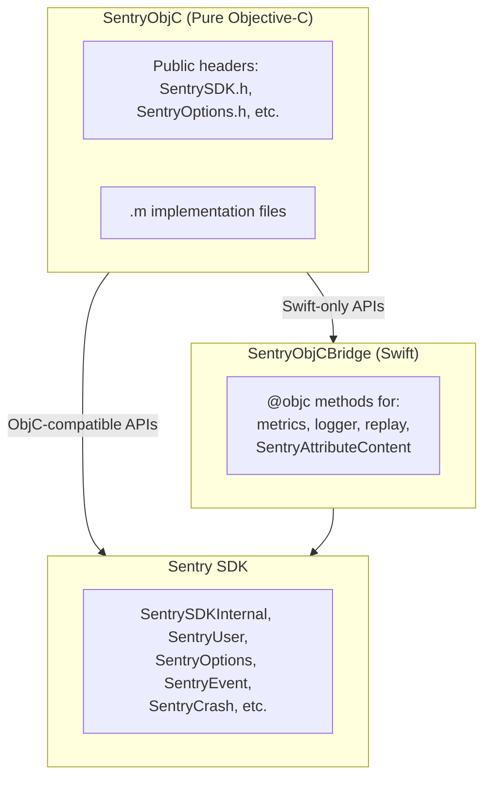

# SentryObjC Architecture

SentryObjC is a pure Objective-C wrapper around the Sentry SDK, designed for consumers who cannot use Clang modules (e.g., ObjC++ projects with `-fmodules=NO`).

## Problem

Many projects cannot enable Clang modules:

- **React Native** (≤0.76): AppDelegate is `.mm` (Objective-C++), modules disabled by default
- **Haxe**: Build toolchain conflicts with `-fmodules` / `-fcxx-modules`
- **Custom build systems**: May not support module imports

With modules disabled:

- `@import Sentry` does not work (requires modules)
- `#import <Sentry/Sentry.h>` exposes only ObjC headers, not Swift APIs
- `#import <Sentry/Sentry-Swift.h>` fails with forward declaration errors in `.mm` files

**Result:** `SentrySDK`, `SentryOptions`, `options.sessionReplay` and other Swift-bridged APIs are unavailable from ObjC++ without modules.

## Solution

SentryObjC provides a three-tier architecture with two dependency paths:



### Two Dependency Paths

**Direct path (SentryObjC → Sentry):** For ObjC-compatible types already exposed in the SDK:

- `SentrySDKInternal` (ObjC class wrapping the real `SentrySDK`)
- `SentryOptions`, `SentryUser`, `SentryEvent`, `SentryBreadcrumb`, etc.
- Any Swift class with `@objc` exposure

**Bridge path (SentryObjC → SentryObjCBridge → Sentry):** For Swift-only APIs that need bridging:

- `SentrySDK.metrics` (Swift protocol type)
- `SentrySDK.logger` (Swift Logger API)
- `SentrySDK.replay` (Swift Replay API)
- `SentryAttributeContent` (Swift enum with associated values)

The bridge converts Swift-only constructs (protocols, enums with payloads, generics) into `@objc`-callable methods that pure ObjC can invoke.

## Type Architecture

SentryObjC defines its own types that mirror the main SDK:

| SentryObjC Type    | Wraps                   |
| ------------------ | ----------------------- |
| `SentrySDK`        | Real `SentrySDK`        |
| `SentryOptions`    | Real `SentryOptions`    |
| `SentryUser`       | Real `SentryUser`       |
| `SentryBreadcrumb` | Real `SentryBreadcrumb` |
| `SentryScope`      | Real `SentryScope`      |
| ...                | ...                     |

Each wrapper type:

1. Is a complete `@interface` definition (pure ObjC, no Swift imports)
2. Holds an internal reference to the real SDK type
3. Exposes the same properties/methods
4. Calls the real SDK directly for ObjC-compatible APIs
5. Uses `SentryObjCBridge` only for Swift-only APIs (metrics, logger, replay)

## Source Layout

```
Sources/
├── SentryObjC/
│   ├── Public/
│   │   ├── SentryObjC.h          # Umbrella header
│   │   ├── SentrySDK.h           # @interface SentrySDK
│   │   ├── SentryOptions.h       # @interface SentryOptions
│   │   ├── SentryUser.h          # @interface SentryUser
│   │   └── ...                   # All public types
│   ├── SentrySDK.m               # Implementation
│   ├── SentryOptions.m
│   └── ...
├── SentryObjCBridge/
│   └── SentryObjCBridge.swift    # @objc bridge methods
```

## Xcode Project Structure

Three framework targets in `Sentry.xcodeproj`:

| Target             | Type      | Sources                          | Dependencies                                 |
| ------------------ | --------- | -------------------------------- | -------------------------------------------- |
| `Sentry`           | Framework | `Sources/Sentry/`, `Swift/`, etc | System frameworks                            |
| `SentryObjCBridge` | Framework | `Sources/SentryObjCBridge/`      | Sentry.framework                             |
| `SentryObjC`       | Framework | `Sources/SentryObjC/`            | SentryObjCBridge.framework, Sentry.framework |

This mirrors the SPM target structure exactly.

## Distribution

### SPM

The `SentryObjC` product in `Package.swift` includes all three tiers:

```swift
.library(name: "SentryObjC", targets: ["SentryObjCInternal", "SentryObjCBridge", "SentryObjC"])
```

### XCFramework

`SentryObjC.xcframework` bundles everything into a single framework:

- All platforms: iOS, macOS, Catalyst, tvOS, watchOS, visionOS
- Pure ObjC public headers (no `Sentry-Swift.h`)
- Single binary containing wrapper + bridge + full SDK

#### XCFramework Structure

```
SentryObjC.xcframework/
├── Info.plist
├── ios-arm64/
│   └── SentryObjC.framework/
│       ├── SentryObjC (binary)
│       ├── Info.plist
│       ├── Headers/
│       │   ├── SentryObjC.h (umbrella)
│       │   ├── SentrySDK.h
│       │   ├── SentryOptions.h
│       │   └── ... (pure ObjC headers)
│       └── Modules/
│           └── module.modulemap
├── ios-arm64_x86_64-simulator/
├── ios-arm64_x86_64-maccatalyst/
├── macos-arm64_x86_64/
├── tvos-arm64/
├── tvos-arm64_x86_64-simulator/
├── watchos-arm64_arm64_32_armv7k/
├── watchos-arm64_x86_64-simulator/
├── xros-arm64/
└── xros-arm64_x86_64-simulator/
```

#### Module Map

```
framework module SentryObjC {
    umbrella header "SentryObjC.h"
    export *
    module * { export * }
}
```

No Swift module exposed - pure ObjC only.

## Usage

```objc
// In .mm file with CLANG_ENABLE_MODULES=NO
#import <SentryObjC/SentryObjC.h>

[SentrySDK startWithConfigureOptions:^(SentryOptions *options) {
    options.dsn = @"https://...";
    options.debug = YES;
    options.tracesSampleRate = @1.0;

    // Swift APIs work!
    options.sessionReplay.sessionSampleRate = 0;
    options.sessionReplay.onErrorSampleRate = 1;
}];
```

## Building

```bash
# Build for iOS simulator (development)
make build-sentryobjc

# Build full xcframework (all platforms)
make build-sentryobjc-xcframework

# Test SPM build
make build-sample-iOS-ObjectiveCpp-NoModules
```

### Build Scripts

XCFramework builds reuse existing infrastructure:

```
scripts/build-xcframework-local.sh
    └── build-xcframework-variant.sh (SentryObjC variant)
        └── build-xcframework-slice.sh
            └── xcodebuild archive -scheme SentryObjC
```

## Design Decisions

### Why same type names?

Using `SentryOptions` instead of `SentryObjCOptions` provides a familiar API for developers. Since `SentryObjC.xcframework` is standalone (doesn't link against `Sentry.xcframework`), there's no symbol collision.

### Why not just fix the Swift headers?

The `Sentry-Swift.h` generated header has inherent issues when included from ObjC++ without modules. Forward declarations for UIKit types (`UIView`, `UIWindowLevel`) fail. This is a limitation of the Swift-to-ObjC bridging, not something we can easily fix.

### Why embed the full SDK?

Embedding the full SDK in `SentryObjC.xcframework` (vs. depending on `Sentry.xcframework`) provides:

- Single framework to link
- No transitive dependency management
- No risk of version mismatches

### Why three Xcode targets?

Having `SentryObjCBridge` as a separate framework target (not compiled into `SentryObjC`) avoids module conflicts. When Swift code is in `SentryObjC` target, it can see both the `SentryObjC` module and `Sentry` module definitions of the same types, causing compilation errors.

## Out of Scope

- SentrySwiftUI support (requires Swift/SwiftUI)
- Hybrid SDK bridges (React Native, Flutter use their own wrappers)

## Related

- [Issue #6342](https://github.com/getsentry/sentry-cocoa/issues/6342) - Original feature request
- [Issue #4543](https://github.com/getsentry/sentry-cocoa/issues/4543) - Problem documentation
- `Samples/iOS-ObjectiveCpp-NoModules/` - Sample app demonstrating usage
