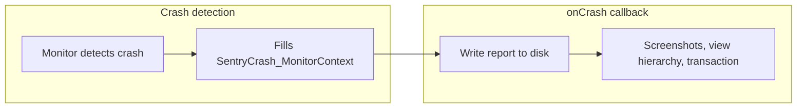
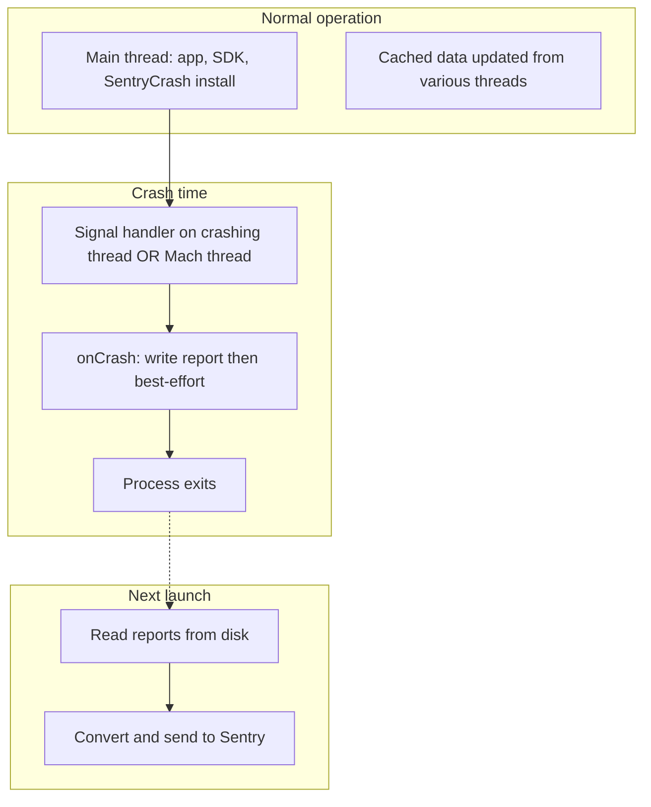

# SentryCrash: Analysis

## About This Document

A reference for the architecture, data flow, async-signal-safety rules, data structures, and developer workflow of SentryCrash. This is a living document — iterate on it as the code evolves.

For the improvement plan (isolation, test coverage, architecture, bugs), see [SENTRYCRASH_IMPROVEMENT_PLAN.md](SENTRYCRASH_IMPROVEMENT_PLAN.md). For build and test conventions, see [BUILD.md](BUILD.md) and [TEST.md](TEST.md).

### Updating This Document

This document was generated with Claude using the prompt below. To refresh it, run the same prompt against the current codebase:

> Analyze `Sources/SentryCrash/` in the sentry-cocoa repo. Produce a reference document covering: component overview (file counts, LOC by subsystem), directory structure, crash detection flow, SDK integration points, initialization sequence, async-signal-safety rules, crash report format and data structures, monitor system details, thread model, KSCrash divergence analysis (timeline, naming, sentry-specific additions, upstream alignment, unadopted fixes, merge candidates), known issues and risks, developer workflow (build, test, debug, adopting upstream changes), and an appendix with a key file reference, platform guards, feature matrix, glossary, and complete file list. Cross-reference all claims (line counts, file paths, API signatures) against the actual source code.

## Table of Contents

- [Problem Statement](#problem-statement)
- [Component Overview](#component-overview)
- [Architecture Deep Dive](#architecture-deep-dive)
- [Async-Signal-Safety Reference](#async-signal-safety-reference)
- [Crash Report Format and Data Structures](#crash-report-format-and-data-structures)
- [Monitor System In Depth](#monitor-system-in-depth)
- [Thread Model](#thread-model)
- [KSCrash Divergence Analysis](#kscrash-divergence-analysis)
- [Known Issues & Risks](#known-issues--risks)
- [Developer Workflow](#developer-workflow)
- [Appendix: Key File Reference](#appendix-key-file-reference)

---

## Problem Statement

SentryCrash is the **backbone of the Sentry Cocoa SDK** -- it handles all crash detection and reporting. However:

- **Heavily diverged from KSCrash**: Forked in June 2018, with 270+ independent commits over 8 years
- **Limited team knowledge**: The low-level C/ObjC crash handling code is specialized and not well understood across the team
- **Very little test coverage**: Core C-level crash handling code has minimal direct unit tests
- **Tight coupling**: Bidirectional dependencies between SentryCrash and the SDK, with Sentry-specific code embedded throughout

---

## Component Overview

| Metric                  | Value                                                                  |
| ----------------------- | ---------------------------------------------------------------------- |
| **Total files**         | 84 files (36 .h, 36 .c, 11 .m, 1 .cpp)                                 |
| **Total lines of code** | ~21,400                                                                |
| **Location**            | `Sources/SentryCrash/`                                                 |
| **Languages**           | C (primary), Objective-C, C++, Swift (wrappers)                        |
| **Test files**          | ~55 across `Tests/SentryTests/SentryCrash/`                            |
| **Original source**     | [KSCrash](https://github.com/kstenerud/KSCrash) by Karl Stenerud (MIT) |

---

## Architecture Deep Dive

### Directory Structure

```
Sources/SentryCrash/
├── Installations/                     # Lifecycle management (221 lines)
│   └── SentryCrashInstallation.m
├── Recording/                         # Core crash recording (4,976 lines)
│   ├── SentryCrash.m                  # Main ObjC class (565 lines)
│   ├── SentryCrashC.c                 # C API entry point (317 lines)
│   ├── SentryCrashReport.c            # Report writing to disk
│   ├── SentryCrashReportStore.c       # Report storage/retrieval
│   ├── SentryCrashReportFixer.c       # Post-processing crash reports
│   ├── SentryCrashCachedData.c        # Thread/system data caching
│   ├── SentryCrashBinaryImageCache.c  # Binary image tracking
│   ├── SentryCrashDoctor.m            # Report analysis
│   ├── Monitors/                      # Crash detection (3,354 lines)
│   │   ├── SentryCrashMonitor.c           # Central monitor dispatcher
│   │   ├── SentryCrashMonitor_MachException.c  # Mach kernel exceptions
│   │   ├── SentryCrashMonitor_Signal.c         # POSIX signals
│   │   ├── SentryCrashMonitor_NSException.m    # ObjC exceptions
│   │   ├── SentryCrashMonitor_CPPException.cpp # C++ exceptions
│   │   ├── SentryCrashMonitor_System.m         # System info collection
│   │   └── SentryCrashMonitor_AppState.c       # App state tracking
│   └── Tools/                         # Utilities (11,872 lines -- 56% of codebase)
│       ├── SentryCrashCPU*.c          # CPU context (arm, arm64, x86, x86_64)
│       ├── SentryCrashStackCursor*.c  # Stack unwinding
│       ├── SentryCrashMach*.c         # Mach kernel interfaces
│       ├── SentryCrashObjC.c          # ObjC runtime introspection
│       ├── SentryCrashJSONCodec.c     # JSON encoder (C)
│       ├── SentryCrashFileUtils.c     # File I/O utilities
│       └── ... (20+ more utility files)
└── Reporting/                         # Report filtering (934 lines)
    └── Filters/
        ├── SentryCrashReportFilterBasic.m
        └── Tools/
            └── SentryDictionaryDeepSearch.m
```

### Lines of Code by Subsystem

```
Recording/Tools:     11,872 lines (55.6%)  ← Most code lives here
Recording/ (base):    4,976 lines (23.3%)
Recording/Monitors:   3,354 lines (15.7%)
Reporting/:             934 lines  (4.4%)
Installations/:         221 lines  (1.0%)
```

### Crash Detection Flow

```
1. App crashes (signal, Mach exception, NSException, or C++ exception)
     ↓
2. Appropriate monitor detects the crash:
   - SentryCrashMonitor_MachException → Mach kernel exceptions
   - SentryCrashMonitor_Signal       → POSIX signals (SIGSEGV, SIGABRT, etc.)
   - SentryCrashMonitor_NSException  → Objective-C exceptions
   - SentryCrashMonitor_CPPException → C++ exceptions via __cxa_throw hook
     ↓
3. Monitor populates SentryCrash_MonitorContext with crash details
     ↓
4. Global onCrash() callback invoked (SentryCrashC.c:75)
   ├── Updates app state: sentrycrashstate_notifyAppCrash()
   ├── Writes crash report to disk: sentrycrashreport_writeStandardReport()
   ├── Saves session replay: sentrySessionReplaySync_writeInfo()
   ├── Saves screenshots/view hierarchy (non-signal-safe, best-effort)
   └── Saves active transaction: g_saveTransaction()
     ↓
5. App terminates (if fatal crash)
     ↓
6. On NEXT launch:
   ├── SentryCrashIntegration.startCrashHandler()
   ├── Retrieves pending reports: reportIDs() → reportWithID()
   ├── SentryCrashReportSink processes and transforms reports
   ├── SentryCrashReportConverter → SentryEvent
   └── Events sent to Sentry backend
```

### SDK Integration Points

The SDK integrates with SentryCrash through these key files:

| File                                                                           | Role                                                     |
| ------------------------------------------------------------------------------ | -------------------------------------------------------- |
| `Sources/Swift/Integrations/SentryCrash/SentryCrashIntegration.swift`          | Main integration, implements `SwiftIntegration` protocol |
| `Sources/Swift/Integrations/SentryCrash/SentryCrashInstallationReporter.swift` | Sentry-specific `SentryCrashInstallation` subclass       |
| `Sources/Swift/SentryCrash/SentryCrashWrapper.swift`                           | Testability wrapper around C API                         |
| `Sources/Sentry/SentryCrashReportConverter.m`                                  | Transforms raw crash reports → `SentryEvent`             |
| `Sources/Sentry/SentryCrashReportSink.m`                                       | Implements `SentryCrashReportFilter` for Sentry          |
| `Sources/Sentry/SentryCrashScopeObserver.m`                                    | Syncs SDK scope → SentryCrash via C interface            |
| `Sources/Sentry/SentryScopeSyncC.c`                                            | C interface for scope synchronization at crash time      |

### Initialization Sequence

```
SentrySDK.start(options:)
  → SentryHub creation → SentryClient init → Install integrations
    → SentryCrashIntegration.init (if enableCrashHandler = true)
      ├── Create SentryCrashWrapper
      ├── Create SentryCrashScopeObserver
      ├── Create SentryCrashIntegrationSessionHandler
      ├── startCrashHandler():
      │   ├── sentrycrashcm_setEnableSigtermReporting()
      │   ├── SentryCrashInstallationReporter.install(cacheDirectory)
      │   │   └── C: sentrycrash_install(appName, installPath)
      │   ├── sentrycrashcm_cppexception_enable_swap_cxa_throw() (if enabled)
      │   ├── sessionHandler.endCurrentSessionIfRequired()
      │   └── installation.sendAllReports() ← sends pending crash reports
      ├── configureScope():
      │   ├── Serialize scope → crashReporter.userInfo → sentrycrash_setUserInfoJSON()
      │   └── Register scope observer for live updates
      └── configureTracingWhenCrashing() (if enabled):
          └── sentrycrash_setSaveTransaction(callback)
```

---

## Async-Signal-Safety Reference

Code that runs during crash handling must respect **async-signal-safety** when the crash was detected by the **Signal** monitor, because the signal handler runs in signal context. The Mach exception handler runs on a **dedicated thread** (not in signal context), so the strictest rules apply when the crash is delivered via signal.

**When code runs in signal context**

- **Signal monitor** — `handleSignal()` in [SentryCrashMonitor_Signal.c](Sources/SentryCrash/Recording/Monitors/SentryCrashMonitor_Signal.c) runs in signal context (on the crashing thread). The entire `onCrash()` callback can therefore run in signal context when the crash was detected by signal.
- **Mach exception monitor** — Runs on a dedicated Mach exception server thread; not in signal context. The same `onCrash()` callback is used, but it is not invoked from a signal handler in that case.

**What is allowed in signal context**

- Only [async-signal-safe](https://man7.org/linux/man-pages/man7/signal-safety.7.html) functions: no `malloc`, no Objective-C runtime, no locks, no `printf`/`NSLog`. Commonly safe: `write`, `_exit`, `sig_atomic_t`, C11 atomics, and a small set of other APIs. When in doubt, assume only the minimal set is safe.

**What SentryCrash uses**

- **Logging** — `SENTRY_ASYNC_SAFE_LOG_*` macros only (no NSLog). See [SentryAsyncSafeLog](Sources/Sentry/SentryAsyncSafeLog.h).
- **Report writing** — `sentrycrashreport_writeStandardReport()` and the code path it uses in [SentryCrashReport.c](Sources/SentryCrash/Recording/SentryCrashReport.c) are designed to be signal-safe (no heap allocation in the critical path; JSON written via async-safe primitives).
- **Best-effort callbacks** — Screenshots, view hierarchy, and transaction save run **after** the report is written to disk. They are explicitly non–signal-safe and may crash; that is acceptable because the process is already terminating. See comment in [SentryCrashC.c](Sources/SentryCrash/Recording/SentryCrashC.c) around the `g_saveScreenShot` / `g_saveViewHierarchy` / `g_saveTransaction` calls.

**Call order in onCrash()**

1. Update app state (`sentrycrashstate_notifyAppCrash()`).
2. Write crash report to disk (`sentrycrashreport_writeStandardReport()` or recrash path) and session replay — **signal-safe path**.
3. Then: screenshots, view hierarchy, transaction callback — **best-effort, non–signal-safe**.

Adding new code in the `onCrash()` callback (in [SentryCrashC.c](Sources/SentryCrash/Recording/SentryCrashC.c)) or in the report writer (in [SentryCrashReport.c](Sources/SentryCrash/Recording/SentryCrashReport.c)) must respect these rules: anything before the best-effort callbacks must be async-signal-safe when the crash was detected by the Signal monitor.

---

## Crash Report Format and Data Structures

**Report format**

The report written by `sentrycrashreport_writeStandardReport()` is JSON. The structure is built in [SentryCrashReport.c](Sources/SentryCrash/Recording/SentryCrashReport.c) using the `SentryCrashReportWriter` callbacks. Main top-level sections (see [SentryCrashReportFields.h](Sources/SentryCrash/Recording/SentryCrashReportFields.h)) include:

- **report** — Report metadata: `id`, `timestamp`, `version`, `process_name`, `type` (e.g. standard).
- **crash** — Crash-specific: `error` (exception type, name, reason, mach/signal/NSException/CPPException details), `threads` (thread list with backtraces, registers, crashed flag), `debug` (diagnosis if available).
- **system** — System info: OS, machine, CPU arch, process/bundle info, app start time, etc.
- **binary_images** — Loaded images (base address, size, UUID, name).
- **application_stats** — App state stats (active/background time since crash/launch, launches since crash).
- **memory** — Memory stats (free, usable).
- **user** — User payload (scope sync: user, tags, context, breadcrumbs, etc.).

The exact keys are defined in `SentryCrashReportFields.h`; the writer fills them in `SentryCrashReport.c`.

**SentryCrash_MonitorContext**

The unified context passed from the detecting monitor to the report writer is defined in [SentryCrashMonitorContext.h](Sources/SentryCrash/Recording/Monitors/SentryCrashMonitorContext.h). Key fields:

- **requiresAsyncSafety** — If true, only async-signal-safe code may run (e.g. when crash was detected by Signal monitor).
- **handlingCrash** — True while the crash handler is active; when false, context fields below are invalid.
- **crashedDuringCrashHandling** — True if a second crash occurred while handling the first (recrash).
- **crashType** — Which monitor detected the crash (Mach, Signal, NSException, C++, etc.); determines which union is valid.
- **offendingMachineContext** — Machine context (registers, etc.) for the crashing thread.
- **stackCursor** — Stack cursor for the crashing thread's backtrace.
- **faultAddress**, **exceptionName**, **crashReason** — Common crash details.
- **mach** — Mach exception type/code/subcode (when crashType is Mach).
- **signal** — signum, sigcode, userContext (when crashType is Signal).
- **NSException** — name, userInfo (when crashType is NSException).
- **CPPException** — name (when crashType is C++).
- **userException** — Custom/user exception fields.
- **appState** — Active/background duration, launches since last crash, etc.

**Cached data**

Thread list and system snapshot are provided by [SentryCrashCachedData.c](Sources/SentryCrash/Recording/SentryCrashCachedData.c). At crash time the cache is **frozen** so the report writer sees a consistent snapshot; it is unfrozen after the report is written. The report writer reads thread and system data from this frozen snapshot.

---

## Monitor System In Depth

**Registration**

Monitors are enabled via `SentryCrashMonitorType` (bitmask). The central dispatcher in [SentryCrashMonitor.c](Sources/SentryCrash/Recording/Monitors/SentryCrashMonitor.c) registers each monitor type and invokes the appropriate handler when that monitor is enabled. When a crash is detected, the **detecting** monitor fills `SentryCrash_MonitorContext` and the shared **onCrash()** callback (registered in [SentryCrashC.c](Sources/SentryCrash/Recording/SentryCrashC.c)) is invoked once.

**Per-monitor context**

Which monitor fills which parts of the context:

- **Mach** — `mach.type`, `mach.code`, `mach.subcode`; sets `offendingMachineContext`, `stackCursor`, `crashType`, `exceptionName`, `crashReason`, etc.
- **Signal** — `signal.signum`, `signal.sigcode`, `signal.userContext`; same common fields.
- **NSException** — `NSException.name`, `NSException.userInfo`; plus stack cursor and machine context from the ObjC exception path.
- **C++** — `CPPException.name`; stack cursor from the `__cxa_throw` hook path.

**Execution context**

- **Signal monitor** — Runs in the signal handler (on the crashing thread). **Strictly async-signal-safe** code only.
- **Mach monitor** — Runs on the dedicated Mach exception server thread. Not in signal context; still avoid heavy work before the report is written.
- **NSException / C++** — Run in ObjC/C++ exception flow (not in signal context). Same `onCrash()` path is used; if the process was not delivered via signal, the report-writing path does not have to be async-signal-safe, but the implementation keeps it signal-safe for uniformity.

Only the code path triggered by the **Signal** monitor must be strictly async-signal-safe; the report writer is written to be safe in all cases.



---

## Thread Model

**Normal operation**

- **Main thread** — App and SDK run; SentryCrash is installed at startup (e.g. from `SentryCrashIntegration.startCrashHandler()`).
- **Other threads** — Scope observer and other SDK work may run on background threads. Cached data ([SentryCrashCachedData.c](Sources/SentryCrash/Recording/SentryCrashCachedData.c)) is updated from various threads; at crash time the cache is **frozen** so the report writer sees a consistent snapshot.

**At crash time**

- **Signal path** — The signal handler runs **on the crashing thread**. `onCrash()` runs in that same (signal) context. Report is written there; then best-effort callbacks (screenshots, view hierarchy, transaction) run in the same context.
- **Mach path** — The Mach exception handler runs on the **dedicated Mach exception server thread**. `onCrash()` runs on that thread. Same order: report write, then best-effort callbacks.
- After that, the process typically terminates (fatal crash).

**Next launch**

- On the next app launch, `SentryCrashIntegration` starts the crash handler and calls `sendAllReportsWithCompletion:`. Pending reports are read from disk (main thread or SDK's queue), then processed by `SentryCrashReportSink` and `SentryCrashReportConverter`, and sent to the Sentry backend.



---

## KSCrash Divergence Analysis

### Timeline

| Date          | Event                                                           |
| ------------- | --------------------------------------------------------------- |
| **June 2018** | Initial KSCrash fork added to sentry-cocoa (commit `edc4eabff`) |
| **Sept 2018** | Symbol renaming: KS* → SentryCrash* (commit `2dfe7fe68`)        |
| **Jan 2021**  | Fixed symbol clashes with apps also using KSCrash               |
| **June 2025** | Added C++ exception capturing via `__cxa_throw` hook            |
| **Oct 2025**  | Major Swift migration of wrapper classes                        |
| **Feb 2026**  | Latest upstream alignment with KSCrash (selective cherry-picks) |

**Total independent commits**: 270+ over 8 years

### Naming Convention

All original KS-prefixed symbols were renamed to Sentry prefixes:

- Files: `KSCrash.m` → `SentryCrash.m`
- Functions: `kscrash_install()` → `sentrycrash_install()`
- Types: `KSCrashMonitorType` → `SentryCrashMonitorType`

**No KS-prefixed files remain** in the current codebase.

### Sentry-Specific Additions (Not in KSCrash)

These features were added by Sentry and do not exist in upstream KSCrash:

1. **Scope Synchronization** (`SentryScopeSyncC.c/.h`)
   - Syncs user, tags, breadcrumbs, context, trace to crash handler memory
   - Accessed during crash via `sentrycrash_scopesync_getScope()`

2. **Transaction Callback** (in `SentryCrashC.c`)
   - `sentrycrash_setSaveTransaction(callback)` -- saves active tracing transaction at crash time
   - Callback defined with `@_cdecl` in Swift

3. **Session Replay Integration** (in `SentryCrashC.c`)
   - `sentrySessionReplaySync_writeInfo()` called during crash callback

4. **Binary Image Cache Hooks** (`SentryCrashBinaryImageCache.c`)
   - `sentry_setRegisterFuncForAddImage/RemoveImage()` for custom dyld tracking
   - Enables real-time binary image change tracking for profiling

5. **Screenshot/View Hierarchy Callbacks** (in `SentryCrashC.c`)
   - `sentrycrash_setSaveScreenshots()`, `sentrycrash_setSaveViewHierarchy()`
   - Best-effort non-signal-safe capture at crash time

6. **Async-Safe Logging** (`SentryAsyncSafeLog.c/.h`)
   - Signal-safe logging replacing NSLog in crash handlers

7. **NSException Stack Cursor** (`SentryCrashMonitor_NSException_StackCursor.*`)
   - Added Jan 2026 for better NSException stack trace capture

8. **C++ Exception Swapper** (`SentryCrashCxaThrowSwapper.c/.h`)
   - Runtime `__cxa_throw` hooking (inspired by fishhook + Yandex approach)

### Recent Upstream Alignment (2026)

Sentry maintains a watching approach, selectively adopting KSCrash improvements:

- `bcabca0bb` (Feb 2026): Align naming with KSCrash, merge notify + suspend to prevent deadlock (#7340)
- `80963bd21` (Feb 2026): Adopted lock-free atomic exchange from KSCrash PR #733 (#7423)

### Upstream Fixes Not Yet Adopted

Fixes from upstream [KSCrash releases](https://github.com/kstenerud/KSCrash/releases) (2.0.0 through 2.5.1) that SentryCrash has **not** yet cherry-picked. These are candidates for selective adoption.

**KSCrash 2.5.1** (Jan 2026):

| KSCrash PR                                            | Description                                                                                                      |
| ----------------------------------------------------- | ---------------------------------------------------------------------------------------------------------------- |
| [#723](https://github.com/kstenerud/KSCrash/pull/723) | Memory safety: `memmove` bug in file utils, `sprintf` → `snprintf` throughout, buffer handling (ASan-discovered) |
| [#725](https://github.com/kstenerud/KSCrash/pull/725) | Memory monitor safety improvements                                                                               |
| [#742](https://github.com/kstenerud/KSCrash/pull/742) | Thread safety in memory tracking                                                                                 |
| [#749](https://github.com/kstenerud/KSCrash/pull/749) | Static analyzer warnings fixed                                                                                   |
| [#751](https://github.com/kstenerud/KSCrash/pull/751) | Undefined behavior issues (UBSan)                                                                                |
| [#763](https://github.com/kstenerud/KSCrash/pull/763) | Unsigned integer underflow in `imageContainingAddress`                                                           |

**KSCrash 2.4.0** (Sep 2025):

| KSCrash PR                                            | Description                                                                                                                                                         |
| ----------------------------------------------------- | ------------------------------------------------------------------------------------------------------------------------------------------------------------------- |
| [#651](https://github.com/kstenerud/KSCrash/pull/651) | Forward Mach exceptions to next handler (13-year-old handler chaining bug; relevant to sentry-cocoa [#4725](https://github.com/getsentry/sentry-cocoa/issues/4725)) |
| [#662](https://github.com/kstenerud/KSCrash/pull/662) | Lockless algorithm for KSCrashMonitor                                                                                                                               |
| [#659](https://github.com/kstenerud/KSCrash/pull/659) | Inverted dependency from monitors to KSCrashMonitor.c using DI                                                                                                      |
| [#696](https://github.com/kstenerud/KSCrash/pull/696) | Always record offending thread at least                                                                                                                             |
| [#693](https://github.com/kstenerud/KSCrash/pull/693) | Still attempt to record threads even if suspend fails                                                                                                               |
| [#705](https://github.com/kstenerud/KSCrash/pull/705) | Remove direct dependency between signal and memory monitors                                                                                                         |

**KSCrash 2.3.0** (Aug 2025):

| KSCrash PR                                            | Description                                                                    |
| ----------------------------------------------------- | ------------------------------------------------------------------------------ |
| [#660](https://github.com/kstenerud/KSCrash/pull/660) | Off-by-one error in `arm64.c` (already applied in SentryCrash via earlier fix) |
| [#664](https://github.com/kstenerud/KSCrash/pull/664) | Raise max captured thread count to 1000                                        |

**KSCrash 2.0.0-alpha.2**:

| KSCrash PR                                            | Description                                         |
| ----------------------------------------------------- | --------------------------------------------------- |
| [#479](https://github.com/kstenerud/KSCrash/pull/479) | Stack overflow caused by insufficient disk space    |
| [#468](https://github.com/kstenerud/KSCrash/pull/468) | Fix tail call optimization in C++ backtrace capture |
| [#478](https://github.com/kstenerud/KSCrash/pull/478) | Fix `NSArray` description                           |

### Merge Candidates

The tracking issue [sentry-cocoa #5619](https://github.com/getsentry/sentry-cocoa/issues/5619) lists KSCrash PRs to consider merging into SentryCrash. Summary with context:

| Candidate                                    | KSCrash PR                                            | Context                                                                                                                                          |
| -------------------------------------------- | ----------------------------------------------------- | ------------------------------------------------------------------------------------------------------------------------------------------------ |
| Forward Mach exceptions to next handler      | [#651](https://github.com/kstenerud/KSCrash/pull/651) | Fixes handler chaining so other crash reporters get a chance; directly addresses [#4725](https://github.com/getsentry/sentry-cocoa/issues/4725). |
| Add thread run state string to report        | [#645](https://github.com/kstenerud/KSCrash/pull/645) | Enriches crash reports with thread run state.                                                                                                    |
| Add improved jailbreak detection logic       | [#666](https://github.com/kstenerud/KSCrash/pull/666) | Improves system info / device context.                                                                                                           |
| Convert KSCrashMonitor to lockless algorithm | [#662](https://github.com/kstenerud/KSCrash/pull/662) | Aligns with Sentry's existing atomic exchange adoption; reduces lock contention.                                                                 |
| Add clang_version field to system info       | [#668](https://github.com/kstenerud/KSCrash/pull/668) | Adds compiler version to system info.                                                                                                            |
| Add binary architecture field to system info | [#669](https://github.com/kstenerud/KSCrash/pull/669) | Helps with [#6180](https://github.com/getsentry/sentry-cocoa/issues/6180) (cpu_type/cpu_subtype) and architecture reporting.                     |
| Add Rosetta detection field                  | [#671](https://github.com/kstenerud/KSCrash/pull/671) | Indicates when app is running under Rosetta.                                                                                                     |

---

## Known Issues & Risks

### HIGH Priority

| Issue                                  | Status               | Details                                                                                                                                               |
| -------------------------------------- | -------------------- | ----------------------------------------------------------------------------------------------------------------------------------------------------- |
| **Data race in thread caching**        | FIXED (Feb 10, 2026) | `SentryCrashCachedData.c` had fragile semaphore-based sync. Replaced with atomic exchange pattern from KSCrash PR #733. Was causing `EXC_BAD_ACCESS`. |
| **Concurrent crash misidentification** | FIXED (Feb 2, 2026)  | `SentryCrashMonitor.c` incorrectly detected concurrent crashes from different threads as "recrash". Fixed with thread-aware atomic guard.             |

### MEDIUM Priority

| Issue                                       | File                                     | Details                                                                                                                   |
| ------------------------------------------- | ---------------------------------------- | ------------------------------------------------------------------------------------------------------------------------- |
| **NSDictionary introspection broken**       | `SentryCrashObjC.c:1816`                 | Marked "TODO: This is broken". `sentrycrashobjc_dictionaryCount()` returns 0. Falls back to generic object introspection. |
| **CPU architecture detection unavailable**  | `SentryCrashCPU.c:42`                    | `sentrycrashcpu_currentArch()` returns NULL. `NXGetLocalArchInfo()` blocked by App Store.                                 |
| **Thread-local storage for C++ exceptions** | `SentryCrashMonitor_CPPException.cpp:71` | Global stack cursor instead of thread-local. Could cause issues with concurrent C++ exceptions.                           |
| **Mach exception freeze workaround**        | `SentryCrashMonitor_MachException.c:338` | "TODO: This was put here to avoid a freeze. Does secondary thread ever fire?"                                             |
| **Unimplemented report sections**           | `SentryCrashReport.c:653`                | "TODO: Implement these" for NSDictionary and NSException introspection cases.                                             |

### LOW Priority (TODOs & Technical Debt)

| File                          | Line     | TODO                                                                 |
| ----------------------------- | -------- | -------------------------------------------------------------------- |
| `SentryCrashMonitor_System.m` | 406, 531 | "use SentryDevice API here now?" / "combine this into SentryDevice?" |
| `SentryCrashObjC.c`           | 1045     | Possible bad access in `sentrycrashobjc_ivarList`                    |
| `SentryCrashObjC.c`           | 1111     | Uncertainty about tagged pointer NSNumber handling                   |
| `SentryCrashObjC.c`           | 1691     | Bit-field unpacking not implemented for mutable arrays               |

### Async-Signal-Safety Concerns

The crash handlers generally follow signal-safety rules:

- Use `SENTRY_ASYNC_SAFE_LOG_*` macros (no malloc/NSLog)
- Signal handler (`handleSignal()`) uses only async-safe functions
- Mach exception handler runs on a dedicated thread (not in signal context)

**Known exceptions** (documented, intentional):

- Screenshot/view hierarchy capture after report is saved (documented as "non async-signal safe code, but since the app is already in a crash state we don't mind if this approach crashes")
- Transaction save callback similarly best-effort

---

## Developer Workflow

**Build**

SentryCrash is part of the main SDK targets. Use the same build commands as the rest of the repo: e.g. `make build-ios`, `make build-macos`. See [develop-docs/BUILD.md](BUILD.md) for full build and deliverable options.

**Test**

Run SentryCrash-related tests with the same pattern as other SDK tests. Examples:

- `make test-ios ONLY_TESTING=SentryCrashInstallationTests,SentryCrashWrapperTests`
- `make test-ios ONLY_TESTING=SentryCrashMonitor_NSException_Tests,SentryCrashMonitor_Signal_Tests`

See AGENTS.md (Testing Instructions) for the convention: test class names follow `<SourceFile>Tests`. The test server is **not** required for most SentryCrash tests; it is only needed for the small set of network integration tests that use the `Sentry_TestServer` xctestplan. See [develop-docs/TEST.md](TEST.md) for general testing practices.

**Debugging**

- **Crash-time code** — Use `SENTRY_ASYNC_SAFE_LOG_*` macros in the crash path; ensure async-safe logging is enabled so output is visible (e.g. to stderr or the configured async-safe log destination). Do not use `NSLog` or `printf` in code that can run in signal context.
- **Written reports** — Reports are stored under the installation path (cache directory passed to `sentrycrash_install()`). Inspect the JSON files written by `sentrycrashreport_writeStandardReport()` to verify report structure and field values; the format is described in [Crash Report Format and Data Structures](#crash-report-format-and-data-structures).
- **Simulating a crash** — Use a sample app (e.g. in `Samples/`) and trigger a crash (e.g. `abort()`, uncaught NSException, or a null dereference) to exercise the full pipeline from detection to report write to next-launch send.

**Adopting upstream KSCrash changes**

We cherry-pick selectively; we do not merge KSCrash wholesale. When bringing in upstream changes:

1. Map **KS\*** symbols to **SentryCrash\*** (files, functions, types); see [Naming Convention](#naming-convention).
2. Run the full test suite after applying changes (`make test-ios` or broader).
3. Preserve **Sentry-specific** behavior: scope sync, session replay sync, transaction callback, binary image hooks, async-safe logging. Upstream code may not have these; do not remove or bypass them when porting fixes.
4. Use the lists in this doc: [Upstream Fixes Not Yet Adopted](#upstream-fixes-not-yet-adopted) and [Merge Candidates](#merge-candidates) (tracking issue [#5619](https://github.com/getsentry/sentry-cocoa/issues/5619)) to decide what to consider next.

---

## Appendix: Key File Reference

### Public API Surface

#### C API (`SentryCrashC.h`)

```c
SentryCrashMonitorType sentrycrash_install(const char *appName, const char *installPath);
void sentrycrash_uninstall(void);
SentryCrashMonitorType sentrycrash_setMonitoring(SentryCrashMonitorType monitors);
void sentrycrash_setUserInfoJSON(const char *userInfoJSON);
void sentrycrash_setCrashNotifyCallback(SentryCrashReportWriteCallback onCrashNotify);
void sentrycrash_setSaveScreenshots(void (*callback)(const char *));
void sentrycrash_setSaveViewHierarchy(void (*callback)(const char *));
void sentrycrash_setSaveTransaction(void (*callback)(void));
```

#### ObjC API (`SentryCrash.h`)

```objc
@interface SentryCrash
@property NSString *basePath;
@property NSDictionary *userInfo;
@property SentryCrashMonitorType monitoring;
@property int maxReportCount;
- (BOOL)install;
- (void)uninstall;
- (NSArray *)reportIDs;
- (NSDictionary *)reportWithID:(NSNumber *)reportID;
- (void)deleteReportWithID:(NSNumber *)reportID;
- (void)sendAllReportsWithCompletion:(SentryCrashReportFilterCompletion)onCompletion;
@end
```

#### Supporting Public Headers

| Header                           | Purpose                                          |
| -------------------------------- | ------------------------------------------------ |
| `SentryCrashMonitorType.h`       | Monitor type enums (MachException, Signal, etc.) |
| `SentryCrashReportFilter.h`      | Report filter protocol and completion callback   |
| `SentryCrashInstallation.h`      | Installation base class                          |
| `SentryCrashBinaryImageCache.h`  | Binary image tracking API                        |
| `SentryCrashStackCursor.h`       | Stack unwinding cursor types                     |
| `SentryCrashMachineContext.h`    | Machine context wrapper types                    |
| Various `SentryCrashMonitor_*.h` | Individual monitor APIs                          |

### Most Critical Files (must understand these)

| File                                                    | Purpose                                           | Lines |
| ------------------------------------------------------- | ------------------------------------------------- | ----- |
| `Recording/SentryCrashC.c`                              | C API, installation, crash callback orchestration | 317   |
| `Recording/SentryCrash.m`                               | ObjC wrapper, configuration management            | 565   |
| `Recording/SentryCrashReport.c`                         | Crash report writing to disk (signal-safe)        | 1,795 |
| `Recording/SentryCrashCachedData.c`                     | Thread/system data caching (lock-free)            | ~360  |
| `Recording/Monitors/SentryCrashMonitor.c`               | Monitor registry and dispatch                     | ~300  |
| `Recording/Monitors/SentryCrashMonitorContext.h`        | Unified crash context structure                   | ~230  |
| `Recording/Monitors/SentryCrashMonitor_MachException.c` | Mach kernel exception handler                     | ~600  |
| `Recording/Monitors/SentryCrashMonitor_Signal.c`        | POSIX signal handler                              | ~300  |

### Platform Availability Guards

| Guard                     | Platforms                                       |
| ------------------------- | ----------------------------------------------- |
| `SENTRY_HAS_MACH`         | iOS, macOS, tvOS, watchOS, visionOS (all Apple) |
| `SENTRY_HAS_SIGNAL`       | All Apple platforms                             |
| `SENTRY_HAS_SIGNAL_STACK` | All Apple platforms                             |
| `SENTRY_HAS_THREADS_API`  | All Apple platforms                             |
| `SENTRY_HAS_UIKIT`        | iOS, tvOS, visionOS (not macOS, watchOS)        |
| `__arm64__`               | iOS devices, Apple Silicon Macs                 |
| `__x86_64__`              | Intel Macs, iOS Simulator (Intel)               |

Some features are disabled or limited on certain OS versions (e.g. test disabled on iOS 26+ [#6116](https://github.com/getsentry/sentry-cocoa/issues/6116)); see Known Issues.

### Platform and Feature Matrix

| Platform | Mach exception | Signal | NSException | C++ exception | App state | System info |
| -------- | -------------- | ------ | ----------- | ------------- | --------- | ----------- |
| iOS      | Yes            | Yes    | Yes         | Yes           | Yes       | Yes         |
| macOS    | Yes            | Yes    | Yes         | Yes           | Yes       | Yes         |
| tvOS     | Yes            | Yes    | Yes         | Yes           | Yes       | Yes         |
| watchOS  | Yes            | Yes    | Limited     | Yes           | Yes       | Yes         |
| visionOS | Yes            | Yes    | Yes         | Yes           | Yes       | Yes         |

**Notes:** watchOS has limited support for unhandled NSException reporting ([#2747](https://github.com/getsentry/sentry-cocoa/issues/2747)). Mach exception handling has known issues on macOS in some configurations ([#1589](https://github.com/getsentry/sentry-cocoa/issues/1589)). Use the guards above and the source (e.g. `SENTRY_HAS_UIKIT`, `TARGET_OS_*`) when adding platform-specific code.

### Glossary

| Term                                            | Definition                                                                                                                                                                                                                                                |
| ----------------------------------------------- | --------------------------------------------------------------------------------------------------------------------------------------------------------------------------------------------------------------------------------------------------------- |
| **ASI**                                         | Application Specific Information; a section in the crash report (e.g. crash_info_message) that can contain exception or app-specific text. See [#7298](https://github.com/getsentry/sentry-cocoa/issues/7298).                                            |
| **Monitor**                                     | A component that detects one kind of crash: Mach exception, Signal, NSException, or C++ exception. Each monitor fills its part of `SentryCrash_MonitorContext` and triggers the shared `onCrash()` callback.                                              |
| **MonitorContext (SentryCrash_MonitorContext)** | The unified structure holding crash details, passed from the detecting monitor to the report writer. Defined in [SentryCrashMonitorContext.h](Sources/SentryCrash/Recording/Monitors/SentryCrashMonitorContext.h).                                        |
| **onCrash()**                                   | The global callback invoked when any monitor detects a crash. Implemented in [SentryCrashC.c](Sources/SentryCrash/Recording/SentryCrashC.c); it writes the report, then runs best-effort callbacks (screenshots, view hierarchy, transaction).            |
| **Freeze / unfreeze**                           | Cached data (thread list, system snapshot) is "frozen" at crash time so the report writer sees a consistent snapshot; it is "unfrozen" after the report is written. See [SentryCrashCachedData.c](Sources/SentryCrash/Recording/SentryCrashCachedData.c). |
| **Recrash**                                     | A second crash while handling the first (e.g. in the report writer). The context field `crashedDuringCrashHandling` is true; a minimal recrash report is written.                                                                                         |
| **Installation**                                | SentryCrash installation: the install path, configuration, and the hook that sends pending reports on next launch. The SDK uses [SentryCrashInstallationReporter](Sources/Swift/Integrations/SentryCrash/SentryCrashInstallationReporter.swift).          |
| **Report filter**                               | Protocol for processing reports (e.g. before send). The SDK implements it in [SentryCrashReportSink.m](Sources/Sentry/SentryCrashReportSink.m) to convert and upload to Sentry.                                                                           |
| **Stack cursor**                                | Abstraction for walking the stack (e.g. `SentryCrashStackCursor`). Used to fill thread backtraces in the report; can be backtrace-based or machine-context-based.                                                                                         |

### Complete File List (by directory)

All files under `Sources/SentryCrash/` with a one-line purpose. Paths are relative to `Sources/SentryCrash/`.

**Installations**

| File                                      | Purpose                                                            |
| ----------------------------------------- | ------------------------------------------------------------------ |
| `Installations/SentryCrashInstallation.m` | Base installation class; lifecycle, config, report path, send-all. |

**Recording (base)**

| File                                      | Purpose                                                          |
| ----------------------------------------- | ---------------------------------------------------------------- |
| `Recording/SentryCrashC.c`                | C API entry point; install, onCrash callback, report path.       |
| `Recording/SentryCrash.m`                 | ObjC wrapper; config, report IDs, sendAllReports.                |
| `Recording/SentryCrashReport.c`           | Writes JSON crash report to disk (signal-safe path).             |
| `Recording/SentryCrashReportStore.c`      | Report storage/retrieval by ID.                                  |
| `Recording/SentryCrashReportFixer.c`      | Post-processes reports (fixup).                                  |
| `Recording/SentryCrashCachedData.c`       | Thread/system cache; freeze at crash, consumed by report writer. |
| `Recording/SentryCrashBinaryImageCache.c` | Binary image tracking; dyld hooks.                               |
| `Recording/SentryCrashDoctor.m`           | Report analysis/diagnosis.                                       |

**Recording/Monitors**

| File                                                              | Purpose                                            |
| ----------------------------------------------------------------- | -------------------------------------------------- |
| `Recording/Monitors/SentryCrashMonitor.c`                         | Central monitor dispatcher; registration, context. |
| `Recording/Monitors/SentryCrashMonitorContext.h`                  | Unified crash context struct.                      |
| `Recording/Monitors/SentryCrashMonitorType.c`                     | Monitor type enum/bitmask.                         |
| `Recording/Monitors/SentryCrashMonitor_MachException.c`           | Mach kernel exception handler.                     |
| `Recording/Monitors/SentryCrashMonitor_Signal.c`                  | POSIX signal handler.                              |
| `Recording/Monitors/SentryCrashMonitor_NSException.m`             | Objective-C exception monitor.                     |
| `Recording/Monitors/SentryCrashMonitor_NSException_StackCursor.m` | NSException stack cursor for backtrace.            |
| `Recording/Monitors/SentryCrashMonitor_CPPException.cpp`          | C++ exception via \_\_cxa_throw hook.              |
| `Recording/Monitors/SentryCrashMonitor_System.m`                  | System info collection.                            |
| `Recording/Monitors/SentryCrashMonitor_AppState.c`                | App state (active/background) tracking.            |

**Recording/Tools**

| File                                                                                                         | Purpose                                                            |
| ------------------------------------------------------------------------------------------------------------ | ------------------------------------------------------------------ |
| `Recording/Tools/SentryCrashCPU.c`, `SentryCrashCPU_arm64.c`, `SentryCrashCPU_x86_64.c`, etc.                | CPU/arch context (registers, arch).                                |
| `Recording/Tools/SentryCrashStackCursor.c`, `_Backtrace.c`, `_MachineContext.c`, `_SelfThread.m`             | Stack unwinding (cursor, backtrace, machine context, self-thread). |
| `Recording/Tools/SentryCrashMach.c`, `SentryCrashMach-O.c`, `SentryCrashThread.c`                            | Mach kernel, Mach-O, thread APIs.                                  |
| `Recording/Tools/SentryCrashMachineContext.c`                                                                | Machine context wrapper.                                           |
| `Recording/Tools/SentryCrashObjC.c`                                                                          | ObjC runtime introspection.                                        |
| `Recording/Tools/SentryCrashJSONCodec.c`, `SentryCrashJSONCodecObjC.m`                                       | JSON encode (C and ObjC).                                          |
| `Recording/Tools/SentryCrashFileUtils.c`                                                                     | File I/O utilities.                                                |
| `Recording/Tools/SentryCrashMemory.c`                                                                        | Memory read utilities.                                             |
| `Recording/Tools/SentryCrashDynamicLinker.c`                                                                 | Dynamic linker / image list.                                       |
| `Recording/Tools/SentryCrashCxaThrowSwapper.c`                                                               | \_\_cxa_throw hook (C++ exceptions).                               |
| `Recording/Tools/SentryCrashString.c`, `SentryCrashDate.c`, `SentryCrashID.c`, `SentryCrashUUIDConversion.c` | String, date, ID, UUID helpers.                                    |
| `Recording/Tools/SentryCrashSysCtl.c`, `SentryCrashSignalInfo.c`, `SentryCrashNSErrorUtil.m`                 | Sysctl, signal info, NSError.                                      |
| `Recording/Tools/SentryCrashDebug.c`                                                                         | Debug helpers.                                                     |

**Reporting**

| File                                                   | Purpose                             |
| ------------------------------------------------------ | ----------------------------------- |
| `Reporting/Filters/SentryCrashReportFilterBasic.m`     | Basic report filter implementation. |
| `Reporting/Filters/Tools/SentryDictionaryDeepSearch.m` | Deep search in report dictionaries. |

Headers (`.h`) accompany the above; see repo for full list. Key report/context headers: `SentryCrashReport.h`, `SentryCrashReportFields.h`, `SentryCrashMonitorContext.h`.
