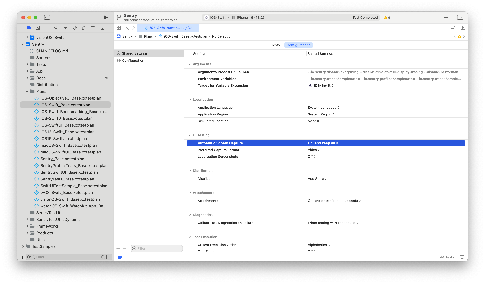
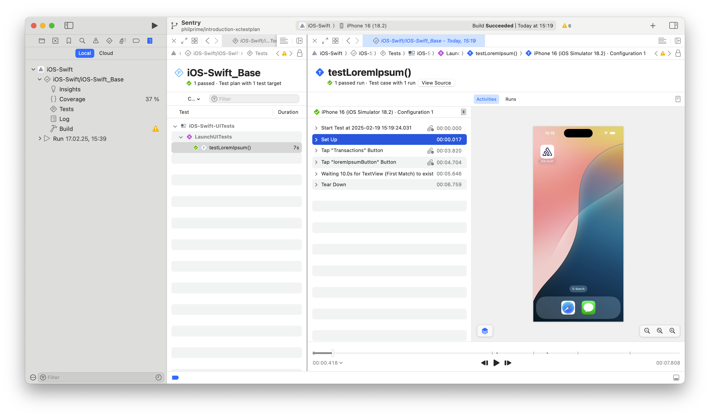

# Testing

## Sample Apps

See //Samples/README.md for more information about how to use the sample apps to test SDK functionality.

## Tests

The tests depend on our test server. To run the automated tests, you first need to have the server running locally with

```sh
make -C test-server start-debug
```

Test guidelines:

- We default to writing tests in Swift. When touching a test file written in Objective-C consider converting it to Swift and then add your tests.
- Make use of the fixture pattern for test setup code. For examples, checkout [SentryClientTest](/Tests/SentryTests/SentryClientTest.swift) or [SentryHttpTransportTests](/Tests/SentryTests/SentryHttpTransportTests.swift).
- Use [TestData](/Tests/SentryTests/Protocol/TestData.swift) when possible to avoid setting up data classes with test values.
- Name the variable of the class you are testing `sut`, which stands for [system under test](https://en.wikipedia.org/wiki/System_under_test).
- When calling `SentrySDK.start` in a test, specify only the minimum integrations required to minimize side effects for tests and reduce flakiness.

Test can either be ran inside from Xcode or via

```sh
make test
```

### SwiftPM SDK Tests

SDK tests need test definitions in both the SDK and test targets; `DEBUG` and `@testable import` alone are insufficient. **Run the main `SentryTests` suite through the package workspace below.** Plain `swift test` neither discovers its Objective-C/Objective-C++ tests nor applies the Xcode test plans.

For the Swift-only support suites on macOS with Swift 6.1+, run from the repository root (append `--filter SentryTestUtilsTests` or `--filter SentryObjCCompatTests` to each command):

```sh
swift test --traits _SentryTest
swift test --traits _SentryTestCI
# V10: select through the environment or trait.
SDK_V10=1 swift test --traits _SentryTest
swift test --traits V10,_SentryTest
```

The traits match [SDK.xcconfig](../Sources/Configuration/SDK.xcconfig), including Swift's Clang importer:

| Trait           | Swift definitions | Objective-C/C/C++ definitions            |
| --------------- | ----------------- | ---------------------------------------- |
| `_SentryTest`   | `SENTRY_TEST`     | `DEBUG=1 SENTRY_TEST=1`                  |
| `_SentryTestCI` | `SENTRY_TEST_CI`  | `DEBUG=1 SENTRY_TEST=1 SENTRY_TEST_CI=1` |

`_SentryTestCI` does not enable `_SentryTest`. Neither trait changes prebuilt binaries.

> [!WARNING]
> Test traits and flags change SDK behavior. Enable them only for SDK tests, never unconditionally in manifests or consumer builds. The underscore does not make traits private.

Swift 6.0 requires explicit flags instead (prefix either command with `SDK_V10=1` for V10):

```sh
swift test -Xswiftc -DSENTRY_TEST -Xcc -DSENTRY_TEST=1
swift test -Xswiftc -DSENTRY_TEST_CI -Xcc -DDEBUG=1 -Xcc -DSENTRY_TEST=1 -Xcc -DSENTRY_TEST_CI=1
```

These Swift-only invocations are not a substitute for the mixed-language package-workspace inventory or routed test runs.

#### Package tests with xcodebuild

For project-equivalent compilation or simulator/device tests, use `xcodebuild`. It cannot select root-package traits from the command line, so explicit test flags are still required. Prepare and test a temporary source-only package to avoid duplicate binary outputs:

```sh
package_dir="$(mktemp -d)"
package_test_config="$PWD/Tests/Configuration/SwiftPM.xcconfig"
rsync -a Package*.swift Sources SentryTestUtils SentryTestUtilsTests SentryTestUtilsDynamic Tests "$package_dir/"
for manifest in "$package_dir"/Package*.swift; do
  ./scripts/prepare-package.sh --package-file "$manifest" --remove-binary-targets true
done

# Use SentryV10_Base.xctestplan and SDK_V10=1 together for V10.
python3 scripts/spm-test-plan.py --plan Plans/Sentry_Base.xctestplan > "$package_dir/test-arguments.txt"
test_arguments=()
while IFS= read -r argument; do test_arguments+=("$argument"); done < "$package_dir/test-arguments.txt"

status=0
xcodebuild test -workspace "$package_dir" -scheme Sentry-Package \
  -configuration Test \
  -destination 'platform=macOS' \
  -xcconfig "$package_test_config" \
  "${test_arguments[@]}" -collect-test-diagnostics never \
  'SWIFT_ACTIVE_COMPILATION_CONDITIONS=$(inherited) SENTRY_TEST' \
  'GCC_PREPROCESSOR_DEFINITIONS=$(inherited) DEBUG=1 SENTRY_TEST=1' \
  > "$package_dir/package-tests.log" 2>&1 || status=$?
grep -E 'Executed|error:|TEST SUCCEEDED|TEST FAILED' "$package_dir/package-tests.log"
(test "$status" -eq 0)
```

- Prefix `xcodebuild` with `SDK_V10=1` for V10.
- Use an available iOS simulator destination for iOS-specific tests.
- Limit a run with `-only-testing:<test-target>`, for example `-only-testing:SentryObjCCompatTests`.
- CI uses `TestCI` and the corresponding definitions from the table above; see the [Distribution Tests job](../.github/workflows/test.yml).

#### Main suite boundaries and routing

| Package target            | Xcode inventory                                                 |
| ------------------------- | --------------------------------------------------------------- |
| `SentryTests`             | Swift tests from `SentryTests` / `SentryTestsV10`               |
| `SentryTestsObjC`         | Objective-C and Objective-C++ tests from the same Xcode targets |
| `SentryTestsObjCHelpers`  | Same-target ObjC helpers and test-only private declarations     |
| `SentryTestsSwiftHelpers` | Swift helpers called by ObjC tests; shared test resources       |

All three active manifests use the same split. Swift files use directory discovery; assign new Clang files to the explicit test/helper lists. `SDK_V10=1` applies the project's source exclusions, including synchronized-group exceptions. No test or support target is reachable from a published SDK product.

The package does not use `SentryTests-Bridging-Header.h` or import `SentryTests-Swift.h`. Test-only named categories and adapters in `Tests/SentryTestsSupport` bridge selectors whose Swift-owned argument types cannot cross a Clang module boundary. `Bundle.sentryTestResources` and `SentryTestResources.bundle` share the resource bundle while retaining the Xcode lookup path.

`SentryTestUtilsDynamic/Package.swift` exports only the separately loaded view-controller fixture. It must remain a **dynamic product of a separate package**: depending on an ordinary target in the root package would link the fixture into the test image and invalidate the swizzling assertions.

`spm-test-plan.py` reads the existing plans rather than maintaining a second skip list:

- **Base:** `Sentry_Base.xctestplan` or `SentryV10_Base.xctestplan`; excludes flaky, disabled, and server tests exactly as the project does.
- **Flaky:** `Sentry_Flaky.xctestplan`; selects only migrated entries and retains three retry attempts. There is no V10 flaky plan in the project.
- **Server:** `Sentry_TestServer.xctestplan` or `SentryV10_TestServer.xctestplan`. Start the test server immediately before running this selection and stop it afterward, including on failure. Prefer macOS, as for the project server jobs.

For local iOS runs on a non-English simulator, add `-testLanguage en -testRegion US` to localize the test process (some assertions inspect English error descriptions). This does not change the simulator's system settings. Use separate derived-data and dependency-checkout directories for concurrent V9/V10 runs; SwiftPM can otherwise remove a checkout needed by the other mode.

Use the generated arguments in the workspace command above. Do not combine plan-wide `-only-testing` arguments with a narrower selector expecting an intersection: Xcode unions them. For a focused run, replace the generated selection with the desired selectors. Unmigrated profiler, ObjC public API, sample UI, performance, and duplicated-SDK targets remain in their existing Xcode plans.

#### Inventory checks

Audit each manifest in default and `SDK_V10=1` modes after changing source membership:

```sh
swift package dump-package > /tmp/sentry-package.json
python3 scripts/spm-test-plan.py --audit-manifest /tmp/sentry-package.json
SDK_V10=1 swift package dump-package > /tmp/sentry-package-v10.json
python3 scripts/spm-test-plan.py --audit-manifest /tmp/sentry-package-v10.json --v10
python3 scripts/test_spm_test_plan.py
```

The audit checks every applicable source against the Xcode synchronized group, V10 xcconfig and membership exceptions, single-language ownership, and product isolation. To compare **discovered test methods**, build both workspaces for the same platform/configuration and use `xcodebuild test-without-building -enumerate-tests -test-enumeration-format json -test-enumeration-output-path <path>`. Do not apply plan skips during enumeration. Normalize and compare:

```sh
python3 scripts/spm-test-plan.py --normalize /tmp/project-tests.json > /tmp/project-tests.txt
python3 scripts/spm-test-plan.py --normalize /tmp/package-tests.json > /tmp/package-tests.txt
diff -u /tmp/project-tests.txt /tmp/package-tests.txt
```

Normalization maps `SentryTestsObjC` and `SentryTestsV10` to `SentryTests`, strips module qualification from class names and trailing `()` from method names, and fails on duplicates or empty/failed enumeration. Other suites are excluded from this comparison. Compare pass/skip results separately using matching plans.

#### Compiler settings and project parity

Plain `swift test` uses SwiftPM's debug and ABI defaults. The opt-in [SwiftPM test configuration](../Tests/Configuration/SwiftPM.xcconfig) aligns package-workspace tests with the project:

- **Test compilation:** `Test`/`TestCI` omit automatic Swift `DEBUG`, preserve manifest definitions, and use unoptimized, testable Sentry builds. Do not substitute `Debug`.
- **Target settings:** Wrappers and wrapper tests use whole-module compilation. `SentrySwift` and `SentryObjCCompat` use library evolution and verify their textual interfaces, including on older Xcode toolchains.
- **Diagnostics:** Sentry-owned targets use warnings-as-errors; dependencies retain their own settings. Avoid global `-Xswiftc -warnings-as-errors` or `-Xcc -Werror` overrides.

Wrapper language features live in the manifests: `MemberImportVisibility` with Swift 6.1+, approachable concurrency with Swift 6.2+. They apply to ordinary builds and tests, while the xcconfig remains test-only. See its comments for setting-specific rationale.

The package still checks warnings in legacy `SentryCrashSysCtl.c`, unlike the project. When changing settings, compare actual compiler commands, interface-verification results, and V9/V10 test identifiers and pass/skip outcomes. Confirm dependency diagnostics and ordinary consumer builds remain unchanged.

### Unit Tests with Thread Sanitizer

CI runs the unit tests for one job with thread sanitizer enabled to detect race conditions.
To ignore false positives or known issues, use the `SENTRY_DISABLE_THREAD_SANITIZER` macro or the [suppression file](../Sources/Resources/ThreadSanitizer.sup).
It's worth noting that you can use the `$(PROJECT_DIR)` to specify the path to the suppression file.
To run the unit tests with the thread sanitizer enabled in Xcode click on edit scheme, go to tests, then open diagnostics, and enable Thread Sanitizer.
The profiler doesn't work with TSAN attached, so tests that run the profiler will be skipped.

#### Further Reading

- [ThreadSanitizerSuppressions](https://github.com/google/sanitizers/wiki/ThreadSanitizerSuppressions)
- [Running Tests with Clang's AddressSanitizer](https://pspdfkit.com/blog/2016/test-with-asan/)
- [Diagnosing Memory, Thread, and Crash Issues Early](https://developer.apple.com/documentation/xcode/diagnosing-memory-thread-and-crash-issues-early)
- [Stackoverflow: ThreadSanitizer suppression file with Xcode](https://stackoverflow.com/questions/38251409/how-can-i-suppress-thread-sanitizer-warnings-in-xcode-from-an-external-library)

### Using Xcode Test Plans

Test plans in Xcode provide a convenient way to organize and configure test execution.
They allow us to segment tests into different groups and configure specific test environments without creating additional targets or schemes.
Furthermore, test plans provide additional features such as built-in test repetition and retry on failures, automatic screen capture for debugging UI test failures, and custom test configurations for different scenarios.

Each Xcode scheme can have multiple test plans configured, but only one test plan can be marked as the default test plan.
When adding new test plans, they must also be added to the relevant schemes.

Some of the features of test plans are:

- Built-in test repetition and retry on failures
- Automatic screen capture for debugging UI test failures
- Custom test configurations for different scenarios

Additional outputs are written to the Xcode results (`.xcresult`) files, which can be found in the `~/Library/Developer/Xcode/DerivedData/.../Logs/Test/` directory.

#### Base Test Plans

We maintain "base" test plans that automatically include all new tests as they are configured by defining a list skipped tests.
This prevents tests from being accidentally excluded and provides convenience when adding new test files.

In case a test is manually marked as skipped in the test plan, it should be added to another test plan (which must also be used in the CI workflow).
When using `xcodebuild` to run tests, only the default test plan is executed unless explicitly specified with the -testPlan argument.

#### Test Plan Organization

Test plans are stored in the repository root since they are shared between sample apps and SDK targets.
This central location makes them easily accessible while maintaining the relationship between plans and schemes.

#### UI Test Recording

It is possible to record UI tests by changing the test plan configuration `Automatic Screen Capture` to `On, and keep all` or `On, and delete if test succeeds`.

After running the tests with the configuration set, it is possible to open the test results in Xcode, inspect the tests in detail by double clicking them.



The details of the test case will display the UI Test history and also display playback of the screen captures.



#### Further Resources

For more details on test plans and their capabilities, refer to:

- [WWDC21 video on Test Plans](https://developer.apple.com/videos/play/wwdc2021/10296/)
- [Apple's documentation on Test Plans](https://developer.apple.com/documentation/xcode/running-tests-and-interpreting-results)

### Test Logs

We used to set the log level to debug all tests to investigate flaky tests. For individual tests we then disabled the logs because printing the messages via NSLog uses synchronization and caused specific tests to fail due to timeouts in CI. The debug logs can also be extremely verbose for tests using tight loops and completely spamming the test logs.

Therefore, the default log level is error for tests. If debug logs can help with fixing flaky tests, we should enable these for specific test cases only with `SentrySDKLog.withDebugLogs`.

### UI Tests

CI runs UI tests on simulators via the `ui-tests.yml` workflow for every PR and every commit on main.

#### Saucelabs

You can find the available devices on [their website](https://saucelabs.com/platform/supported-browsers-devices). Another way to check their available devices is to go to [live app testing](https://app.saucelabs.com/live/app-testing), go to iOS-Swift and click on choose device. This brings the full list of devices with more details.

### Test Expectations

We recommend using `XCTAssertEqual(<VALUE>, <EXPECTED VALUE>)` over `XCTAssertEqual(<EXPECTED VALUE>, <VALUE>)` for no strong reason, but to align so tests are consistent and therefore easier to read.

### Teardown

Ideally, tests shouldn't need teardown at all — prefer designing tests so they don't leave behind shared state. When teardown is necessary (e.g., resetting globals), prefer [`addTeardownBlock`](https://developer.apple.com/documentation/xctest/xctestcase/addteardownblock(_:)-5gief) over a global [`tearDown()`](https://developer.apple.com/documentation/xctest/xctestcase/teardown()-8jkux) method. `addTeardownBlock` lets you scope cleanup to the specific test that introduced the state, keeping unrelated tests free of unnecessary teardown logic. This makes tests easier to understand and maintain, because the setup and cleanup live together in one place.

For example, if only two tests in a class set a global measurement, only those two tests should clean it up:

```swift
func testColdStart_shouldSetMeasurement() {
    SentrySDK.setAppStartMeasurement(coldStartMeasurement)
    addTeardownBlock { SentrySDK.setAppStartMeasurement(nil) }
    // ...
}
```

## Performance benchmarking

Once daily and for every PR via [Github action](../.github/workflows/benchmarking.yml), the benchmark runs in Sauce Labs, on a [high-end device](https://github.com/getsentry/sentry/blob/8986f81e19f63ee370b1649e08630c9b946c87ed/src/sentry/profiles/device.py#L43-L49) we categorize. Benchmarks run from an XCUITest (`iOS-Benchmarking` target) using the iOS-Swift sample app, under the `iOS-Benchmarking` scheme. [`PerformanceViewController`](../Samples/iOS-Swift/ViewControllers/PerformanceViewController.swift) provides a start and stop button for controlling when the benchmarking runs, and a text field to marshal observations from within the test harness app into the test runner app. There, we assert that the P90 of all trials remains under 5%. We also print the raw results to the test runner's console logs for postprocessing into reports with `//scripts/process-benchmark-raw-results.py`.

### Test procedure

- Tap the button to start a Sentry transaction with the associated profiling.
- Run a loop performing large amount of calculations to use as much CPU as possible. This simulates something an app developer would want to profile in a real world scenario.
- While benchmarking, run a sampling profiler at 10 Hz to calculate the CPU usage of each thread, in particular the Sentry profiler's, to calculate its relative usage.
- Tap the button to stop the transaction after waiting for 15 seconds.
- Calculate the total time used by app threads and separately, the profiler's thread. Keep separated by system call and user call times.
- Write these four values as CSV into the text field accessible as an XCUIElement in the runner app.

### Test Plan

- Run the procedure 20 times, then assert that the 90th percentile remains under 5% so we can be alerted via CI if it spikes.
  - Sauce Labs allows relaxing the timeout for a suite of tests and for a `XCTestCase` subclass' collection of test case methods, but each test case in the suite must run in less than 15 minutes. 20 trials takes too long, so we split it up into multiple test cases, each running a subset of the trials.
  - This is done by dynamically generating test case methods in `SentrySDKPerformanceBenchmarkTests`, which is necessarily written in Objective-C since this is not possible to do in Swift tests. By doing this dynamically, we can easily fine tune how we split up the work to account for changes in the test duration or in constraints on how things run in Sauce Labs etc.

### Flaky tests

If you see a test being flaky, you should ideally fix it immediately. If that's not feasible, you can add it to the Sentry_Flaky test plan and remove it from the SentryBase test plan. The Sentry_Flaky test plan has a retry mechanism of 3 times until a test officially fails.

Or you disable the test in the test scheme by unchecking it in the associated test plan:


Then create a GH issue with the [flaky test issue template](https://github.com/getsentry/sentry-cocoa/issues/new?assignees=&labels=Platform%3A+Cocoa%2CType%3A+Flaky+Test&template=flaky-test.yml).

Disabling the test in the test plan has the advantage that the test report will state "X tests passed, Y tests failed, Z tests skipped", as well as maintaining a centralized list of skipped tests (look in the associated .xctestplan file source in //Plans/) and they will be grayed out when viewing in the Xcode Tests Navigator (⌘6):


