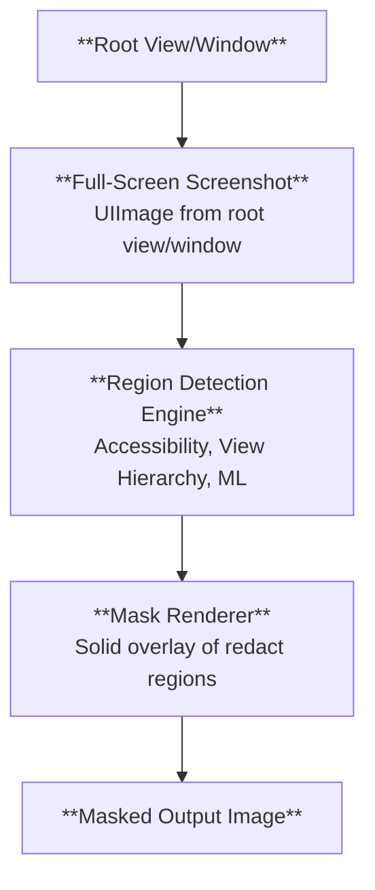

# Sensitive View Masking for Screenshot & Session Replay

## Overview

This document explores approaches of a robust, extensible approach to detecting and masking sensitive content in screenshots and session replay frames captured on iOS, with a particular focus on SwiftUI.
Traditional UIKit-based masking via view traversal often fails for SwiftUI because text and values are frequently rendered by opaque layers and not represented by discrete, discoverable `UIView` subclasses (anymore).

## Background & Motivation

SDK features like session replay and screenshots may capture PII if left unredacted. Shipping a defensible, default-on redaction solution is required for privacy (GDPR/CCPA), regulatory compliance, and user trust.
While UIKit exposes rich view metadata, SwiftUI does not, therefore we need to move away from class-name heuristics toward alternatives such as semantic information from accessibility or pixel-based analysis using machine-learning.

### Goals

- Detect and mask sensitive regions without requiring app developer annotations.
- Support UIKit, SwiftUI, and mixed apps incl. hybrid apps built with React Native.
- Minimize maintenance cost across OS updates and new UI frameworks.
- Keep performance overhead low and predictable.

### Requirements

- No private APIs in production App Store builds.
- No dependence on globally toggled system services (e.g., VoiceOver) in production.
- Work reliably in background-capable scenarios and during animations (e.g., during view transitions).
- Capture edge-cases such as frames taken during view transitions.
- Be configurable via user-provided include/exclude class lists.

## Processing Pipeline Overview

The process when taking a screenshot or session replay frame is as follows:



This document focuses on the **Region Detection Engine** and how we calculate the `SentryRedactRegion` geometry.

## View Hierarchy-Based Redaction (Default Implementation)

The `SentryUIRedactBuilder` is the current default implementation for identifying which areas of a view hierarchy should be masked during screenshot or session replay capture.
It is highly configurable and built to handle both UIKit and modern hybrid/SwiftUI scenarios, minimizing risk of privacy leaks while reducing the chance of costly masking mistakes (such as over-masking backgrounds or missing PII embedded in complex render trees).

Some of the key features of the `SentryUIRedactBuilder` are:

- Maintains configured sets of classes to redact and ignore (optionally gated by backing `CALayer` type to handle edge cases) and supports container overrides (force-redact or force-ignore).
- Traverses the Core Animation layer tree from the root view’s presentation layer to match runtime geometry during animations.
- Creates `SentryRedactRegion` entries for matched views, inserts clip regions for opaque/clip-to-bounds cases, and handles ordering so masks apply correctly.
- Applies special handling for `UIImageView` (skip tiny/bundle images), SwiftUI render surfaces, and known web/pdf/video views.

### Class-Based Redaction and Ignoring

At the heart of the builder is the concept of **class identifiers**:

Views to mask ("redact") and views to explicitly "ignore" are stored as _sets of string identifiers_ (not `AnyClass` directly).
This deliberate design avoids referencing Objective-C class objects at runtime, which can trigger class initializers (`+initialize`) and crash if done off the main thread.
Instead, each class name is stored and compared as a string via `type(of: view).description()`.

The builder supports:

- **Unmasked (ignored) views:** e.g. standard system controls such as `UISlider`, `UISwitch`, or explicit user configuration, will have their subtrees excluded from redaction.
- **Masked (redacted) views:** e.g. `UILabel`, `UITextView`, `UIImageView` (with heuristics), and known hybrid/SwiftUI/React Native renderers.
- **Granular overrides:** The system allows the user to register container classes to force redaction or allow-list (ignore) their direct children, or marking instances of views to be ignored or redacted.

### Layer Tree Traversal & Presentation-State Geometry

The redaction builder walks the Core Animation layer tree, not just the UIKit `subviews`, to match real-time, animated geometry. This allows the builder to correctly handle views that are hidden, alpha-transparent, or have a non-zero frame size, and also cases where views use multiple layers.

Each view’s masking eligibility is checked not only based on its type but, when necessary, with a secondary filter on the underlying `CALayer` type.
This allows disambiguation for cases like SwiftUI rendering, where the same view class serves both as a text/image renderer and as a generic structural element.

During traversal, if the system encounters opaque views that completely cover previously marked redaction regions, it can remove or bypass those earlier masks to prevent the creation of unnecessary or hidden mask layers. The rules that determine which parts of the interface to mask are flexible and can be combined: for instance, a `UIImageView` may be masked or left visible depending on specific heuristics, such as whether its image comes from a bundle asset or if the image is very small.

### Special Case Handling

**SwiftUI/Hybrid Views:**

Many hybrid frameworks and SwiftUI components use generic or non-public view types to render content. The builder uses a combination of:

- (a) string-matched class IDs (e.g., `"SwiftUI._UIGraphicsView"`)
- (b) layer class filters (e.g., only masking when `.layerId == "SwiftUI.ImageLayer"`)

React Native text/image renderers are also included explicitly to cover cross-platform apps.

**Known risk classes:**

A special case exists for `"CameraUI.ChromeSwiftUIView"` (Xcode 16/iOS 26+) because accessing its layers directly can cause crashes. It is therefore ignored in subtree traversal.

### Clip Handling and Z-Ordering

Redact regions are assembled in **reverse z-order** (to match real on-screen compositing).
When clips (because of `clipsToBounds` or opaque/covering views) are encountered, logical "clip begin"/"clip end" markers are inserted so the renderer can avoid over-masking subregions or incorrectly masking nested content.

### Container Overrides

The builder supports registering _ignore containers_ (marking all direct children as safe/unmasked) or _redact containers_ (force-masking entire subtrees).

### Thread Safety and Side Effects Avoidance

All class-matching and hierarchy operations are intentionally free of logic that would cause UIKit classes to initialize on background threads. As access to class objects is limited to the main thread, the redaction calculations are performed on the main thread while further processing is performed on a background queue using the thread-safe `SentryRedactRegion` type.

### Redact Region Output

At the end, the builder outputs a collection of `SentryRedactRegion` items, each corresponding to a geometric region in the screenshot to be masked. For debugging, entries also include the view’s class name and other relevant metadata.

### Known Limitations and Safeguards

Some UIKit/private class names or render layers can change across iOS versions. The design allows quick update of class/layer rules but requires regular review on new OS releases.
Some "decoration" views (e.g., `"_UICollectionViewListLayoutSectionBackgroundColorDecorationView"`) get special handling to prevent over-eager region suppression.

## Accessibility-Based Redaction:

The `SentryAccessibilityRedactBuilder` is an alternative implementation for identifying which areas of a view hierarchy should be masked during screenshot or session replay capture.

### The Accessibility Framework

The Accessibility framework on iOS is a system of APIs and runtime services that allow apps to expose their interface semantics and content to users with disabilities, as well as to automated tools. Developers annotate UI elements (such as buttons, images, and custom views) with accessibility properties like labels, traits, hints, and values, either directly in Interface Builder or programmatically. The framework constructs an accessibility "tree" that mirrors key elements of the UI, describing their position, state, and purpose. This metadata lets assistive technologies like VoiceOver describe app contents, navigate hierarchies, and let users interact with the interface through non-visual means.

VoiceOver, iOS’s built-in screen reader, relies on the Accessibility framework to give spoken feedback about what appears on screen and to support alternative input mechanisms like swipe and tap gestures. When VoiceOver is enabled, it queries the accessibility tree of visible UI elements, reads out each element’s label, value, and role, and listens for user gestures to perform navigation or activation. Apple encourages developers to annotate their UI with accessibility properties tailored to their app’s content and user experience to improve the VoiceOver experience for users with disabilities.

**Example:**

```swift
// UIKit
let button = UIButton(type: .system)
button.accessibilityLabel = "Login"
button.accessibilityValue = "Click to login"
button.accessibilityTraits = .button
button.accessibilityHint = "Login to your account"
button.accessibilityIdentifier = "loginButton"
button.isAccessibilityElement = true

// SwiftUI
struct LoginView: View {
    var body: some View {
        Button(action: {
            print("Login button tapped")
        }) {
            Text("Login")
        }
        .accessibilityLabel("Login")
        .accessibilityValue("Click to login")
        .accessibilityTraits(.button)
        .accessibilityHint("Login to your account")
        .accessibilityIdentifier("loginButton")
        .isAccessibilityElement(true)
    }
```

In addition to assistive use cases, the Accessibility framework also powers automated UI testing tools such as XCTest’s UI test APIs. UI tests interact with an app not by directly manipulating view instances, but by simulating user actions (like taps or swipes) on accessibility elements. The framework exposes a stable interface layer that remains consistent even if the underlying view implementation changes, making tests more robust and maintainable.

**Example:**

```swift
let app = XCUIApplication()

let loginButton = app.buttons["loginButton"]
guard loginButton.waitForExistence(timeout: 10) else {
    XCTFail("Login button not found")
    return
}
loginButton.tap()
```

To explore the Accessibility information available in a view hierarchy, we can use the the _Accessibility Inspector_ included in Xcode.

### Accessing Accessibility Information from SDK

To access the information from the SDK, we have two potential approaches:

1. Access the tree directly using the `UIAccessibility` framework, similar to how Xcode UI Tests and the Accessibility Inspector work.
2. Traversing the view hierarchy and accessing the accessibility information from the views.

#### Accessing the Accessibility Tree Directly

The Accessibility framework does not offer a public API to directly query the system accessibility server (which is used by `XCUIApplication` to interact with the app), as it lives outside of the app's process.
Further analysis of SDK frameworks show that only the `Accessibility.framework` is available in the SDK, while all other frameworks mentioning `Accessibility` or `AX*` (e.g. `AXRuntime` is used by `XCUITests`) are private frameworks.

```bash
$ find /Applications/Xcode-26.1.0.app/Contents/Developer/Platforms/iPhoneOS.platform/Developer/SDKs/iPhoneOS.sdk -name "Accessibility*"
/Applications/Xcode-26.1.0.app/Contents/Developer/Platforms/iPhoneOS.platform/Developer/SDKs/iPhoneOS.sdk/System/Library/Frameworks/Accessibility.framework
/Applications/Xcode-26.1.0.app/Contents/Developer/Platforms/iPhoneOS.platform/Developer/SDKs/iPhoneOS.sdk/System/Library/Frameworks/Accessibility.framework/Accessibility.tbd
/Applications/Xcode-26.1.0.app/Contents/Developer/Platforms/iPhoneOS.platform/Developer/SDKs/iPhoneOS.sdk/System/Library/Frameworks/Accessibility.framework/Headers/Accessibility.h
/Applications/Xcode-26.1.0.app/Contents/Developer/Platforms/iPhoneOS.platform/Developer/SDKs/iPhoneOS.sdk/System/Library/Frameworks/Accessibility.framework/Modules/Accessibility.swiftmodule

$ find /Applications/Xcode-26.1.0.app/Contents/Developer/Platforms/iPhoneOS.platform/Developer/SDKs/iPhoneOS.sdk -name "AX*"
/Applications/Xcode-26.1.0.app/Contents/Developer/Platforms/iPhoneOS.platform/Developer/SDKs/iPhoneOS.sdk/System/Library/Frameworks/Accessibility.framework/Headers/AXColorUtilities.h
/Applications/Xcode-26.1.0.app/Contents/Developer/Platforms/iPhoneOS.platform/Developer/SDKs/iPhoneOS.sdk/System/Library/Frameworks/Accessibility.framework/Headers/AXMathExpression.h
/Applications/Xcode-26.1.0.app/Contents/Developer/Platforms/iPhoneOS.platform/Developer/SDKs/iPhoneOS.sdk/System/Library/Frameworks/Accessibility.framework/Headers/AXHearingUtilities.h
/Applications/Xcode-26.1.0.app/Contents/Developer/Platforms/iPhoneOS.platform/Developer/SDKs/iPhoneOS.sdk/System/Library/Frameworks/Accessibility.framework/Headers/AXAudiograph.h
/Applications/Xcode-26.1.0.app/Contents/Developer/Platforms/iPhoneOS.platform/Developer/SDKs/iPhoneOS.sdk/System/Library/Frameworks/Accessibility.framework/Headers/AXCustomContent.h
/Applications/Xcode-26.1.0.app/Contents/Developer/Platforms/iPhoneOS.platform/Developer/SDKs/iPhoneOS.sdk/System/Library/Frameworks/Accessibility.framework/Headers/AXTechnology.h
/Applications/Xcode-26.1.0.app/Contents/Developer/Platforms/iPhoneOS.platform/Developer/SDKs/iPhoneOS.sdk/System/Library/Frameworks/Accessibility.framework/Headers/AXRequest.h
/Applications/Xcode-26.1.0.app/Contents/Developer/Platforms/iPhoneOS.platform/Developer/SDKs/iPhoneOS.sdk/System/Library/Frameworks/Accessibility.framework/Headers/AXFoundation.h
/Applications/Xcode-26.1.0.app/Contents/Developer/Platforms/iPhoneOS.platform/Developer/SDKs/iPhoneOS.sdk/System/Library/Frameworks/Accessibility.framework/Headers/AXBrailleTranslator.h
/Applications/Xcode-26.1.0.app/Contents/Developer/Platforms/iPhoneOS.platform/Developer/SDKs/iPhoneOS.sdk/System/Library/Frameworks/Accessibility.framework/Headers/AXFeatureOverrideSessionManager.h
/Applications/Xcode-26.1.0.app/Contents/Developer/Platforms/iPhoneOS.platform/Developer/SDKs/iPhoneOS.sdk/System/Library/Frameworks/Accessibility.framework/Headers/AXBrailleMap.h
/Applications/Xcode-26.1.0.app/Contents/Developer/Platforms/iPhoneOS.platform/Developer/SDKs/iPhoneOS.sdk/System/Library/Frameworks/Accessibility.framework/Headers/AXSettings.h
```

Further private frameworks can be found when looking into the macOS platform SDKs, proofing the existence of the Accessibility runtime:

```bash
$ find /Applications/Xcode-26.1.0.app/Contents/Developer/Platforms/MacOSX.platform/Developer/SDKs/MacOSX.sdk/System/Library/PrivateFrameworks/ -name "Accessibility*"
/Applications/Xcode-26.1.0.app/Contents/Developer/Platforms/MacOSX.platform/Developer/SDKs/MacOSX.sdk/System/Library/PrivateFrameworks/AccessibilityUIShared.framework
/Applications/Xcode-26.1.0.app/Contents/Developer/Platforms/MacOSX.platform/Developer/SDKs/MacOSX.sdk/System/Library/PrivateFrameworks/AccessibilityAudit.framework
/Applications/Xcode-26.1.0.app/Contents/Developer/Platforms/MacOSX.platform/Developer/SDKs/MacOSX.sdk/System/Library/PrivateFrameworks/AccessibilityPerformance.framework
/Applications/Xcode-26.1.0.app/Contents/Developer/Platforms/MacOSX.platform/Developer/SDKs/MacOSX.sdk/System/Library/PrivateFrameworks/AccessibilityBundles.framework
/Applications/Xcode-26.1.0.app/Contents/Developer/Platforms/MacOSX.platform/Developer/SDKs/MacOSX.sdk/System/Library/PrivateFrameworks/AccessibilityPlatformTranslation.framework
/Applications/Xcode-26.1.0.app/Contents/Developer/Platforms/MacOSX.platform/Developer/SDKs/MacOSX.sdk/System/Library/PrivateFrameworks/AccessibilityUI.framework
/Applications/Xcode-26.1.0.app/Contents/Developer/Platforms/MacOSX.platform/Developer/SDKs/MacOSX.sdk/System/Library/PrivateFrameworks/AccessibilitySharedSupport.framework
/Applications/Xcode-26.1.0.app/Contents/Developer/Platforms/MacOSX.platform/Developer/SDKs/MacOSX.sdk/System/Library/PrivateFrameworks/AccessibilityUIService.framework
/Applications/Xcode-26.1.0.app/Contents/Developer/Platforms/MacOSX.platform/Developer/SDKs/MacOSX.sdk/System/Library/PrivateFrameworks/AccessibilityReaderData.framework
/Applications/Xcode-26.1.0.app/Contents/Developer/Platforms/MacOSX.platform/Developer/SDKs/MacOSX.sdk/System/Library/PrivateFrameworks/AccessibilityUtilities.framework
/Applications/Xcode-26.1.0.app/Contents/Developer/Platforms/MacOSX.platform/Developer/SDKs/MacOSX.sdk/System/Library/PrivateFrameworks/AccessibilityReadingUI.framework
/Applications/Xcode-26.1.0.app/Contents/Developer/Platforms/MacOSX.platform/Developer/SDKs/MacOSX.sdk/System/Library/PrivateFrameworks/AccessibilitySettingsUI.framework
/Applications/Xcode-26.1.0.app/Contents/Developer/Platforms/MacOSX.platform/Developer/SDKs/MacOSX.sdk/System/Library/PrivateFrameworks/AccessibilitySharedUISupport.framework
/Applications/Xcode-26.1.0.app/Contents/Developer/Platforms/MacOSX.platform/Developer/SDKs/MacOSX.sdk/System/Library/PrivateFrameworks/AccessibilitySupport.framework

$ find /Applications/Xcode-26.1.0.app/Contents/Developer/Platforms/MacOSX.platform/Developer/SDKs/MacOSX.sdk/System/Library/PrivateFrameworks/ -name "AX*"
/Applications/Xcode-26.1.0.app/Contents/Developer/Platforms/MacOSX.platform/Developer/SDKs/MacOSX.sdk/System/Library/PrivateFrameworks/AXMotionCuesServices.framework
/Applications/Xcode-26.1.0.app/Contents/Developer/Platforms/MacOSX.platform/Developer/SDKs/MacOSX.sdk/System/Library/PrivateFrameworks/AXMotionCuesServices.framework/AXMotionCuesServices.tbd
/Applications/Xcode-26.1.0.app/Contents/Developer/Platforms/MacOSX.platform/Developer/SDKs/MacOSX.sdk/System/Library/PrivateFrameworks/AXMotionCuesServices.framework/Versions/A/AXMotionCuesServices.tbd
/Applications/Xcode-26.1.0.app/Contents/Developer/Platforms/MacOSX.platform/Developer/SDKs/MacOSX.sdk/System/Library/PrivateFrameworks/AXMediaUtilities.framework
/Applications/Xcode-26.1.0.app/Contents/Developer/Platforms/MacOSX.platform/Developer/SDKs/MacOSX.sdk/System/Library/PrivateFrameworks/AXMediaUtilities.framework/Versions/A/AXMediaUtilities.tbd
/Applications/Xcode-26.1.0.app/Contents/Developer/Platforms/MacOSX.platform/Developer/SDKs/MacOSX.sdk/System/Library/PrivateFrameworks/AXMediaUtilities.framework/AXMediaUtilities.tbd
/Applications/Xcode-26.1.0.app/Contents/Developer/Platforms/MacOSX.platform/Developer/SDKs/MacOSX.sdk/System/Library/PrivateFrameworks/AXRuntime.framework
/Applications/Xcode-26.1.0.app/Contents/Developer/Platforms/MacOSX.platform/Developer/SDKs/MacOSX.sdk/System/Library/PrivateFrameworks/AXRuntime.framework/AXRuntime.tbd
/Applications/Xcode-26.1.0.app/Contents/Developer/Platforms/MacOSX.platform/Developer/SDKs/MacOSX.sdk/System/Library/PrivateFrameworks/AXRuntime.framework/Versions/A/AXRuntime.tbd
/Applications/Xcode-26.1.0.app/Contents/Developer/Platforms/MacOSX.platform/Developer/SDKs/MacOSX.sdk/System/Library/PrivateFrameworks/AXCoreUtilities.framework
/Applications/Xcode-26.1.0.app/Contents/Developer/Platforms/MacOSX.platform/Developer/SDKs/MacOSX.sdk/System/Library/PrivateFrameworks/AXCoreUtilities.framework/AXCoreUtilities.tbd
/Applications/Xcode-26.1.0.app/Contents/Developer/Platforms/MacOSX.platform/Developer/SDKs/MacOSX.sdk/System/Library/PrivateFrameworks/AXCoreUtilities.framework/Versions/A/AXCoreUtilities.tbd
/Applications/Xcode-26.1.0.app/Contents/Developer/Platforms/MacOSX.platform/Developer/SDKs/MacOSX.sdk/System/Library/PrivateFrameworks/AXGuestPassServices.framework
/Applications/Xcode-26.1.0.app/Contents/Developer/Platforms/MacOSX.platform/Developer/SDKs/MacOSX.sdk/System/Library/PrivateFrameworks/AXGuestPassServices.framework/Versions/A/AXGuestPassServices.tbd
/Applications/Xcode-26.1.0.app/Contents/Developer/Platforms/MacOSX.platform/Developer/SDKs/MacOSX.sdk/System/Library/PrivateFrameworks/AXGuestPassServices.framework/AXGuestPassServices.tbd
/Applications/Xcode-26.1.0.app/Contents/Developer/Platforms/MacOSX.platform/Developer/SDKs/MacOSX.sdk/System/Library/PrivateFrameworks/AXAssetLoader.framework
/Applications/Xcode-26.1.0.app/Contents/Developer/Platforms/MacOSX.platform/Developer/SDKs/MacOSX.sdk/System/Library/PrivateFrameworks/AXAssetLoader.framework/Versions/A/AXAssetLoader.tbd
/Applications/Xcode-26.1.0.app/Contents/Developer/Platforms/MacOSX.platform/Developer/SDKs/MacOSX.sdk/System/Library/PrivateFrameworks/AXAssetLoader.framework/AXAssetLoader.tbd
```

Due to this limitation, this approach is not feasible for the Sentry SDK and would cause non-conformity with the App Store Review Guidelines.

#### Traversing the View Hierarchy

The view hierarchy consists of a tree structure of `UIView`, which are subclasses of `NSObject` and have a `subviews` property that contains an array of `UIView` instances.
As the accessibility information properties are instance properties of `NSObject` (see [Apple Documentation](https://developer.apple.com/documentation/objectivec/nsobject-swift.class#Instance-Properties)), it allows us to traverse the view hierarchy and access the accessibility information from the views.

It is important to note that each view is therefore an accessibility element with an accessibility frame, accessibility label, accessibility value, accessibility traits, and accessibility identifier.
Furthermore, while the view hierarchy is already a tree structure with multiple leaf nodes per subview, each accessibility element can also have multiple children set in [`accessibilityElements`](https://developer.apple.com/documentation/objectivec/nsobject-swift.class/accessibilityelements).

The built accessibility tree is therefore larger than the view hierarchy tree by itself, which makes it especially valuable when working with SwiftUI views, due to them being partially rendered via graphical views.

**Example:**

```swift
```
