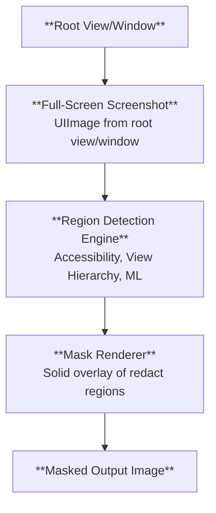

# Sensitive View Masking for Screenshot & Session Replay

## Overview

This document explores approaches of a robust, extensible approach to detecting and masking sensitive content in screenshots and session replay frames captured on iOS, with a particular focus on SwiftUI.
Traditional UIKit-based masking via view traversal often fails for SwiftUI because text and values are frequently rendered by opaque layers and not represented by discrete, discoverable `UIView` subclasses (anymore).

## Background & Motivation

SDK features like session replay and screenshots may capture PII if left unredacted. Shipping a defensible, default-on redaction solution is required for privacy (GDPR/CCPA), regulatory compliance, and user trust.

While UIKit exposes rich view metadata, SwiftUI does not, therefore we need to move away from class-name heuristics toward alternatives such as semantic information from accessibility or pixel-based analysis using machine-learning.

### Goals

- Detect and mask sensitive regions without requiring app developer annotations.
- Support UIKit, SwiftUI, and mixed apps incl. hybrid apps built with React Native.
- Minimize maintenance cost across OS updates and new UI frameworks.
- Keep performance overhead low and predictable.

### Requirements

- No private APIs in production App Store builds.
- No dependence on globally toggled system services (e.g., VoiceOver) in production.
- Work reliably in background-capable scenarios and during animations (e.g., during view transitions).
- Capture edge-cases such as frames taken during view transitions.
- Be configurable via user-provided include/exclude class lists.

## Processing Pipeline Overview

The process when taking a screenshot or session replay frame is as follows:



This document focuses on the **Region Detection Engine** and how we calculate the `SentryRedactRegion` geometry based on a given view hierarchy and layer tree.

## View Hierarchies on iOS

On iOS, the UI is organized as a tree of `UIView` objects (UIKit views). Each view manages layout, interaction, and is part of the responder chain. Every `UIView` also owns a primary Core Animation layer (`CALayer`) available via `view.layer`. Layers form their own tree and are responsible for rendering and animation.

Difference between a view and a layer:

- View (`UIView`): UIKit object that participates in hit‑testing and input events, Auto Layout, coordinate conversion, and accessibility. Views determine where content goes and when it needs to be redrawn, and may implement `draw(_:)` or act as the `CALayer`’s delegate.
- Layer (`CALayer`): Core Animation object that holds the visual content and animation state. Layers composite on the render server, expose visual properties (e.g., `backgroundColor`, `cornerRadius`, `shadow*`, `opacity`, `transform`), and can have `sublayers`. Layers do not receive touch events, are not first responders, and do not own constraints; their geometry is defined by `bounds`/`position`/`anchorPoint`.

Important consequences:

- The view tree and the layer tree are related but not identical. A single view can add multiple sublayers, and some sublayers have no backing `UIView`.
- During animations, the on‑screen geometry lives in the layer’s `presentationLayer` (the animated state), which can differ from the model layer values and the view’s frame.
- Frameworks like SwiftUI and hybrid renderers often draw into generic views that host complex layer subtrees without exposing a view hierarchy.

These distinctions matter for masking: to match what the user actually sees, our redaction logic inspects the Core Animation layer tree (and, when needed, the `presentationLayer`) rather than relying only on the `UIView` hierarchy.

## View Hierarchy & Layer Tree-Based Redaction

> ![INFO]
> As of Nov 13th, 2025, this is the default implementation for identifying which areas of a view hierarchy should be masked during screenshot or session replay capture.

The `SentryUIRedactBuilder` is the current default implementation for identifying which areas of a view hierarchy should be masked during screenshot or session replay capture.
It is highly configurable and built to handle both UIKit and modern hybrid/SwiftUI scenarios, minimizing risk of privacy leaks while reducing the chance of costly masking mistakes (such as over-masking backgrounds or missing PII embedded in complex render trees).

Some of the key features of the `SentryUIRedactBuilder` are:

- Maintains configured sets of classes to redact and ignore (optionally gated by backing `CALayer` type to handle edge cases) and supports container overrides (force-redact or force-ignore).
- Traverses the Core Animation layer tree from the root view’s presentation layer to match runtime geometry during animations.
- Creates `SentryRedactRegion` entries for matched views, inserts clip regions for opaque/clip-to-bounds cases, and handles ordering so masks apply correctly.
- Applies special handling for `UIImageView` (skip tiny/bundle images), SwiftUI render surfaces, and known web/pdf/video views.

### Class-Based Redaction and Ignoring

At the heart of the builder is the concept of **class identifiers**:

Views to mask ("redact") and views to explicitly "ignore" are stored as _sets of string identifiers_ (not `AnyClass` directly).
This deliberate design avoids referencing Objective-C class objects at runtime, which can trigger class initializers (`+initialize`) and crash if done off the main thread.
Instead, each class name is stored and compared as a string via `type(of: view).description()`.

The builder supports:

- **Unmasked (ignored) views:** e.g. standard system controls such as `UISlider`, `UISwitch`, or explicit user configuration, will have their subtrees excluded from redaction.
- **Masked (redacted) views:** e.g. `UILabel`, `UITextView`, `UIImageView` (with heuristics), and known hybrid/SwiftUI/React Native renderers.
- **Granular overrides:** The system allows the user to register container classes to force redaction or allow-list (ignore) their direct children, or marking instances of views to be ignored or redacted.

### Layer Tree Traversal & Presentation-State Geometry

The redaction builder walks the Core Animation layer tree, not just the UIKit `subviews`, to match real-time, animated geometry. This allows the builder to correctly handle views that are hidden, alpha-transparent, or have a non-zero frame size, and also cases where views use multiple layers.

Each view’s masking eligibility is checked not only based on its type but, when necessary, with a secondary filter on the underlying `CALayer` type.
This allows disambiguation for cases like SwiftUI rendering, where the same view class serves both as a text/image renderer and as a generic structural element.

During traversal, if the system encounters opaque views that completely cover previously marked redaction regions, it can remove or bypass those earlier masks to prevent the creation of unnecessary or hidden mask layers. The rules that determine which parts of the interface to mask are flexible and can be combined: for instance, a `UIImageView` may be masked or left visible depending on specific heuristics, such as whether its image comes from a bundle asset or if the image is very small.

### Special Case Handling

**SwiftUI/Hybrid Views:**

Many hybrid frameworks and SwiftUI components use generic or non-public view types to render content. The builder uses a combination of:

- (a) string-matched class IDs (e.g., `"SwiftUI._UIGraphicsView"`)
- (b) layer class filters (e.g., only masking when `.layerId == "SwiftUI.ImageLayer"`)

React Native text/image renderers are also included explicitly to cover cross-platform apps.

**Known risk classes:**

A special case exists for `"CameraUI.ChromeSwiftUIView"` (Xcode 16/iOS 26+) because accessing its layers directly can cause crashes. It is therefore ignored in subtree traversal.

### Clip Handling and Z-Ordering

Redact regions are assembled in **reverse z-order** (to match real on-screen compositing).
When clips (because of `clipsToBounds` or opaque/covering views) are encountered, logical "clip begin"/"clip end" markers are inserted so the renderer can avoid over-masking subregions or incorrectly masking nested content.

### Container Overrides

The builder supports registering _ignore containers_ (marking all direct children as safe/unmasked) or _redact containers_ (force-masking entire subtrees).

### Thread Safety and Side Effects Avoidance

All class-matching and hierarchy operations are intentionally free of logic that would cause UIKit classes to initialize on background threads. As access to class objects is limited to the main thread, the redaction calculations are performed on the main thread while further processing is performed on a background queue using the thread-safe `SentryRedactRegion` type.

### Redact Region Output

At the end, the builder outputs a collection of `SentryRedactRegion` items, each corresponding to a geometric region in the screenshot to be masked. For debugging, entries also include the view’s class name and other relevant metadata.

### Known Limitations and Safeguards

Some UIKit/private class names or render layers can change across iOS versions. The design allows quick update of class/layer rules but requires regular review on new OS releases.
Some "decoration" views (e.g., `"_UICollectionViewListLayoutSectionBackgroundColorDecorationView"`) get special handling to prevent over-eager region suppression.

## Accessibility-Based Redaction:

> ![WARNING]
> This approach is not usable for session replay due to unavailability of accessibility information on actual iOS devices unless VoiceOver is enabled system-wide.

The `SentryAccessibilityRedactBuilder` is an alternative implementation for identifying which areas of a view hierarchy should be masked during screenshot or session replay capture.

### The Accessibility Framework

The Accessibility framework on iOS is a system of APIs and runtime services that allow apps to expose their interface semantics and content to users with disabilities, as well as to automated tools. Developers annotate UI elements (such as buttons, images, and custom views) with accessibility properties like labels, traits, hints, and values, either directly in Interface Builder or programmatically. The framework constructs an accessibility "tree" that mirrors key elements of the UI, describing their position, state, and purpose. This metadata lets assistive technologies like VoiceOver describe app contents, navigate hierarchies, and let users interact with the interface through non-visual means.

VoiceOver, iOS’s built-in screen reader, relies on the Accessibility framework to give spoken feedback about what appears on screen and to support alternative input mechanisms like swipe and tap gestures. When VoiceOver is enabled, it queries the accessibility tree of visible UI elements, reads out each element’s label, value, and role, and listens for user gestures to perform navigation or activation. Apple encourages developers to annotate their UI with accessibility properties tailored to their app’s content and user experience to improve the VoiceOver experience for users with disabilities.

**Example:**

```swift
// UIKit
let button = UIButton(type: .system)
button.accessibilityLabel = "Login"
button.accessibilityValue = "Click to login"
button.accessibilityTraits = .button
button.accessibilityHint = "Login to your account"
button.accessibilityIdentifier = "loginButton"
button.isAccessibilityElement = true

// SwiftUI
struct LoginView: View {
    var body: some View {
        Button(action: {
            print("Login button tapped")
        }) {
            Text("Login")
        }
        .accessibilityLabel("Login")
        .accessibilityValue("Click to login")
        .accessibilityTraits(.button)
        .accessibilityHint("Login to your account")
        .accessibilityIdentifier("loginButton")
        .isAccessibilityElement(true)
    }
```

In addition to assistive use cases, the Accessibility framework also powers automated UI testing tools such as XCTest’s UI test APIs. UI tests interact with an app not by directly manipulating view instances, but by simulating user actions (like taps or swipes) on accessibility elements. The framework exposes a stable interface layer that remains consistent even if the underlying view implementation changes, making tests more robust and maintainable.

**Example:**

```swift
let app = XCUIApplication()

let loginButton = app.buttons["loginButton"]
guard loginButton.waitForExistence(timeout: 10) else {
    XCTFail("Login button not found")
    return
}
loginButton.tap()
```

To explore the Accessibility information available in a view hierarchy, we can use the the _Accessibility Inspector_ included in Xcode.

### Accessing Accessibility Information from SDK

To access the information from the SDK, we have two potential approaches:

1. Access the tree directly using the `UIAccessibility` framework, similar to how Xcode UI Tests and the Accessibility Inspector work.
2. Traversing the view hierarchy and accessing the accessibility information from the views.

#### Accessing the Accessibility Tree Directly

The Accessibility framework does not offer a public API to directly query the system accessibility server (which is used by `XCUIApplication` to interact with the app), as it lives outside of the app's process.
Further analysis of SDK frameworks show that only the `Accessibility.framework` is available in the SDK, while all other frameworks mentioning `Accessibility` or `AX*` (e.g. `AXRuntime` is used by `XCUITests`) are private frameworks.

```bash
$ find /Applications/Xcode-26.1.0.app/Contents/Developer/Platforms/iPhoneOS.platform/Developer/SDKs/iPhoneOS.sdk -name "Accessibility*"
/Applications/Xcode-26.1.0.app/Contents/Developer/Platforms/iPhoneOS.platform/Developer/SDKs/iPhoneOS.sdk/System/Library/Frameworks/Accessibility.framework
/Applications/Xcode-26.1.0.app/Contents/Developer/Platforms/iPhoneOS.platform/Developer/SDKs/iPhoneOS.sdk/System/Library/Frameworks/Accessibility.framework/Accessibility.tbd
/Applications/Xcode-26.1.0.app/Contents/Developer/Platforms/iPhoneOS.platform/Developer/SDKs/iPhoneOS.sdk/System/Library/Frameworks/Accessibility.framework/Headers/Accessibility.h
/Applications/Xcode-26.1.0.app/Contents/Developer/Platforms/iPhoneOS.platform/Developer/SDKs/iPhoneOS.sdk/System/Library/Frameworks/Accessibility.framework/Modules/Accessibility.swiftmodule

$ find /Applications/Xcode-26.1.0.app/Contents/Developer/Platforms/iPhoneOS.platform/Developer/SDKs/iPhoneOS.sdk -name "AX*"
/Applications/Xcode-26.1.0.app/Contents/Developer/Platforms/iPhoneOS.platform/Developer/SDKs/iPhoneOS.sdk/System/Library/Frameworks/Accessibility.framework/Headers/AXColorUtilities.h
/Applications/Xcode-26.1.0.app/Contents/Developer/Platforms/iPhoneOS.platform/Developer/SDKs/iPhoneOS.sdk/System/Library/Frameworks/Accessibility.framework/Headers/AXMathExpression.h
/Applications/Xcode-26.1.0.app/Contents/Developer/Platforms/iPhoneOS.platform/Developer/SDKs/iPhoneOS.sdk/System/Library/Frameworks/Accessibility.framework/Headers/AXHearingUtilities.h
/Applications/Xcode-26.1.0.app/Contents/Developer/Platforms/iPhoneOS.platform/Developer/SDKs/iPhoneOS.sdk/System/Library/Frameworks/Accessibility.framework/Headers/AXAudiograph.h
/Applications/Xcode-26.1.0.app/Contents/Developer/Platforms/iPhoneOS.platform/Developer/SDKs/iPhoneOS.sdk/System/Library/Frameworks/Accessibility.framework/Headers/AXCustomContent.h
/Applications/Xcode-26.1.0.app/Contents/Developer/Platforms/iPhoneOS.platform/Developer/SDKs/iPhoneOS.sdk/System/Library/Frameworks/Accessibility.framework/Headers/AXTechnology.h
/Applications/Xcode-26.1.0.app/Contents/Developer/Platforms/iPhoneOS.platform/Developer/SDKs/iPhoneOS.sdk/System/Library/Frameworks/Accessibility.framework/Headers/AXRequest.h
/Applications/Xcode-26.1.0.app/Contents/Developer/Platforms/iPhoneOS.platform/Developer/SDKs/iPhoneOS.sdk/System/Library/Frameworks/Accessibility.framework/Headers/AXFoundation.h
/Applications/Xcode-26.1.0.app/Contents/Developer/Platforms/iPhoneOS.platform/Developer/SDKs/iPhoneOS.sdk/System/Library/Frameworks/Accessibility.framework/Headers/AXBrailleTranslator.h
/Applications/Xcode-26.1.0.app/Contents/Developer/Platforms/iPhoneOS.platform/Developer/SDKs/iPhoneOS.sdk/System/Library/Frameworks/Accessibility.framework/Headers/AXFeatureOverrideSessionManager.h
/Applications/Xcode-26.1.0.app/Contents/Developer/Platforms/iPhoneOS.platform/Developer/SDKs/iPhoneOS.sdk/System/Library/Frameworks/Accessibility.framework/Headers/AXBrailleMap.h
/Applications/Xcode-26.1.0.app/Contents/Developer/Platforms/iPhoneOS.platform/Developer/SDKs/iPhoneOS.sdk/System/Library/Frameworks/Accessibility.framework/Headers/AXSettings.h
```

Further private frameworks can be found when looking into the macOS platform SDKs, proofing the existence of the Accessibility runtime:

```bash
$ find /Applications/Xcode-26.1.0.app/Contents/Developer/Platforms/MacOSX.platform/Developer/SDKs/MacOSX.sdk/System/Library/PrivateFrameworks/ -name "Accessibility*"
.../PrivateFrameworks/AccessibilityUIShared.framework
.../PrivateFrameworks/AccessibilityAudit.framework
.../PrivateFrameworks/AccessibilityPerformance.framework
.../PrivateFrameworks/AccessibilityBundles.framework
.../PrivateFrameworks/AccessibilityPlatformTranslation.framework
.../PrivateFrameworks/AccessibilityUI.framework
.../PrivateFrameworks/AccessibilitySharedSupport.framework
.../PrivateFrameworks/AccessibilityUIService.framework
.../PrivateFrameworks/AccessibilityReaderData.framework
.../PrivateFrameworks/AccessibilityUtilities.framework
.../PrivateFrameworks/AccessibilityReadingUI.framework
.../PrivateFrameworks/AccessibilitySettingsUI.framework
.../PrivateFrameworks/AccessibilitySharedUISupport.framework

$ find /Applications/Xcode-26.1.0.app/Contents/Developer/Platforms/MacOSX.platform/Developer/SDKs/MacOSX.sdk/System/Library/PrivateFrameworks/ -name "AX*"
.../PrivateFrameworks/AXMotionCuesServices.framework
.../PrivateFrameworks/AXMotionCuesServices.framework/AXMotionCuesServices.tbd
.../PrivateFrameworks/AXMotionCuesServices.framework/Versions/A/AXMotionCuesServices.tbd
.../PrivateFrameworks/AXMediaUtilities.framework
.../PrivateFrameworks/AXMediaUtilities.framework/Versions/A/AXMediaUtilities.tbd
.../PrivateFrameworks/AXMediaUtilities.framework/AXMediaUtilities.tbd
.../PrivateFrameworks/AXRuntime.framework
.../PrivateFrameworks/AXRuntime.framework/AXRuntime.tbd
.../PrivateFrameworks/AXRuntime.framework/Versions/A/AXRuntime.tbd
.../PrivateFrameworks/AXCoreUtilities.framework
.../PrivateFrameworks/AXCoreUtilities.framework/AXCoreUtilities.tbd
.../PrivateFrameworks/AXCoreUtilities.framework/Versions/A/AXCoreUtilities.tbd
.../PrivateFrameworks/AXGuestPassServices.framework
.../PrivateFrameworks/AXGuestPassServices.framework/Versions/A/AXGuestPassServices.tbd
.../PrivateFrameworks/AXGuestPassServices.framework/AXGuestPassServices.tbd
.../PrivateFrameworks/AXAssetLoader.framework
.../PrivateFrameworks/AXAssetLoader.framework/Versions/A/AXAssetLoader.tbd
.../PrivateFrameworks/AXAssetLoader.framework/AXAssetLoader.tbd
```

Due to this limitation, this approach is not feasible for the Sentry SDK and would cause non-conformity with the App Store Review Guidelines.

#### Traversing the View Hierarchy

As the accessibility information properties are instance properties of `NSObject` (see [Apple Documentation](https://developer.apple.com/documentation/objectivec/nsobject-swift.class#Instance-Properties)), it allows us to traverse the view hierarchy and access the accessibility information from the views.

It is important to note that each view is therefore an accessibility element with an accessibility frame, accessibility label, accessibility value, accessibility traits, and accessibility identifier.
Furthermore, while the view hierarchy is already a tree structure with multiple leaf nodes per subview, each accessibility element can also have multiple children set in [`accessibilityElements`](https://developer.apple.com/documentation/objectivec/nsobject-swift.class/accessibilityelements).

The built accessibility tree is therefore larger than the view hierarchy tree by itself, which makes it especially valuable when working with SwiftUI views, due to them being partially rendered via graphical views.

While testing potential implementations, we identified that while accessing the view hiearachy with accessibility information works on iOS simulators at all times, the **accessibility information is not populated on real iOS devices unless VoiceOver is enabled system-wide**.
The reason for this is that UIKit checks if VoiceOver is enabled by accessing the private `_AXSAutomationEnabled` flag in the `Accessibility.framework` and only sets values for the accessibility information if it is enabled.

Snapshot testing libraries such as [AccessibilitySnapshot](https://github.com/cashapp/AccessibilitySnapshot) are handling this by patching the `Accessibility.framework` to always return `true` for the `_AXSAutomationEnabled` flag in their [ASAccessibilityEnabler.m](https://github.com/cashapp/AccessibilitySnapshot/blob/main/Sources/AccessibilitySnapshot/Parser/ObjC/ASAccessibilityEnabler.m#L37-L49) class, which can also be rewritten in Swift as follows:

```swift
// Load the private accessibility dylib
guard let handle = loadDylib(path: "/usr/lib/libAccessibility.dylib") else {
    fatalError("Failed to load libAccessibility.dylib")
}

// Resolve function pointers to private APIs
guard let symEnabled = dlsym(handle, "_AXSAutomationEnabled"), let symSetEnabled = dlsym(handle, "_AXSSetAutomationEnabled") else {
    dlclose(handle)
    fatalError("Failed to find accessibility automation functions")
}

let getAutomationEnabled = unsafeBitCast(symEnabled, to: AXSAutomationEnabled.self)
let setAutomationEnabled = unsafeBitCast(symSetEnabled, to: AXSSetAutomationEnabled.self)

// Save current state and enable accessibility
let previousValue = getAutomationEnabled?() ?? 0
setAutomationEnabled?(1)

// PERFORM THE ACTION HERE

// Restore previous state
setAutomationEnabled?(previousValue)
dlclose(handle)
```

Loading the Accessibility framework and calling private methods via `dlsym` is not allowed by Apple and would already cause non-conformity with the App Store Review Guidelines.

To proof that this set up is required, we can run the following application and inspect the logs using this view hierarchy and accessibility tree printer:

<details>
<summary>View Hierarchy and Accessibility Tree Printer</summary>

```swift
/// Prints a minimal tree of the `UIView` hierarchy similar to the `tree` CLI.
/// Runs on the main thread for UIKit safety.
///
/// Example output:
/// ├─ UIView(frame: {{0, 0}, {390, 844}})
/// │  ├─ UILabel(frame: {{16, 24}, {200, 20}}, ax=1, "Title")
/// │  └─ UIButton(frame: {{16, 60}, {80, 32}}, ax=1, "Login")
///
public func printViewHierarchyTree(from root: UIView, maxDepth: Int = 64) {
    if !Thread.isMainThread {
        DispatchQueue.main.async { [weak self] in
            self?.printViewHierarchyTree(from: root, maxDepth: maxDepth)
        }
        return
    }

    func describeView(_ view: UIView) -> String {
        let typeName = String(describing: type(of: view))
        let frameStr = "frame: \(NSCoder.string(for: view.frame))"
        let isAX = view.isAccessibilityElement ? "1" : "0"
        let label = (view.accessibilityLabel?.isEmpty == false) ? ", \"\(view.accessibilityLabel!)\"" : ""
        return "\(typeName)(\(frameStr), ax=\(isAX)\(label))"
    }

    func printTree(_ view: UIView, prefix: String, isLast: Bool, depth: Int) {
        if depth > maxDepth { return }
        
        let branch = isLast ? "└─ " : "├─ "
        print("\(prefix)\(branch)\(describeView(view))")
        
        let nextPrefix = prefix + (isLast ? "   " : "│  ")
        let subviews = view.subviews
        for (index, subview) in subviews.enumerated() {
            let last = index == subviews.count - 1
            printTree(subview, prefix: nextPrefix, isLast: last, depth: depth + 1)
        }
    }

    // Print root without leading branch
    print(describeView(root))
    let subviews = root.subviews
    for (index, subview) in subviews.enumerated() {
        let last = index == subviews.count - 1
        printTree(subview, prefix: "", isLast: last, depth: 1)
    }

}

/// Prints a minimal combined tree that includes the `UIView` hierarchy
/// plus any `accessibilityElements` children exposed by objects.
/// Runs on the main thread for UIKit safety.
///
/// Example output:
/// ├─ UIView(frame: {{0, 0}, {390, 844}})
/// │ ├─ UILabel(frame: {{16, 24}, {200, 20}}, ax=1, "Title")
/// │ │ └─ (AX) label="Title", value="", traits=[staticText]
/// │ └─ UIView(frame: {{0, 100}, {390, 44}})
/// │ └─ (AX) label="Search", value="", traits=[searchField]
///
public func printCombinedViewAndAccessibilityTree(from root: UIView, maxDepth: Int = 64) {
    func describeView(_ view: UIView) -> String {
        let typeName = String(describing: type(of: view))
        let frameStr = "frame: \(NSCoder.string(for: view.frame))"
        let isAX = view.isAccessibilityElement ? "1" : "0"
        let label = (view.accessibilityLabel?.isEmpty == false) ? ", \"\(view.accessibilityLabel!)\"" : ""
        return "\(typeName)(\(frameStr), ax=\(isAX)\(label))"
    }

    func readableTraits(_ traits: UIAccessibilityTraits) -> String {
        var parts: [String] = []
        if traits.contains(.button) { parts.append("button") }
        if traits.contains(.link) { parts.append("link") }
        if traits.contains(.image) { parts.append("image") }
        if traits.contains(.staticText) { parts.append("staticText") }
        if traits.contains(.keyboardKey) { parts.append("keyboardKey") }
        if traits.contains(.searchField) { parts.append("searchField") }
        if traits.contains(.header) { parts.append("header") }
        if traits.contains(.selected) { parts.append("selected") }
        if traits.contains(.playsSound) { parts.append("playsSound") }
        if traits.contains(.summaryElement) { parts.append("summary") }
        if traits.contains(.updatesFrequently) { parts.append("updatesFrequently") }
        if traits.contains(.startsMediaSession) { parts.append("startsMedia") }
        if traits.contains(.adjustable) { parts.append("adjustable") }
        if traits.contains(.allowsDirectInteraction) { parts.append("directInteraction") }
        if traits.contains(.notEnabled) { parts.append("disabled") }
        return parts.joined(separator: "|")
    }

    func describeAX(_ object: NSObject, relativeTo root: UIView) -> String {
        let label = object.accessibilityLabel ?? ""
        let value = object.accessibilityValue ?? ""
        let traits = readableTraits(object.accessibilityTraits)
        let frame = object is UIView ? (object as! UIView).frame : root.convert(object.accessibilityFrame, from: nil)
        let frameStr = NSCoder.string(for: frame)
        return "(AX) label=\"\(label)\", value=\"\(value)\", traits=[\(traits)], frame: \(frameStr)"
    }

    func childrenForObject(_ object: NSObject) -> [NSObject] {
        if let view = object as? UIView {
            var children: [NSObject] = []
            if let axChildren = view.accessibilityElements as? [NSObject], !axChildren.isEmpty {
                children.append(contentsOf: axChildren)
            }
            children.append(contentsOf: view.subviews)
            return children
        } else if let axChildren = object.accessibilityElements as? [NSObject] {
            return axChildren
        } else {
            return []
        }
    }

    func printTree(_ object: NSObject, prefix: String, isLast: Bool, depth: Int) {
        if depth > maxDepth { return }
        
        let branch = isLast ? "└─ " : "├─ "
        if let view = object as? UIView {
            print("\(prefix)\(branch)\(describeView(view))")
        } else {
            print("\(prefix)\(branch)\(describeAX(object, relativeTo: root))")
        }
        
        let nextPrefix = prefix + (isLast ? "   " : "│  ")
        let children = childrenForObject(object)
        for (index, child) in children.enumerated() {
            let last = index == children.count - 1
            printTree(child, prefix: nextPrefix, isLast: last, depth: depth + 1)
        }
    }

    // Print root without leading branch
    print(describeView(root))
    let children = childrenForObject(root)
    for (index, child) in children.enumerated() {
        let last = index == children.count - 1
        printTree(child, prefix: "", isLast: last, depth: 1)
    }

}
```

</details>

**Example SwiftUI:**

The following sample app was inspected on a real iPhone 14 Pro with iOS 26.1 with and without patching the Accessibility.framework to always return true for the `_AXSAutomationEnabled` flag.

```swift
struct ContentView: View {
    var body: some View {
        VStack {
            Label("Invisbible Title", image: "xmark")
                .labelStyle(.iconOnly)
            Label("Only Title", image: "xmark")
                .labelStyle(.titleOnly)
            Label("Title & Icon", image: "xmark")
                .labelStyle(.titleAndIcon)
            Text("Hello, World!")
            TextField("Insecure Textfield", text: .constant("Insecure Value"))
            TextField("Secure Textfield", text: .constant("Secure Value"))
        }
    }
}
```

<details>
<summary>View Hierarchy</summary>

```swift
UIWindow(frame: {{0, 0}, {393, 852}}, ax=0)
└─ UITransitionView(frame: {{0, 0}, {393, 852}}, ax=0)
   └─ UIDropShadowView(frame: {{0, 0}, {393, 852}}, ax=0)
      └─ _UIHostingView<ModifiedContent<AnyView, RootModifier>>(frame: {{0, 0}, {393, 852}}, ax=0)
         ├─ UIKitPlatformViewHost<PlatformViewRepresentableAdaptor<PlatformTextFieldAdaptor>>(frame: {{0, 456.66666666666663}, {393, 19.666666666666664}}, ax=0)
         │  └─ UITextField(frame: {{0, 0}, {393, 19.666666666666664}}, ax=0)
         │     ├─ _UITouchPassthroughView(frame: {{0, 0}, {393, 19.666666666666668}}, ax=0)
         │     └─ _UITextLayoutCanvasView(frame: {{0, 0}, {393, 19.666666666666668}}, ax=0)
         │        └─ _UITextLayoutFragmentView(frame: {{-8, 0}, {146, 20.333333333333332}}, ax=0)
         └─ UIKitPlatformViewHost<PlatformViewRepresentableAdaptor<PlatformTextFieldAdaptor>>(frame: {{0, 484.33333333333331}, {393, 19.666666666666664}}, ax=0)
            └─ UITextField(frame: {{0, 0}, {393, 19.666666666666664}}, ax=0)
               ├─ _UITouchPassthroughView(frame: {{0, 0}, {393, 19.666666666666668}}, ax=0)
               └─ _UITextLayoutCanvasView(frame: {{0, 0}, {393, 19.666666666666668}}, ax=0)
                  └─ _UITextLayoutFragmentView(frame: {{-8, 0}, {135, 20.333333333333332}}, ax=0)
```

</details>

<details>
<summary>View Hierarchy + Accessibility Tree (without AccessibilityEnabler)</summary>

```swift
UIWindow(frame: {{0, 0}, {393, 852}}, ax=0)
└─ UITransitionView(frame: {{0, 0}, {393, 852}}, ax=0)
   └─ UIDropShadowView(frame: {{0, 0}, {393, 852}}, ax=0)
      └─ _UIHostingView<ModifiedContent<AnyView, RootModifier>>(frame: {{0, 0}, {393, 852}}, ax=0)
         ├─ UIKitPlatformViewHost<PlatformViewRepresentableAdaptor<PlatformTextFieldAdaptor>>(frame: {{0, 456.66666666666663}, {393, 19.666666666666664}}, ax=0)
         │  └─ UITextField(frame: {{0, 0}, {393, 19.666666666666664}}, ax=0)
         │     ├─ _UITouchPassthroughView(frame: {{0, 0}, {393, 19.666666666666668}}, ax=0)
         │     └─ _UITextLayoutCanvasView(frame: {{0, 0}, {393, 19.666666666666668}}, ax=0)
         │        └─ _UITextLayoutFragmentView(frame: {{-8, 0}, {146, 20.333333333333332}}, ax=0)
         └─ UIKitPlatformViewHost<PlatformViewRepresentableAdaptor<PlatformTextFieldAdaptor>>(frame: {{0, 484.33333333333331}, {393, 19.666666666666664}}, ax=0)
            └─ UITextField(frame: {{0, 0}, {393, 19.666666666666664}}, ax=0)
               ├─ _UITouchPassthroughView(frame: {{0, 0}, {393, 19.666666666666668}}, ax=0)
               └─ _UITextLayoutCanvasView(frame: {{0, 0}, {393, 19.666666666666668}}, ax=0)
                  └─ _UITextLayoutFragmentView(frame: {{-8, 0}, {135, 20.333333333333332}}, ax=0)
```

</details>

<details>
<summary>View Hierarchy + Accessibility Tree (without AccessibilityEnabler)</summary>

```swift
UIWindow(frame: {{0, 0}, {393, 852}}, ax=0)
└─ UITransitionView(frame: {{0, 0}, {393, 852}}, ax=0)
   └─ UIDropShadowView(frame: {{0, 0}, {393, 852}}, ax=0)
      └─ _UIHostingView<ModifiedContent<AnyView, RootModifier>>(frame: {{0, 0}, {393, 852}}, ax=0)
         ├─ (AX) label="Invisbible Title", value="", traits=[image], frame: {{196.5, 372.88362630208331}, {0, 0}}
         ├─ (AX) label="Only Title", value="", traits=[staticText], frame: {{163.83333333333334, 378.50179036458331}, {65.333333333333343, 18}}
         ├─ (AX) label="Title & Icon", value="", traits=[staticText], frame: {{161.83333333333334, 405.83333333333331}, {77.333333333333343, 18}}
         ├─ (AX) label="Hello, World!", value="", traits=[staticText], frame: {{152.66666666666669, 429.45149739583331}, {87.666666666666657, 18}}
         ├─ UITextField(frame: {{0, 0}, {393, 19.666666666666664}}, ax=1)
         │  ├─ _UITouchPassthroughView(frame: {{0, 0}, {393, 19.666666666666668}}, ax=0)
         │  └─ _UITextLayoutCanvasView(frame: {{0, 0}, {393, 19.666666666666668}}, ax=0)
         │     └─ _UITextLayoutFragmentView(frame: {{-8, 0}, {146, 20.333333333333332}}, ax=0)
         ├─ UITextField(frame: {{0, 0}, {393, 19.666666666666664}}, ax=1)
         │  ├─ _UITouchPassthroughView(frame: {{0, 0}, {393, 19.666666666666668}}, ax=0)
         │  └─ _UITextLayoutCanvasView(frame: {{0, 0}, {393, 19.666666666666668}}, ax=0)
         │     └─ _UITextLayoutFragmentView(frame: {{-8, 0}, {135, 20.333333333333332}}, ax=0)
         ├─ UIKitPlatformViewHost<PlatformViewRepresentableAdaptor<PlatformTextFieldAdaptor>>(frame: {{0, 456.66666666666663}, {393, 19.666666666666664}}, ax=0)
         │  └─ UITextField(frame: {{0, 0}, {393, 19.666666666666664}}, ax=1)
         │     ├─ _UITouchPassthroughView(frame: {{0, 0}, {393, 19.666666666666668}}, ax=0)
         │     └─ _UITextLayoutCanvasView(frame: {{0, 0}, {393, 19.666666666666668}}, ax=0)
         │        └─ _UITextLayoutFragmentView(frame: {{-8, 0}, {146, 20.333333333333332}}, ax=0)
         └─ UIKitPlatformViewHost<PlatformViewRepresentableAdaptor<PlatformTextFieldAdaptor>>(frame: {{0, 484.33333333333331}, {393, 19.666666666666664}}, ax=0)
            └─ UITextField(frame: {{0, 0}, {393, 19.666666666666664}}, ax=1)
               ├─ _UITouchPassthroughView(frame: {{0, 0}, {393, 19.666666666666668}}, ax=0)
               └─ _UITextLayoutCanvasView(frame: {{0, 0}, {393, 19.666666666666668}}, ax=0)
                  └─ _UITextLayoutFragmentView(frame: {{-8, 0}, {135, 20.333333333333332}}, ax=0)
```

</details>

When running the application and inspecting the logs, we see the following error on real iOS devices, indicating a clear violation of the sandboxing rules:

```bash
Couldn't write values for keys (
    ApplicationAccessibilityEnabled
) in CFPrefsPlistSource<0x11a209a80> (Domain: com.apple.Accessibility, User: kCFPreferencesCurrentUser, ByHost: No, Container: (null), Contents Need Refresh: No): setting preferences outside an application's container requires user-preference-write or file-write-data sandbox access
```

Due to this limitation, this approach is not feasible for Sentry SDK to use, as it would require accessing and swizzling private APIs, which is not allowed by Apple.

## Machine Learning Based Approach

TODO

## Wireframe Based Approach

> ![WARNING]
> This approach is not usable for session replay due to unavailability of the view hierarchy in SwiftUI views.

This approach replaces the traditional screenshot capture by converting the view hierarchy directly into a simplified wireframe representation using colored rectangles.
By representing views as colored rectangles rather than pixel-perfect screenshots, it eliminates the risk of capturing sensitive content while maintaining enough visual context to understand user interactions and UI state.

### How It Works

1. Traverse view hierarchy and layer tree
2. Categorize each view by type (button, label, image, container, etc.)
3. Generate rectangle primitives with:
   - Frame geometry (from `view.frame` or `layer.presentationLayer`)
   - Color assignment (based on view heuristics)
   - Z-ordering (based on view hierarchy)
   - Available metadata (view class, accessibility info, view properties, etc.)
4. Order rectangles by z-position to ensure correct visual layering
5. Render rectangles into final image (can be done on background thread)

### View Categorization and Color Heuristics

The core challenge of this approach is determining appropriate colors for rectangles, so that the wireframe visually represents the view hierarchy and the content of the view.

One approach could be grouping the views into semantic groups and assigning a color to each group (similar to the [bitdrift.io approach](https://github.com/bitdriftlabs/capture-sdk/tree/main/platform/swift/source/replay))

**Example Categories:**

- Interactive elements (e.g. Buttons, switches, sliders)
- Text containers (e.g. Labels, text fields, text views)
- Image containers (e.g. Image views)
- Containers (e.g. Views, scroll views, table views)
- System UI (e.g. Status bar, navigation bars)

Another approach could be deriving information from the view instance itself to determine the color of the view:

- Use properties of the view to determine the color (e.g. background color, text color, etc.)
- Vary colors for enabled/disabled, selected/unselected states (e.g. red for disabled, green for enabled toggles)
- Select colors based on the semantic group of the view (e.g. blue for buttons, green for text fields, etc.)

A reference implementation can be found in [bitdrift.io's capture SDK](https://github.com/bitdriftlabs/capture-sdk/tree/main/platform/swift/source/replay), which demonstrates view categorization and color assignment strategies.

### Performance Benefits

**Elimination of Graphics Context Rendering:**

As documented in our [performance analysis](https://blog.sentry.io/boosting-session-replay-performance-on-ios-with-view-renderer-v2/), rendering the view hierarchy into a graphical context causes a performance hit. Using the wireframe approach, we **do not have to render the view hierarchy into a graphical context**, which allows for significant performance improvements. This avoids the expensive `draw(_:)` and `render(in:)` calls and reduces memory allocation for full-screen bitmap buffers.

**Parallel Processing:**

As view hierarchy traversal must be performed on the main thread, this approach allows for parallel processing of the view hierarchy on a background thread.

**Spatial & Temporal Compression Benefits:**

Wireframes contain fewer colors and simple geometric shapes, which compress more efficiently than complex pixel data. These large areas of uniform color (common in wireframes) compress extremely well and therefore reduce the overall data size of the session replay. Simple geometric shapes moving between frames compress better than complex images, as video codecs can more easily predict and encode the changes.

**However**, the most significant data size reduction comes from moving away from video encoding entirely (see RRWeb Integration Potential below), where structured data representing only changes between frames can be orders of magnitude smaller than even compressed video.

### RRWeb Integration Potential

One of the most compelling advantages of the wireframe approach is the potential to move away from video-based session replay entirely. Instead of capturing frames as images, we could:

1. **Convert to DOM-like structure**: Represent the view hierarchy as a tree of elements (similar to HTML DOM)
2. **Use RRWeb format**: Leverage the same format used by the JavaScript SDK for web session replay
3. **Event-based updates**: Only capture changes (view additions, removals, frame updates) rather than full frames
4. **Client-side rendering**: Let the Sentry UI reconstruct the wireframe visualization from the structured data

This would provide:

- **Dramatically reduced payload sizes**: Only structural changes, not full images
- **Better scalability**: Text-based format is easier to compress and store
- **Unified format**: Same replay format across web and mobile platforms
- **Better debugging**: Structured data enables querying and analysis

### View Hierarchy Traversal

The wireframe generation process traverses both the `UIView` hierarchy and the `CALayer` tree to capture all visible elements:

1. **Start from root window/view**
2. **For each view:**
   - Extract frame geometry (using `presentationLayer` during animations)
   - Determine view category based on class, traits, and context
   - Assign color based on category heuristics
   - Handle special cases (clipsToBounds, opacity, transforms)
3. **For each layer:**
   - Process sublayers that don't have backing views
   - Handle layer-specific properties (cornerRadius, shadows, etc.)
4. **Generate rectangle primitives** with all metadata
5. **Apply z-ordering** to ensure correct visual layering

### Handling Edge Cases

**Animations:**

When capturing animated frames, we need to use the `presentationLayer` to capture the animated frame positions, and maybe even interpolate the positions between frames to capture the animated frame positions.

**Transparency and Overlapping:**

Views with `alpha < 1.0` can be represented with semi-transparent rectangles, and overlapping views require proper z-ordering in the rectangle list.

**Custom Drawing:**

Views that override `draw(_:)` may not be accurately represented. Heuristics may need to detect custom drawing and apply special handling, e.g. adding a visual warning information.

**SwiftUI Views:**

Ability to handle SwiftUI views is limited, as SwiftUI views are often rendered through opaque layers without exposing their internal structure. This will result in large single-colored areas, resulting in unusable session replay video segments.

**Capturing Images:**

When rendering captured image views, a large screen portion might be replaced by a single color, taking away any visual context of the image. This could be improved by calculating a color average of the image view content, rather than using a default color.

### Implementation Considerations

**Advantages:**

- No sensitive content is ever captured
- Significantly faster than screenshot capture
- Smaller data payloads enable better storage efficiency
- Future-proof, potential for RRWeb integration and unified replay format
- Background processing, rendering can occur off main thread

**Disadvantages:**

- Heuristic complexity, requires extensive rules for view categorization and color assignment
- Visual fidelity, Wireframe representation is less visually accurate than screenshots
- Maintenance burden, heuristics may need updates for new view types or iOS versions
- SwiftUI challenges, opaque rendering layers make categorization difficult
- User experience, Wireframes may be less intuitive for non-technical users reviewing replays

### Conclusion

The Wireframe Based Approach offers a great alternative to screenshot-based session replay, providing inherent privacy protection and significant performance benefits. While it requires extensive heuristics for view categorization and color assignment, the approach is viable and has been successfully implemented by other SDKs.

The main trade-off is reduced visual fidelity in exchange for better performance, privacy, and scalability.

## Defensive-Unredacting Approach

> ![WARNING]
> This approach is not usable for session replay due to complex heuristics and the need to prove safety of the region.

The Defensive-Unredacting Approach inverts the masking logic used by `SentryUIRedactBuilder`. Instead of starting with an unmasked screenshot and adding redaction regions for potentially sensitive content, this approach begins with a fully redacted (masked) screenshot and removes redaction only from areas that can be proven safe with 100% certainty.

### Philosophy: Better Safe Than Sorry

This approach follows a defensive programming philosophy: **assume everything is sensitive unless proven otherwise**. The core principle is that we cannot assume an area is safe to show unless we have definitive proof that it contains no PII or sensitive information.

### Inverse Masking Logic

The current `SentryUIRedactBuilder` approach:

1. Starts with an unmasked screenshot
2. Traverses the view hierarchy
3. Identifies potentially sensitive views (e.g., `UILabel`, `UITextView`, `UIImageView`)
4. Adds redaction regions for those views

The Defensive-Unredacting Approach:

1. Starts with a fully masked screenshot (everything redacted)
2. Traverses the view hierarchy
3. Identifies regions that are **definitively safe** (e.g., completely empty views, padding areas, known-safe system UI)
4. Removes redaction from those safe regions

### Identifying Safe Regions

The primary blocker for implementing this approach is the difficulty in establishing reliable heuristics for what constitutes a "safe" region. Unlike identifying potentially sensitive content (where we can err on the side of caution by masking anything that might contain PII), identifying safe regions requires **absolute certainty** that an area contains no sensitive information.

**Examples of potentially safe regions:**

- Completely empty views (no subviews, no content, transparent background)
- Known padding/margin areas (though these may overlap with content)
- System UI elements that are guaranteed to never contain user data (e.g., status bar indicators, system navigation chrome)

**Some Challenges:**

- A view may appear empty but could contain text rendered via Core Graphics or custom drawing
- Padding regions may overlap with content due to transparency or layering
- Views with transparency cannot be considered safe, as underlying content may be visible
- Views that appear safe at one moment may contain sensitive content after state changes

### SwiftUI Limitations

This approach requires complete visibility into the view hierarchy and layer tree to reliably identify safe regions.
Since SwiftUI views are often rendered through opaque layers without exposing their internal structure, the defensive-unredacting approach cannot work reliably for SwiftUI content.

### Implementation Considerations

**Advantages:**

- Maximum privacy protection, fails safe on the side of over-masking
- Eliminates false negatives (missed sensitive content)
- Provides a clear safety guarantee, if it's visible, it's proven safe

**Disadvantages:**

- Requires proving safety rather than identifying risk
- Likely to over-masking
- Difficult to establish reliable rules for what's safe
- May require more extensive analysis, causing performance degradation
- SwiftUI incompatibility, cannot work reliably without full hierarchy visibility

### Conclusion

While the Defensive-Unredacting Approach offers the strongest privacy guarantees by eliminating the possibility of false negatives (missed sensitive content), its implementation is blocked by the lack of clear, reliable heuristics for identifying safe regions. The fundamental challenge is that proving an area is safe requires more information than proving an area might be sensitive. Without a robust method for identifying definitively safe regions—particularly in the face of transparency, overlapping views, and opaque rendering layers—this approach remains theoretical rather than practical.

## PDF Based Approach

> ![WARNING]
> This approach is not usable for session replay because the view is rendered as a single image, which makes it impossible to redact text from the PDF document.

This approach is rendering the view hierarchy into a PDF context using CoreGraphics and UIKit's built-in PDF rendering capabilities, which is then modified at the PDF level to remove all images and text, before converting it into an image.

### Draw the view hierarchy into a PDF context

To generate a simple PDF document, we can create a new PDF graphics context, start a new page and render the view hierarchy into the context. To finalize the PDF document, we need to end the context and write the data to a temporary file.

```swift
let data = NSMutableData()
let bounds = view.bounds

UIGraphicsBeginPDFContextToData(data, bounds, nil)
guard let context = UIGraphicsGetCurrentContext() else {
    UIGraphicsEndPDFContext()
    SentrySDKLog.error("Failed to create PDF graphics context")
    throw RedactionError.failedToCreateContext
}
UIGraphicsBeginPDFPage()
let layer = view.layer.presentation() ?? view.layer
layer.render(in: context)
UIGraphicsEndPDFContext()

try data.write(to: URL(fileURLWithPath: "/tmp/output.pdf"))
```

### Exploring the PDF document

To explore the PDF document on an object level, we can use the `MuPDF` library / CLI tool.

```bash
# Show the trailer of the PDF document:
$ mutool show /tmp/output.pdf 
trailer
<<
  /Size 21
  /Root 19 0 R
  /Info 20 0 R
  /ID [ <A6E83D94C1B9ACAD3980B7EB2AA32E02> <A6E83D94C1B9ACAD3980B7EB2AA32E02> ]
>>

# List all objects in the PDF document:
$ mutool show /tmp/output.pdf grep
1 0 obj <</Contents 3 0 R/Parent 2 0 R/Resources 4 0 R/Type/Page>>
2 0 obj <</Count 1/Kids[1 0 R]/MediaBox[0 0 402 874]/Type/Pages>>
3 0 obj <</Filter/FlateDecode/Length 209>> stream
4 0 obj <</ColorSpace<</Cs1 5 0 R>>/ProcSet[/PDF/ImageB/ImageC/ImageI]/XObject<</Im1 6 0 R/Im2 7 0 R/Im3 8 0 R/Im4 9 0 R/Im5 10 0 R>>>>
5 0 obj [/ICCBased 17 0 R]
6 0 obj <</Type/XObject/Subtype/Image/BitsPerComponent 8/ColorSpace 11 0 R/Filter/FlateDecode/Height 61/Interpolate true/Length 195/SMask 12 0 R/Width 217>> stream
7 0 obj <</Type/XObject/Subtype/Image/BitsPerComponent 8/ColorSpace 11 0 R/Filter/FlateDecode/Height 61/Interpolate true/Length 229/SMask 13 0 R/Width 257>> stream
8 0 obj <</Type/XObject/Subtype/Image/BitsPerComponent 8/ColorSpace 11 0 R/Filter/FlateDecode/Height 61/Interpolate true/Length 257/SMask 14 0 R/Width 292>> stream
9 0 obj <</Type/XObject/Subtype/Image/BitsPerComponent 8/ColorSpace 11 0 R/Filter/FlateDecode/Height 67/Interpolate true/Length 449/SMask 15 0 R/Width 486>> stream
10 0 obj <</Type/XObject/Subtype/Image/BitsPerComponent 8/ColorSpace 11 0 R/Filter/FlateDecode/Height 67/Interpolate true/Length 418/SMask 16 0 R/Width 450>> stream
11 0 obj [/ICCBased 18 0 R]
12 0 obj <</Type/XObject/Subtype/Image/BitsPerComponent 8/ColorSpace/DeviceGray/Filter/FlateDecode/Height 61/Length 1977/Width 217>> stream
13 0 obj <</Type/XObject/Subtype/Image/BitsPerComponent 8/ColorSpace/DeviceGray/Filter/FlateDecode/Height 61/Length 2361/Width 257>> stream
14 0 obj <</Type/XObject/Subtype/Image/BitsPerComponent 8/ColorSpace/DeviceGray/Filter/FlateDecode/Height 61/Length 2818/Width 292>> stream
15 0 obj <</Type/XObject/Subtype/Image/BitsPerComponent 8/ColorSpace/DeviceGray/Filter/FlateDecode/Height 67/Length 2900/Width 486>> stream
16 0 obj <</Type/XObject/Subtype/Image/BitsPerComponent 8/ColorSpace/DeviceGray/Filter/FlateDecode/Height 67/Length 2802/Width 450>> stream
17 0 obj <</Alternate/DeviceGray/Filter/FlateDecode/Length 3385/N 1/Range[-2147483648 2147483647]>> stream
18 0 obj <</Alternate/DeviceRGB/Filter/FlateDecode/Length 2612/N 3>> stream
19 0 obj <</Type/Catalog/Pages 2 0 R/Version/1.4>>
20 0 obj <</CreationDate(D:20251111140334Z00'00')/ModDate(D:20251111140334Z00'00')/Producer(iOS Version 26.1 \(Build 23B80\) Quartz PDFContext)>>
trailer <</Size 21/Root 19 0 R/Info 20 0 R/ID[<A6E83D94C1B9ACAD3980B7EB2AA32E02><A6E83D94C1B9ACAD3980B7EB2AA32E02>]>>
```

Based on the output above, we can see that the PDF document contains 21 objects, but only images and no text, even though we are expecting text from labels and text fields.

Therefore, this approach can not be used to redact text from the PDF document.

<details>
<summary>Running `mupdf` in a Docker container</summary>

In case you don't want to build and install `MuPDF` on your machine, you can run it in a Docker container.

First create a new Dockerfile:

```Dockerfile
# ================================================================================================================
# Downloader
# ================================================================================================================  

FROM debian:latest AS downloader
WORKDIR /tmp

RUN apt-get update \
    && apt-get install -y wget \
    && apt-get clean \
    && rm -rf /var/lib/apt/lists/*

RUN wget -O mupdf-1.26.11-source.tar.gz https://casper.mupdf.com/downloads/archive/mupdf-1.26.11-source.tar.gz
RUN tar -xzf mupdf-1.26.11-source.tar.gz && rm mupdf-1.26.11-source.tar.gz
RUN mv mupdf-1.26.11-source mupdf

# ================================================================================================================
# Builder
# ================================================================================================================

FROM debian:latest AS builder   
RUN apt-get update && apt-get install -y gcc g++ make pkg-config && apt-get clean && rm -rf /var/lib/apt/lists/*

COPY --from=downloader /tmp/mupdf /tmp/mupdf
WORKDIR /tmp/mupdf
RUN make

# ================================================================================================================
# Release
# ================================================================================================================

FROM debian:latest AS release

RUN apt-get update && apt-get install -y make && apt-get clean && rm -rf /var/lib/apt/lists/*

COPY --from=builder /tmp/mupdf /tmp/mupdf
RUN cd /tmp/mupdf && make install && rm -rf /tmp/mupdf
```

The build the image locally:

```bash
$ docker build -t mupdf .
```

Then run the container and pass the PDF file as a volume:

```bash
$ docker run -it --rm -v /tmp/output.pdf:/tmp/output.pdf mupdf
```

Now you are in an interactive shell with the `mupdf` CLI tool available.

</details>
