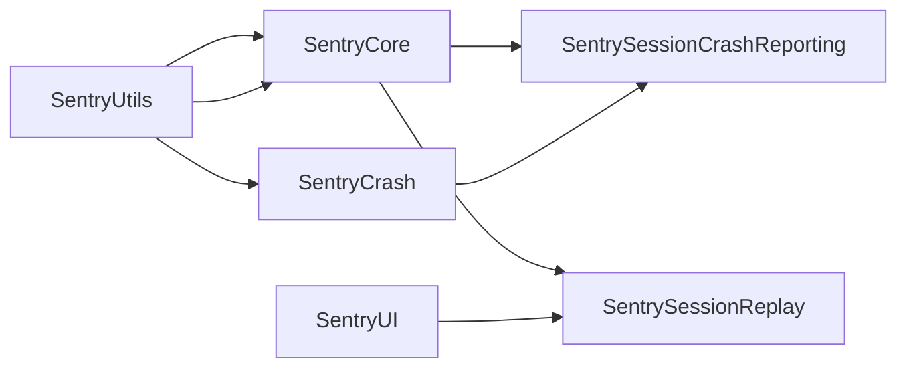

# Project Structure

## Xcode Projects

Xcode projects are the traditional way to build Swift code. They provide a comprehensive build system for iOS, macOS, and other Apple platforms.

### Xcode Projects - Targets

Xcode projects are built using targets. Targets are the basic building blocks of an Xcode project and define how code is compiled and linked.

Targets configure the compilation process, specifying:

- Source files to compile
- Build settings (compiler flags, frameworks, libraries)
- Dependencies on other targets
- Output products (frameworks, static libraries, executables)

**Framework Targets**: The most common type of target for SDKs, which outputs a framework bundle (`.framework`). Frameworks can contain Swift and/or Objective-C code and are distributed as dynamic or static frameworks.

**Static Library Targets**: Used to separate code into modular components. Static libraries (`.a` files) are compiled code that gets linked into other targets at build time. They allow for:

- Code organization and separation of concerns
- Local dependencies between targets
- Reusable components that can be imported by multiple targets

When a target depends on a static library target, it can import and use the code from that library. This creates clear boundaries between different parts of the codebase while keeping everything within the same Xcode project.

### Xcode Projects - Products

Xcode projects produce products as outputs from targets. The main product types are:

- **Frameworks**: Bundles containing compiled code, headers, and resources
- **Static Libraries**: Compiled object files that are linked into other targets
- **Executables**: Binary applications that can be run

Products can combine multiple targets. For example, a framework product can link multiple static library targets together, creating a single distributable framework while maintaining internal modularity.

## Swift Package Manager (SPM)

It's important to understand the similarities and differences between SPM and Xcode projects.

- SPM is a package manager for Swift.
- Xcode projects are a collection of files that are used to build an app.
- SPM is a more modern way to build Swift code.
- Xcode projects are a more traditional way to build Swift code.

A set of `targets` and `products` will be created in the `Package.swift` file.

### SPM - Swift and Objective-C Interoperability

SPM does not support inter-operability between Swift and Objective-C within the same target. This is a key difference from Xcode projects, where Swift and Objective-C files can be mixed freely in the same target.

**Implications:**

- **Clear separation required**: Source code must be clearly separated into different targets based on language
- **Refactoring needed**: Code that mixes Swift and Objective-C will need to be refactored to separate them into distinct targets
- **Language flexibility maintained**: You can still keep logic in Objective-C or C++ if desired, but it must be in separate targets from Swift code
- **Target dependencies**: Swift targets can depend on Objective-C targets and vice versa, but they cannot be mixed within a single target

**Example:**

- In Xcode: A single target can contain both `MyClass.swift` and `MyClass.m`
- In SPM: `MyClass.swift` must be in a Swift target, `MyClass.m` must be in an Objective-C target, and they communicate via target dependencies

This limitation requires careful planning during migration, but it also enforces better code organization and clear module boundaries.

**Example:**

```swift
let package = Package(
    name: "sample-package",
    dependencies: [
        .package(url: "https://github.com/apple/swift-argument-parser.git", from: "1.2.0"),
    ],
    targets: [
        // Targets are the basic building blocks of a package, defining a module or a test suite.
        // Targets can depend on other targets in this package and products from dependencies.
        .executableTarget(
            name: "sample-executable",
            dependencies: [
                .product(name: "ArgumentParser", package: "swift-argument-parser"),
            ]
        ),
    ]
)
```

### SPM - Targets

SPM targets are the building blocks of SPM packages and defined in the `Package.swift` file.

```swift
var targets: [Target] = [
    // Executable targets, output is a binary executable
    .executableTarget(name: "my-cli", dependencies: ["CoreLibrary"]),
    
    // Binary targets, input is a binary framework, output is a binary framework
    .binaryTarget(
        name: "Sentry",
        url: "https://github.com/getsentry/sentry-cocoa/releases/download/9.0.0-rc.0/Sentry.xcframework.zip",
        checksum: "ac1dc89e7a6d685790fccf3fdaeec79e9a276be91fcb0bbfa4a82eedbf7fe539" //Sentry-Static
    ),
    
    // Plugin targets, output is a plugin, e.g. a custom linter
    .plugin(name: "swift-lint", capability: .buildTool),

    // System library targets, allows to use system libraries, e.g. c++ library
    .systemLibrary(name: "CLibAwesome", path: "Sources/CLibAwesome"),

    // A target with Swift code
    .target(
        name: "SentrySwift",
        path: "Sources/SentrySwift",
        sources: ["Sources/**/*.swift"],
        swiftSettings: [
            .unsafeFlags(["-warnings-as-errors"])
        ]
    ),
    // A target with Objective-C code
    .target(
        name: "SentryObjc",
        path: "Sources/SentryObjc",
        cSettings: [
            .headerSearchPath("Sentry"),
        ]
    )
    // A target with C++ code
    .target(
        name: "SentryCpp",
        path: "Sources/SentryCpp",
        linkerSettings: [
            .linkedLibrary("c++")
        ]
    )

    // Test targets, output is a test bundle
    .testTarget(name: "CoreLibraryTests", dependencies: ["CoreLibrary"])
]
```

### SPM - Products

Products are the outputs of the package and can be one of the following:

- **Executable**: A binary executable that can be run, e.g. a CLI tool.
- **Library**: A library that can be used in other projects, e.g. a Swift library.
- **Plugin**: A build tool plugin that can be used in other projects, e.g. a linter used in the SPM build system.

The Sentry SDK should ideally be distributed as a library product.

### SPM - Dependencies

Dependencies can be internal or external.

#### Internal Dependencies

Internal dependencies are other targets that are part of the same package. They do not need to be defined in the `dependencies` array of the package definition, as targets can just depend on other targets in the same package.

Using internal dependencies offers these benefits:

- Enforces modularization
- Clear boundaries between internal and private code
- Targets can still be used in other targets and also distributed as standalone products

#### External Dependencies

External dependencies are other Swift packages which are referenced using a URL or a local path to a directory/repository with exactly one `Package.swift` file in the root directory.

To add a dependency it must be defined in the `dependencies` array of the package definition:

```swift
let package = Package(
    ....
    dependencies: [
        .package(url: "https://github.com/apple/swift-argument-parser.git", from: "1.2.0"),
    ]
    ....
)
```

When a package only offers one product with the same name as the package, it can be used without specifying the product name when using it in a target.

```swift
let package = Package(
    ....
    targets: [
        .target(name: "sample-target", dependencies: ["swift-argument-parser"]),
    ]
    ....
```

When a package offers multiple products, it must be specified which product to use when using it in a target.

```swift
let package = Package(
    ....
    targets: [
        .target(name: "sample-target", dependencies: [
            .product(name: "ArgumentParser", package: "swift-argument-parser"),
        ]),
    ]
    ....
)
```

### SPM - Testing

Testing is a core part of the Swift ecosystem and SPM packages support testing out of the box.
To create unit tests for a target, a test target must be defined in the `targets` array of the package definition and add the target to test as a dependency.

```swift
let package = Package(
    ....
    targets: [
        .testTarget(name: "sample-target-tests", dependencies: ["sample-target"]),
    ]
    ....
)
```

### SPM - Development

SPM package are first class citizens in the Swift ecosystem, therefore when opening the `Package.swift` file in Xcode, it will be opened as a Swift package (project).

### SPM - Folder Structure

When working with SPM packages, it is important to follow some sensible defaults to ensure the package is easy to use and maintain.
When creating a new target it expects the source code to be in the `Sources/TargetName` folder, with the tests in the `Tests/TargetNameTests` folder:

```
.
├── Package.swift
├── Sources
│   └── MyTarget
│       └── MyClass.swift
└── Tests
    └── MyTargetTests
        └── MyClassTests.swift
```

For Objective-C targets, the source code should be in the `Sources/TargetName` folder, with the header files in the `Sources/TargetName/include` folder.

```
.
├── Package.swift
└── Sources
    └── MyTarget
        └── MyClass.m
        └── include
            └── MyClass.h
```

> [!NOTE]
> The `Sources` and `Tests` folder hierarchy is not required, but it is a good practice to follow.
> This is one of the main reasons why we should refactor our project structure to follow these defaults.

# Migrating from Xcode projects to SPM packages

To migrate from monolithic Xcode project targets to SPM targets, we should follow a gradual, step-by-step approach. This allows us to achieve modularization while maintaining the Xcode project structure, making the eventual conversion to SPM straightforward.

## Migration Strategy

The migration strategy focuses on restructuring the codebase within the Xcode project first, then converting to SPM. This approach minimizes risk and allows incremental progress.

### Important Consideration: Swift and Objective-C Separation

As mentioned in the SPM section, SPM does not support mixing Swift and Objective-C files within the same target. This means:

- **During Xcode project phase**: We can still mix Swift and Objective-C in targets, but should start separating them to prepare for SPM
- **Refactoring requirement**: Code that mixes languages will need to be refactored into separate targets
- **Language preservation**: We can still keep logic in Objective-C or C++ if desired, but it must be in separate targets from Swift code
- **Clear boundaries**: This separation enforces better code organization and module boundaries

The migration steps below will help us achieve this separation gradually while maintaining the Xcode project structure.

### Step 1: Reorganize File Hierarchy

Change the file hierarchy to follow the SPM `Sources/Tests/include` pattern, while keeping all files in their existing Xcode targets.

**Benefits:**

- Aligns with SPM conventions early
- Makes future SPM conversion straightforward
- No changes to build configuration required initially
- Files remain in their current targets, so builds continue to work

**Structure:**

```
Sources/
├── SentryCore/
│   ├── *.swift
│   └── *.m
├── SentryCrash/
│   ├── *.m
│   └── include/
│       └── *.h
└── SentryUtils/
    ├── *.swift
Tests/
├── SentryCoreTests/
│   └── *.swift
├── SentryCrashTests/
│   └── *.swift
└── SentryUtilsTests/
    └── *.swift
```

### Step 2: Extract Isolated Utilities

Extract isolated utilities into a separate static library target (managed via Xcode project target), including all utility code.

**Process:**

- Create a new static library target (e.g., `SentryUtils`)
- Move utility code to `Sources/SentryUtils`
- Configure the target with appropriate build settings
- Update dependencies so other targets can import from `SentryUtils`

**Benefits:**

- Clear separation of utility code
- Utilities can be reused across multiple targets
- Easier to test utilities in isolation

### Step 3: Extract Tests for Utilities

Extract tests for the isolated utilities into a separate testing target of the static library.

**Process:**

- Create a test target (e.g., `SentryUtilsTests`)
- Move utility tests to `Tests/SentryUtilsTests`
- Configure the test target to depend on `SentryUtils`
- Ensure tests can run independently

**Benefits:**

- Tests are co-located with their code
- Can run utility tests in isolation
- Easier to identify which tests belong to which module

### Step 4: Repeat Extraction Incrementally

Repeat the extraction process as often as needed, step by step. A major extraction would be `SentryCrash`.

**Process:**

- Identify a cohesive module (e.g., `SentryCrash`)
- Create static library target(s) for it
  - If the module mixes Swift and Objective-C, create separate targets (e.g., `SentryCrashSwift` and `SentryCrashObjC`)
  - This prepares for SPM conversion where languages must be separated
- Move code to `Sources/SentryCrash` (or `Sources/SentryCrashSwift` and `Sources/SentryCrashObjC` if separated)
- Extract tests to `Tests/SentryCrashTests`
- Update dependencies

**Language Separation Note:**

When extracting modules that contain both Swift and Objective-C code, consider creating separate targets for each language. While Xcode projects allow mixing, separating them early:

- Prepares the codebase for SPM conversion
- Enforces clear module boundaries
- Makes dependencies explicit
- Allows keeping logic in Objective-C or C++ if desired, just in separate targets

**Benefits:**

- Allows clear boundaries in multiple libraries
- Libraries are combined at compilation time
- Each module can be developed and tested independently
- Gradual migration reduces risk
- Language separation prepares for SPM conversion

### Step 5: Extract Tests for All Libraries

Extract tests for all separate libraries into separate testing targets. Using test plans and schemas, we can still run all tests in one go from CI.

**Process:**

- Create test targets for each library
- Organize tests in `Tests/LibraryNameTests` folders
- Create test plans that include all test targets
- Configure CI to run test plans

**Benefits:**

- Modular test structure
- Can run all tests together via test plans
- Can run individual library tests for debugging
- Easier to identify flaky tests by library

**Test Plans Example:**

- `Sentry_AllTests.xctestplan` - Runs all test targets
- `Sentry_CoreTests.xctestplan` - Runs only core tests
- `Sentry_CrashTests.xctestplan` - Runs only crash tests

### Step 6: Maintain Xcode Project Structure

This approach allows us to stick with the Xcode project for as long as possible while already achieving a modular structure.

**Benefits:**

- No immediate need to convert to SPM
- Modular structure is in place
- Clear boundaries between modules
- Easier to reason about dependencies

## Converting to SPM

Once the modular structure is established in the Xcode project, conversion to SPM becomes straightforward.

### 1:1 Target Conversion

The Xcode project structure with multiple targets can ideally be converted to SPM 1:1, without having to define complex paths for sources, headers, and tests.

**Why this works:**

- File hierarchy already matches SPM conventions
- Targets already represent modules
- Dependencies are already defined
- Tests are already separated

**Conversion Process:**

- Each Xcode static library target → SPM target
- Each Xcode test target → SPM test target
- Dependencies map directly
- Products map directly

## Benefits of Modular Structure

### Flaky Test Investigation

Using multiple test targets, we can investigate flaky tests by (re-)running only tests for individual libraries.

**Example:**

- If tests are flaky, run only `SentryCrashTests` to isolate the issue
- Faster feedback loop
- Easier to identify problematic modules

### Product Merging

Products allow merging multiple targets as one product. This changes nothing for the user (framework size needs to be investigated).

**How it works:**

- Main framework product links all static library targets
- Users still get a single framework
- Internal modularity is maintained
- Framework size should be similar (needs verification)

### Hybrid SDK Support

For the hybrid SDK, this allows us to create new wrapper targets and products which consume our modular targets, abstracting away our SDK. This offers a clear boundary from us to them.

**Example Structure:**



- SentrySessionCrashReporting depends on SentryCore and SentryCrash, both of which depend on SentryUtils.
- SentrySessionReplay depends on SentryCore (which depends on SentryUtils) and on SentryUI.

**Benefits:**

- Clear boundaries between SDK and wrapper
- Wrapper can selectively import modules
- Using modularization with multiple targets/products, we can even explore targets per integration
- React Native can import only what they need
- Other integrations can have their own wrapper targets

**Integration Example:**

- `SentryReactNative` target depends on specific Sentry modules
- `SentryFlutter` target depends on different modules
- Each integration only includes what it needs
- Reduces bundle size for integrations
